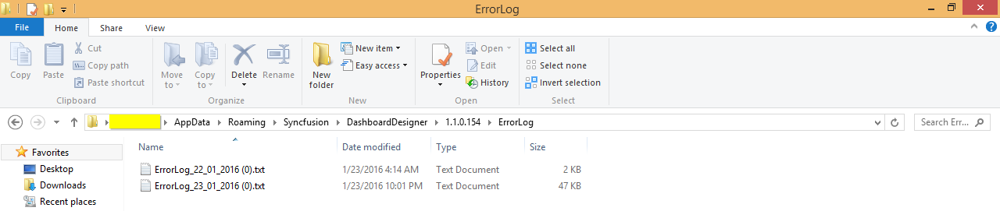

# Acting on Errors

   Any error occurred, while working with Dashboard Designer get logged under the following location in text file.
   
   `\%appdata%\Syncfusion\DashboardDesigner\[Version]\ErrorLog`
   
   Any error occurred, while previewing the dashboard through Dashboard Designer get logged under the following location in text file.
   
   `\%appdata%\Syncfusion\DashboardDesigner\[Version]\IISExpress_DashboardService\ErrorLog`

   The errors occurred in a day will get logged in the same file one below the other. The next day log will get added in a new file like below:
   
   
   
   When you face any error while working, have these log files collected and share to us through creating a support ticket in Direct-Trac.

   Not only the errors from the application get logged here, but also some generic errors like, data connection error due to network failure.

