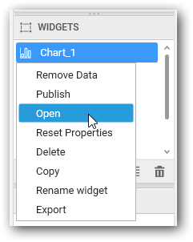

# Commenting Dashboard and Widget 

Syncfusion Dashboard Designer allows you to enable commenting over a dashboard and/or its individual widgets by users when published to a dashboard server. You can toggle this setting through the `Enable Comment` option exposed in application menu or toolbar for dashboard and in widget properties window for individual widgets.

## Commenting a Dashboard

To enable commenting a dashboard, navigate to the `Dashboard` menu and select `Enable Comment`.

You can also enable commenting for dashboard by navigating to the Dashboard tab and select `Enable Comment` option in toolbar. 

## Commenting a Widget

To enable commenting for a widget, select that widget in the `WIDGETS` container window and either double click it or right click to open the context menu and select `Open` to open the selected widget in a separate tab.

Once the widget tab was opened, navigate to the Properties pane and select the `Enable Comment` option under `Container Appearance` section.

N> Image, Label and RangeNavigator widgets do not have Commenting support.
N> You may find the commenting procedure [here](/en-us/dashboard-platform/dashboard-server/collaboration)