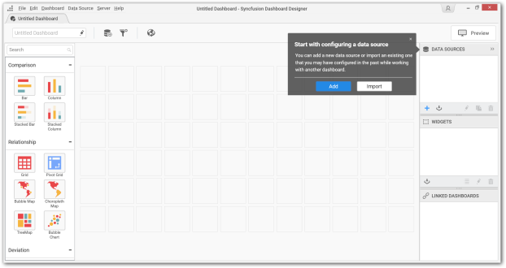
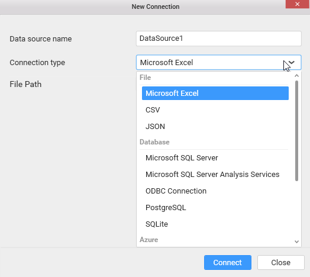

# Compose Dashboard

  Once you are ready with the formatted data source, you can start to compose a new dashboard with required filter, data visualization and/or miscellaneous widgets configured with data.

## Creating a Dashboard

   Run the Syncfusion Dashboard Designer application through the shortcut icon that has been placed on your desktop. Once the application launches you should see a prompt to configure a data source first.

   

   You can click the `Add` option to select the required `Connection type` to add the data source into the dashboard.

   

   Drag and drop the Dashboard widgets based on your requirements.

