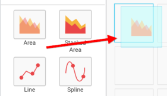
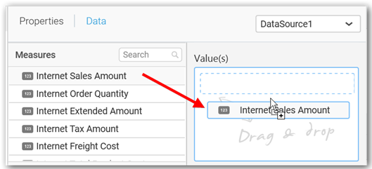
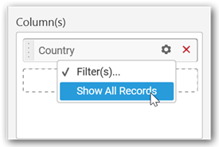

# Area Chart

Area Chart allows you to compare values for a set of unordered items across categories through filled curves ordered vertically.

## How to configure flat table data to Area Chart?

Area Chart need a minimum of 1 value element and 1 column element to showcase. The measure or expression field that you would like to analyze can be dropped into Value(s) block. The dimension that you would like to categorize the measure, can be dropped onto Column block. If you would like to categorize based on a series, then the respective dimension can be dropped onto Row block in addition. 

Following chart illustrates about how to configure data to area chart

Drag and drop the **Area** chart widget into canvas and resize into your required size.

Connect to the data source.

Focus on the Chart widget.

Click on the `Assign Data` Button.

A Data pane will be opened with available `Measures` and `Dimensions`.

**Assigning Value(s)**

Drag and drop the `Measure` into `Value`.

Now the chart will be rendered like this. 

You can change the summary type of the value by clicking on `Settings` option.

Select the required summary type from list.

You can select what data to be displayed by choosing filter option.

The `Measure Filter` option will be shown and you can choose the filter condition and apply the condition value.

You can clear the filter. 

You can `Format` the value.

The format options will be shown.

Choose the options you need and click `OK`.

Now the Chart will be rendered like this.

You can add more number of values by drag drop the `Measures` into `Value` field. 

You can also add `Dimensions` and `Columns` to `Value(s)`.

 **Assigning Column(s)** 

You can add the `Dimension` into `Column` field by drag and drop.

You have option to add more than one `Column` Value.

The following alert message will be shown.

* If you choose `Yes` Drill down option will be enabled.

You can drill down the chart by clicking on the chart.

The drilled view of the chart is follows.

* If you click `No` the new `Dimension` value will replace old value.

You can also add `Measure` and `Expression columns` into `Column(s)` field.

You have options to change the settings.

You can sort the chart either in `Ascending` or `Descending` series.

**Ascending Order:**

**Descending order:**

You can apply a filter.

Select the `Conditions` and `Rank` you need.

Now the chart will be rendered like this.

To show all records again click on `Show All Records`.

You can add `Measures` into `Column(s)`.

**Assigning Row**

You can add `Dimension` into the `Row` field for series chart.

The chart will be rendered in series as shown in the image.

You have settings options similar to `column(s)`.

## How to configure the SSAS data to Area Chart?

Area Chart need a minimum of 1 value element and 1 column element to showcase. The measure or expression field that you would like to analyze can be dropped into Value(s) block. The dimension that you would like to categorize the measure, can be dropped onto Column block. If you would like to categorize based on a series, then the respective dimension can be dropped onto Row block in addition.

Following steps illustrates configuring SSAS data to `Area` chart

Drag and drop the `Area` chart widget into canvas and resize into your required size.

 

Select the dropped widget using mouse.

Click the `Assign Data button` in the toolbar.

A Data pane will be opened with available `Measures` and `Dimensions`.

  

**Assigning Value(s)**

Drag and drop a column under `Measures` category into `Value(s)` `section`.

   

Now the chart will be rendered like this.

Define the filter criteria to match through choosing `Edit` option in `Filter` menu item.

 
The `Measure filter` dialog will be shown where you can choose the filter condition and apply the condition value.

 
Select `Clear` option to clear the defined filter.

 

Select `Format` option to define the display format to the values in the column through `Measure Formatting` window.

Choose the options you need and click `OK`.

 

Now the Chart will be rendered like this.

 

You can also add more than one column to the `Value(s)` section.

**Assigning Column(s)**

Add a dimension level or hierarchy into Column(s) section through drag and drop.

 

You may also add more than one column into `Column(s)` section. In that case, you will be prompted with a message like below, asking for confirmation to enable drilling across the levels.

 

Select `Yes` to enable drill option in chart. Select `No`  to replace the existing column with this one in the Column(s) section.

Click the respective data value marker in chart to drill into its inner level.

The drilled view of the chart is follows.
 

Through the breadcrumb at top, you may navigate to the outer or middle levels from your current inner level.

Define filter criteria through `Filter(s)…` menu item in the Settings drop down menu.

 
Select `Filter(s)…` to launch the `Filters` window.
 

Define the filter `Condition` and `Rank` and Click `OK`.

Now the chart will be rendered like this

 
To show all records again click on `Show All Records`.

 

**Assigning Row**

You can add a dimension level or hierarchy to `Row` section for series rendering of chart

The chart will be rendered in series as shown in the image below.

## How to format Area Chart?

You can format the Area chart for better illustration of the view that you require, through the settings available in `Properties` pane.

To format area chart follow the steps

Drag and drop the area chart into canvas and resize it to your required size.

Configure the data into bar chart.

Focus on the area chart and Click on Widget Settings.

The property window will be opened.

You can see the list of properties available for the widget with default value.

**General Settings**

**Header**

This allows you to set title for this area chart widget.

**Description**

This allows you to set description for this area chart widget, whose visibility will be denoted by `i` icon, hovering which will display this description in tooltip.

**Basic Settings**

**Chart Type**

This allows you to switch the widget view from current chart type to another chart type.

**Enable Animation**

This allows you to enable the rendering of series in animated mode.

**Show Marker**

This allows you to toggle the visibility of marker from label to adorn each data point in chart series.

**Enable Drill Down**

This allows you to add more than one dimension element to the `Column` block in Data Pane of Widget View such that, those form an hierarchy and each of its level can be navigated through clicking the respective series drawn. In its disabled state, trying to add more than one element will replace the existing one. 

**Initial View**

**Drilled View**

**Show Legend**

This allows you to toggle the visibility of legend in chart and also changing the legend text position (selecting through combo box).  

Enabling this option of **Custom Legend Text** will allow you to define a custom text (through the text area) to display for each legend series (selecting through the combo box) in chart.

**Custom Legend Settings**

You can customize the legend text through the Custom Legend Settings dialog. This dialog will show the legend text list as labels at left and corresponding text area at right to add the formatted text to display instead. When a column is added into Row section, this dialog will show two options `Individual` and `Group` at top in addition, to toggle between.

***Individual***

Selecting  Individual option will allow you to define a custom text (through the text area) to display for each legend series in chart with the default format:

{{"{{"}} : Row {{}}}} ({{"{{"}} : Value {{}}}})

Where, Row represents the value of dimension column added to `Row section` and Value represents the value of the measure column added to `Value section`. 

***Group***

Enabling `Group` option will allow you to set the display format and define a custom text (through the text area) to display for each legend series based on the specified format. 

For example, If Display Format is {{"{{"}} : Row {{}}}} ({{"{{"}} : Value {{}}}}), then Legend series will display like Argentina (Sum of Order ID)

**Show Value Labels**

This allows you to toggle the visibility of value labels.

**Value Label Rotation**
 
This allows you to define the rotation angle for the value labels to display.

**Value Labels Suffix**

Allows you to set suffix to the value labels. 

**Filter Settings**

**Hierarchical Filtering**

This allows you to define the behavior of top `n` filtering which can be flat or hierarchical.

**Act as Master Widget**

This allows you to define this area chart widget as a master widget such that its filter action can be made to listen by other widgets in the dashboard.

**Ignore Filter Actions**

This allows you to define this area chart widget to ignore responding to the filter actions applied on other widgets in dashboard.

**Link Settings**

To configure the linking to URL or dashboard with the widget through its settings. For more details, refer [Linking](/en-us/dashboard-platform/dashboard-designer/compose-dashboard/linking-urls-and-dashboards). 

**Container Settings**

**Title Alignment**

This allows you to handle the alignment of widget title to either left, center or right.

**Title Color**

This allows you to apply text color to the widget title.

**Border Visibility**

This allows you to toggle the visibility of border surrounding the widget.

**Corner Radius**

This allows you to apply the specified radius to the widget corners. Value can be between 0 and 10.

**Maximized View**

This allows you to enable/disable the maximized mode of this area chart widget. The visibility of the maximize icon in widget header will be defined based on this setting in viewer.

**CSV Export**

This allows you to enable/disable the CSV export option for this area chart widget. Enabling this allows you to export the summarized data of the widget view to CSV format in viewer.

**Excel Export**

This allows you to enable/disable the Excel export option for this area chart widget. Enabling this allows you to export the summarized data of the widget view to XLSX format in viewer.

**Image Export**

This allows you to enable/disable the image export option for this area chart widget. Enabling this allows you to export the view of the widget to image format (*.JPG) in viewer.

**Enable Comment**

This allows you to enable/disable comment for dashboard widget. For more details refer [here](/en-us/dashboard-platform/dashboard-designer/compose-dashboard/commenting-dashboard-and-widget)

**Axis Settings**

This section allows you to customize the axis settings in chart. 

**Category Axis**

This allows to enable or edit the option of `Category Axis`. It will reflect in chart area x-axis name. 

**Category Axis Title**

This allows you to toggle the visibility of Category axis title.

**Primary X-Axis Label Trim**

This allow you to enable the label trimming in chart area x-axis.

**Label Rotation**

This allows you to define the rotation angle for the category axis labels to display.

**Primary Value Axis**

This allows you to enable and edit the `Primary Value Axis` title. It will reflect in chart area y-axis name. 

**Primary Value Axis Title**

This allows you to toggle the visibility of primary value axis title.

**Secondary Value Axis**

This allows you to enable/edit the `Secondary Value Axis` title. It will reflect in chart area secondary y-axis name. 

**Secondary Value Axis Title**

This allows you to toggle the visibility of secondary value axis title.

**Sort Order**

This allows you to define the sorting of chart based on any of the measures that you dropped and its order through this option. Following screenshot illustrates the Ascending sort order.

**Plot Axis Settings**

This allows you to define which measure column need to be plotted against which value axis (primary or secondary).

**Primary Value Axis**

**Secondary Value Axis**

**Axis Formatting**

This allows you to handle different formatting options like display type, denominations, decimal places, currency culture and negative value display format to the value axis labels. Clicking the “Axis Formatting” button will launch the following editor to configure settings.

**Grid Line Settings**

**Primary Value Axis**

This allows you to enable the primary value axis gridlines.

**Category Axis**

This allows you to toggle the visibility of category axis gridlines.

**Secondary Value Axis**

This allows you to toggle the visibility of secondary value axis gridlines. 

**Trend Line Settings**

You can add trend line to chart based on dropped measure that you select. You can also customize its legend text, line type and line color. Trend line is not visible, by default.

After applying these settings, it will reflect in chart like below. 

You have options to edit or delete the added trend lines.

