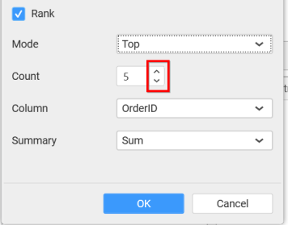
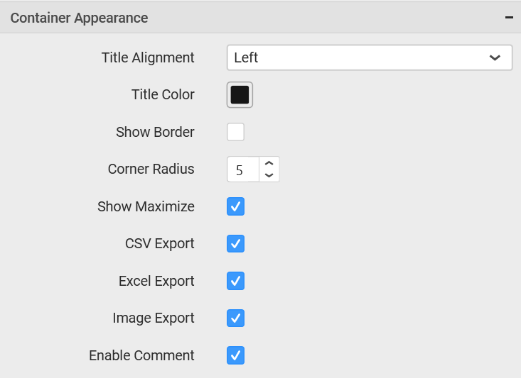

# Bubble Map

Bubble Map allows you to showcase quantitative values encoded through bubble size.

## How to configure flat table data to Bubble map?

To plot a bubble map, a minimum requirement of 1 value and 1 shape is needed.

The following procedure illustrates data configuration of Bubble Map.

 Drag and drop `Bubble Map` control icon from the Tool box into design panel. You can find control in Toolbox by search.

After control added in design panel, click `Assign Data` button at Design Tools Pane to open the Data configuration pane.

Bind column through drag and drop element from `Measures` section to `Value`.

Drag and Drop the elements from sections to `Shape`.

You can use the aggregation function to change the `Value` of the column.

You can use the filter option to enable the `Filters` by selecting the `Edit` option.

`Measure Filters` window will be shown to select filter condition.

You can clear the filter by selecting the `Clear` option.

You can format the values by selecting the `Format` option.

`Measure Formatting` window will be shown.

You can use the filters by selecting the `Filter(s)…` option to rank the elements.

You can select the specific country to filter the element and `CheckAll` is used either to check all the data or to select the specific data. `Include` and `Exclude` is used to include and exclude the elements by selecting the radio button and click the `Apply` button.

You can select the Condition option to change the `Column` elements and `Summary` type by selecting the required column name and summary type.

You can select the `Rank` option to enable filters and select the `Mode` either top or bottom.

You can change the `Count` value to filter the top elements and change the column and summary type as required and click `OK` button.

You can clear the filters by selecting the `Show All Records` options.

Here is an illustration,

## How to configure SSAS data to Bubble map?

To plot a bubble map, a minimum requirement of 1 value and 1 shape is needed.

Following steps illustrates configuring SSAS data to Bubble Map.

Drag and drop `Bubble Map` control icon from the Tool box into design panel. You can find control in Toolbox by search.

 
After control added in design panel, click `Assign Data` button at Design Tools Pane to open the Data configuration pane.

 
Drag and drop a column under `Measures` category into `Value`.

 
Drag and drop a dimension level or hierarchy column under `Dimensions` category into `Shape`.

 
Define the filter criteria to match through choosing `Edit` option in `Filter` menu item.

 
The `Measure filter` dialog will be shown where you can choose the filter condition and apply the condition value.

 
Select `Clear` option to clear the defined filter.

 
Select `Format` option to define the display format to the values in the column through `Measure Formatting` window.

 
Choose the options you need and click `OK`.
 

Define filter criteria through `Filter(s)…` menu item in the Settings drop down menu.

  
Select `Filter(s)…` to launch the `Filters` window.

 

Define the filter `Condition` and Rank and Click `OK`.

To show all records again click on `Show All Records`.

 
Here is an illustration,
 

## How to format Bubble map widget?

You can format the bubble map for better illustration of the view that you require, through the settings available in `Properties` pane.

**General Settings**

**Header**

This allows you to set title for this bubble map widget.

**Description**

This allows you to set description for this bubble map widget, whose visibility will be denoted by `i` icon, hovering which will display this description in tooltip.

**Basic Settings**

**Enable Navigator**

You can enable/ disable the map navigator in bubble map.

**Bubble Color**

You can customize the bubble color from the set of predefined color palette.

**Filter Settings**

**Act as Master**

This allows you to define this bubble map widget as a master widget such that its filter action can be made to listen by other widgets in the dashboard.

**Ignore Filter Actions**

This allows you to define this bubble map widget to ignore responding to the filter actions applied on other widgets in dashboard.

**Link Settings**

You can enable linking and configure to navigate either to a published dashboard URL or to a general URL with or without parameters. For more details, refer [Linking](/en-us/dashboard-platform/dashboard-designer/compose-dashboard/linking-urls-and-dashboards). 

**Container Appearance**

**Title Alignment**

This allows you to handle the alignment of widget title to either left, center or right.

**Title Color**

This allows you to apply text color to the widget title.

**Show Border**

This allows you to toggle the visibility of border surrounding the widget.

**Corner Radius**

This allows you to apply the specified radius to the widget corners. Value can be between 0 and 10.

**Show Maximize**

This allows you to enable/disable the maximized mode of this bubble map widget. The visibility of the maximize icon in widget header will be defined based on this setting. Clicking this icon in viewer will show the maximized view of the bubble map widget.

**CSV Export** 

This allows you to enable/disable the CSV export option for this bubble map widget. Enabling this allows you to export the summarized data of the widget view to CSV format.

**Excel Export** 

This allows you to enable/disable the Excel export option for this bubble map widget. Enabling this allows you to export the summarized data of the widget view to XLSX format.

**Image Export**

This allows you to enable/disable the image export option for this bubble map widget. Enabling this allows you to export the view of the widget to image format (*.JPG) in viewer.

**Enable Comment**

This allows you to enable/disable comment for dashboard widget. For more details refer [here](/en-us/dashboard-platform/dashboard-designer/compose-dashboard/commenting-dashboard-and-widget)

**Map Settings**   

**Built-in**

You can choose from the available 14 map shape files shipped along with dashboard designer for visualizing map data.

**Custom**

You can load any custom map shape file to visualize the data in map through enabling this option. 

**Field**

You can choose from the list of column names supported by the loaded map shape file that can be mapped with the data source connected.

