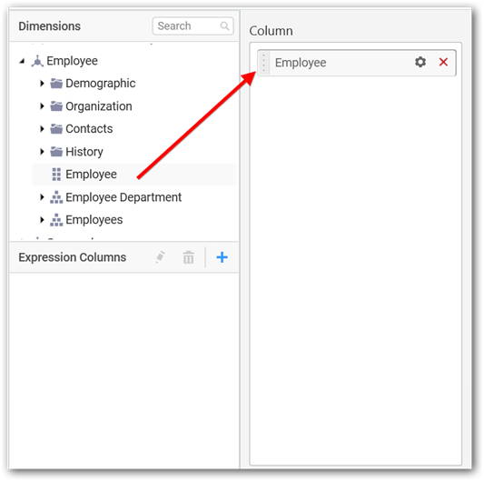
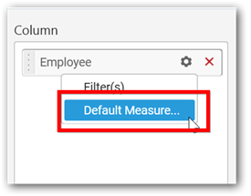
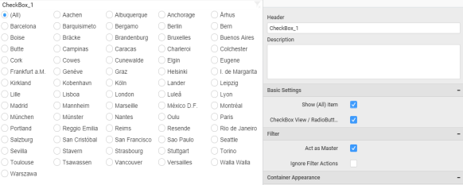

# Check Box

Checkbox enables you to filter based on single or multiple items selection in a group. To configure a checkbox, a minimum requirement of 1 column is needed.

## How to configure flat table data to Check Box?

The following procedure illustrates data configuration of Checkbox.

Drag and drop `CheckBox` widget from the Toolbox into design panel and resize into your required size. You can find widget in Toolbox by search.

Select the dropped widget using mouse and click the `Assign Data` button at Design Tools Pane to open the Data configuration pane.

Drag and drop a column from `Measures` or `Dimensions` or `Expression Columns` category to `Column` section.

Define the sort order of the dropped column through the `Settings` drop down menu.

Define filter criteria through the `Filter(s)…` menu item in the `Settings` drop down menu.

Select the specific item to filter the element and `CheckAll` is used either to check all the item or to select the specific item. `Include` and `Exclude` is used to include and exclude the selected elements. Click the `Apply` button to apply the selection.

Select the `Condition` option to change the `Column` elements and `Summary` type by selecting the required column name and summary type.

Select the `Rank` option to enable filters and select the `Mode` as either top or bottom.

You can change the `Count` value to filter the top elements and change the column and summary type as required and click `OK` button.

Clear the filters by selecting the `Show All Records` in the `Settings` dropdown menu.

Here is an illustration, 

## How to configure the SSAS data to Check Box?

Following steps illustrates configuring SSAS data to Checkbox.

Drag and drop `CheckBox` widget from the Toolbox into design panel and resize into your required size. You can find widget in Toolbox by search.

 
Select the dropped widget using mouse and click the `Assign Data` button at Design Tools Pane to open the Data configuration pane.

 
Drag and drop a dimension level or hierarchy column under `Dimensions` category into `Column` section.

 

Define filter criteria through `Filter(s)…` menu item in the Settings drop down menu.

 
 
Select the specific item to filter the element and `CheckAll` is used either to check all the item or to select the specific item. `Include` and `Exclude` is used to include and exclude the selected elements. Click the `Apply` button to apply the selection.
 
 

Select the `Condition` option to change the `Column` elements by selecting the required column name.
 

Select the `Rank` option to enable filters and select the `Mode` as either top or bottom.

 
Select the `Count` value to filter the top elements and change the column as required and click `OK` button.

 
Clear the filters by selecting the `Show All Records` in the `Settings` dropdown menu. 

 

Define a `default measure` to the dropped dimension against which dimension values need to be categorized.

 

Here is an illustration,

## How to format Check Box?

You can format the Check box for better illustration of the view that you require, through the settings available in Properties pane.

**General Settings**

**Header**

This allows you to set title for this check box widget.

**Description**

This allows you to set description for this check box widget, whose visibility will be denoted by `i` icon, hovering which will display this description in tooltip.

**Basic Settings**

**Show (All) item**

This allows you to enable selection or deselection of entire items by adding `Select All` item.

**Check Box with Select All**

**Check Box without Select All**

**CheckBox View/ RadioButton View**

This allows you to change the view of the widget to radio button.

**Check Box with Radio Button View**

**Filter Settings**

**Act as Master Widget**

This allows you to define this check box widget as a master widget such that its filter action can be made to listen by other widgets in the dashboard.

**Ignore Filter Actions**

This allows you to define this check box widget to ignore responding to the filter actions applied on other widgets in dashboard.

**Container Appearance** 

**Title Alignment**

This allows you to handle the alignment of widget title to either left, center or right.

**Title Color**

This allows you to apply text color to the widget title.

**Show Border**

This allows you to toggle the visibility of border surrounding the widget.

**Corner Radius**

This allows you to apply the specified radius to the widget corners. Value can be between 0 and 10.

**Enable Comment**

This allows you to enable/disable comment for dashboard widget. For more details refer [here](/en-us/dashboard-platform/dashboard-designer/compose-dashboard/commenting-dashboard-and-widget)

