# Combo Box

Combo Box enables you to filter based on single or multiple items selection in dropdown list. To bind a combo box, a minimum requirement of 1 column is needed. 

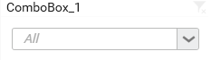

## How to configure flat table data to Combo Box?

The following procedure illustrates data configuration of Combo Box.

Drag and drop `ComboBox` widget from the Toolbox into design panel and resize into your required size. You can find widget in Toolbox by search. 

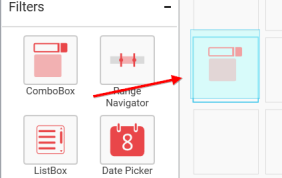

Select the dropped widget using mouse and click the `Assign Data` button at Design Tools Pane to open the Data configuration pane.

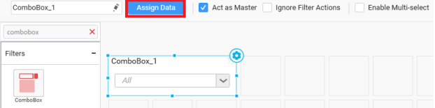

Drag and drop a column from `Measures` or `Dimensions` or `Expression Columns` category to `Column` section.

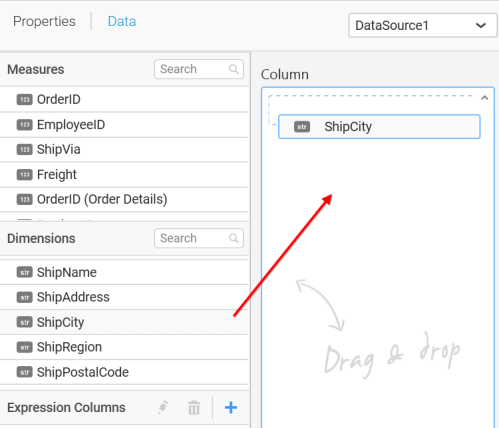

Define the sort order of the dropped column through the `Settings` drop down menu.

Define filter criteria through the `Filter(s)…` menu item in the `Settings` drop down menu.

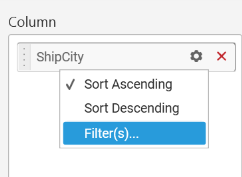

Select the specific item to filter the element and `CheckAll` is used either to check all the item or to select the specific item. `Include` and `Exclude` is used to include and exclude the selected elements. Click the `Apply` button to apply the selection.

Select the `Condition` option to change the `Column` elements and `Summary` type by selecting the required column name and summary type.

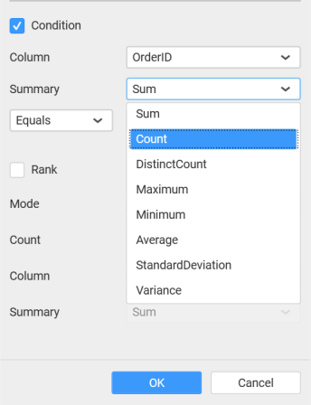

Select the `Rank` option to enable filters and select the `Mode` as either top or bottom.

You can change the `Count` value to filter the top elements and change the column and summary type as required and click `OK` button.

Clear the filters by selecting the `Show All Records` in the `Settings` dropdown menu.

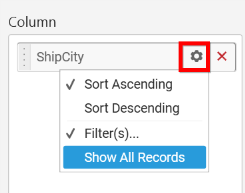

Here is an illustration,

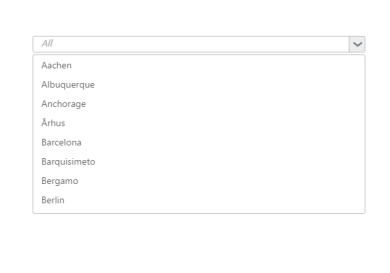

## How to configure the SSAS data to Combo Box?

Following steps illustrates configuration of SSAS data to Combo Box.

Drag and drop `ComboBox` widget from the Toolbox into design panel and resize into your required size. You can find widget in Toolbox by search.

 
Select the dropped widget using mouse and click the `Assign Data` button at Design Tools Pane to open the Data configuration pane.

 
Drag and drop a dimension level or hierarchy column under `Dimensions` category into `Column` section.

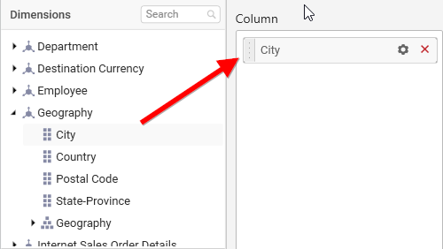
 
Define filter criteria through `Filter(s)…` menu item in the Settings drop down menu.

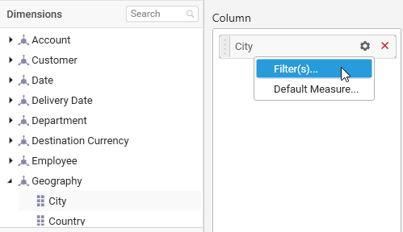

To know more about filters, refer [here](/en-us/dashboard-platform/dashboard-designer/compose-dashboard/configuring-widget-filters). 

Define a `default measure` to the dropped dimension through the `Settings` dropdown menu against which dimension values need to be categorized.

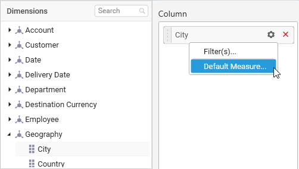

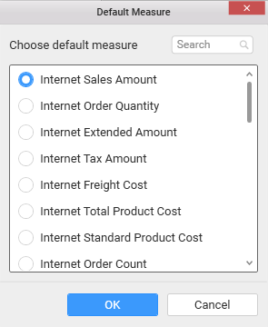 
 
Here is an illustration,
 

## How to format Combo Box?

You can format the combo box for better illustration of the view that you require, through the settings available in `Properties` pane. This pane can be opened from design view through clicking the `Settings` icon at top right corner of the widget.

**General Settings**

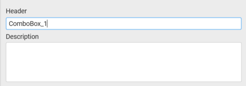

**Header**

This allows you to set title for this combo box widget.

**Description**

This allows you to set description for this combo box widget, whose visibility will be denoted by `i` icon, hovering which will display this description in tooltip.

**Basic Settings**

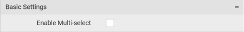

**Enable Multi-select**

This allows you to define single/multiple item selection in dropdown list.

**Single Selection**

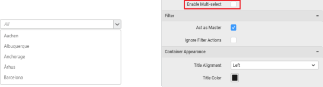

**Multiple Selection**

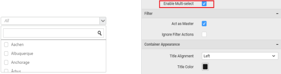

**Filter Settings**

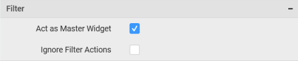

**Act as Master Widget**

This allows you to define this combo box widget as a master widget such that its filter action can be made to listen by other widgets in the dashboard.

**Ignore Filter Actions**

This allows you to define this combo box widget to ignore responding to the filter actions applied on other widgets in dashboard.

**Container Appearance**

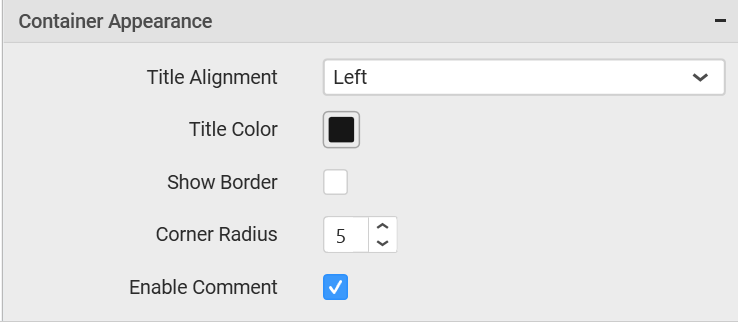

**Title Alignment**

This allows you to handle the alignment of widget title to either left, center or right.

**Title Color**

This allows you to apply text color to the widget title.

**Show Border**

This allows you to toggle the visibility of border surrounding the widget.

**Corner Radius**

This allows you to apply the specified radius to the widget corners. Value can be between 0 and 10.

**Enable Comment**

This allows you to enable/disable comment for dashboard widget. For more details refer [here](/en-us/dashboard-platform/dashboard-designer/compose-dashboard/commenting-dashboard-and-widget)

