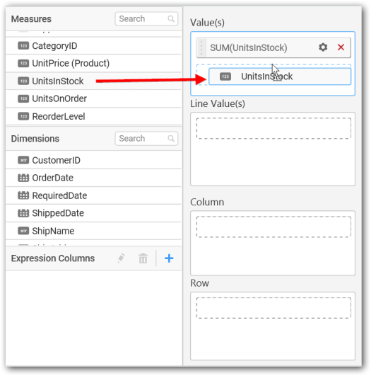
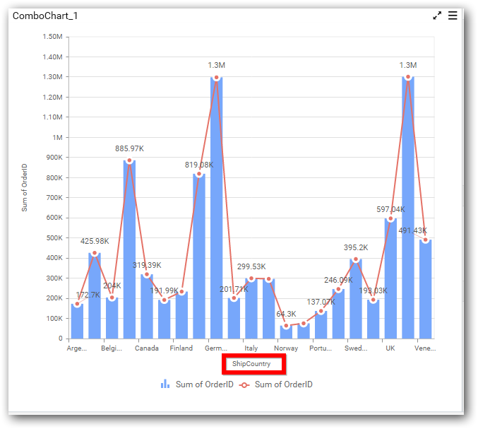
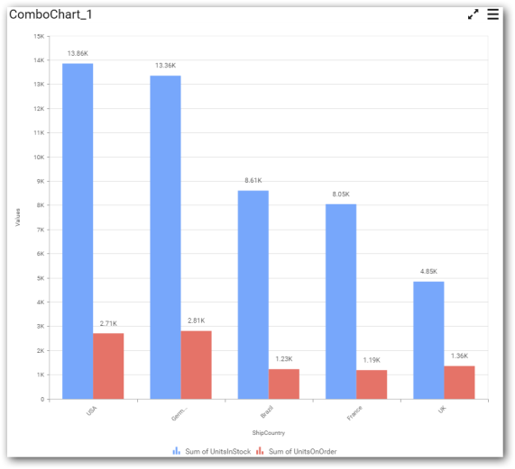
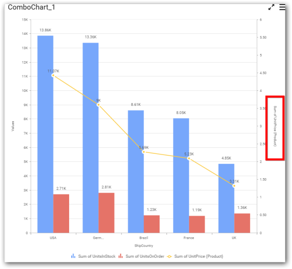

# Combo Chart

Combo Chart allows you to compare values across categories representing different data sets with different chart types and a secondary axis.

## How to configure flat table data to Combo Chart?

To plot a combo chart, a minimum requirement of 1 value or line value and 1 column is needed. Combo charts differ in one case when compared to basic charts, which is, on adding series to Row section, for each distinct value of the series added, one combo chart will get rendered. W.r.t this chart, one additional block `Line Value` will be available in Data pane where we can drop the measure whose type will be line, which need to be compared against.

Follow the steps to configure data to combo chart

Drag and drop the combo chart widget to canvas and resize it to your required size.

Connect to the data source.

Focus on the Combo chart and click on `Assign Data`.

The data pane will be opened with available measures and dimensions from the connected data source.

 **Assigning Value(s)**

Drag and drop the `Measure` into `Value`.

Now the chart will be rendered like this.

You can change the summary type of the value by clicking on `Settings` option.

Select the required summary type from list.

You can select what data to be displayed by choosing filter option.

The `Measure Filter` option will be shown and you can choose the filter condition and apply the condition value.

You can `Clear` the filter.

You can `Format` the value.

The format options will be shown.

Choose the options you need and click `OK`.

Now the Chart will be rendered like this.

You can add more number values by drag drop the `Measures` into `Value` field.

You can also add `Dimensions` and `Columns` to `Value(s)`.

**Assigning Line Value**

You can add the `Measures` into `Line` values.

You can add more than one line values of `Measure` or `Dimension`, the settings are similar to `Value(s)` field.

**Assigning Column(s)** 

You can add the `Dimension` into `Column` field by drag and drop.

You can also add `Measures` and `Expression Columns` into `Column(s)` field.

You have options to change the settings.

You can sort the chart either in `Ascending` or `Descending` series.

**Ascending Order:**

**Descending order:**

You can apply a filter.

Select the `Conditions` and `Rank` you need.

Now the chart will be rendered like this

To show all records again click on `Show All Records`.

**Assigning Row**

You can add `Dimension` into the `Row` field for series chart.

The chart will be rendered in series as shown in the image.

You have `Settings` options similar to `Column(s)`.

## How to configure the SSAS data to Combo Chart?

Following steps illustrates configuration of SSAS data to combo chart

Drag and drop the `Combo Chart` widget to canvas and resize it to your required size.

Select the dropped widget using mouse.
 
Click the `Assign Data` button in the toolbar.

 
A Data pane will be opened with available `Measures` and `Dimensions`.

 
**Assigning Value(s)**

Drag and drop a column under `Measures` category into `Value(s)` section.
 

Now the chart will be rendered like this.

Define the filter criteria to match through choosing `Edit` option in `Filter` menu item.

The `Measure filter` dialog will be shown where you can choose the filter condition and apply the condition value.

 
Select `Clear` option to clear the defined filter.

 

Select `Format` option to define the display format to the values in the column through `Measure Formatting` window.

 

Choose the options you need and click `OK`.
 

Now the Chart will be rendered like this.
 

You can also add more than one column to the `Value(s)` section.

 

**Assigning Line Value**

Add a Measure into `Line Value(s)` section through drag and drop.

  

You can also add more than one column to the `Line Value(s)` section.

**Assigning Column(s)**

Add a dimension level or hierarchy into Column section through drag and drop
 

 

Define filter criteria through `Filter(s)…` menu item in the Settings drop down menu.

 
Select `Filter(s)…` to launch the `Filters` window.
 

Define the filter `Condition` and `Rank` and Click `OK`.

Now the chart will be rendered like this

To show all records again click on `Show All Records`.

**Assigning Row**

You can add a dimension level or hierarchy to `Row` section for series rendering of chart.
 

## How to format Combo Chart?

You can format the combo chart for better illustration of the view that you require, through the settings available in `Properties` pane.

To configure data into combo chart follow the steps

1. Drag and drop the combo chart into canvas and resize it to your required size.

2. Configure the data into combo chart.

3. Focus on the combo chart and Click on Widget Settings.

The property window will be opened.

You can see the list of properties available for the widget with default value.

**General Settings**

**Header**

This allows you to set title for this combo chart widget.

**Description**

This allows you to set description for this combo chart widget, whose visibility will be denoted by `i` icon, hovering which will display this description in tooltip.

**Basic Settings**

**Chart Type**

This allows you to switch the widget view from current chart type to another chart type. To selecting chart type through combo box.

**Enable Animation**

This allows you to enable the series rendering in animated mode.

**Show Data Marker**

This allows you to toggle the visibility of marker from label to adorn each data point in chart series.

**Show Legend**

This allows you to toggle the visibility of legend in chart and also changing the legend text position (selecting through combo box).

Enabling this option of `Custom Legend Text` will allow you to define a custom text (through the text area) to display for each legend series (selecting through the combo box) in chart. 

**Show Value Labels**

This allows you to toggle the visibility of value labels. 

**Value Label Rotation**
 
This allows you to define the rotation angle for the value labels to display.

**Value Labels Suffix**

Allows you to set suffix to the value labels.

**Filter Settings**

**Enable Hierarchical Filtering**

This allows you to define the behavior of top `n` filtering which can be flat or hierarchical.

**Act as Master Widget**

This allows you to define this combo chart widget as a master widget such that its filter action can be made to listen by other widgets in the dashboard.

**Ignore Filter Actions**

This allows you to define this combo chart widget to ignore responding to the filter actions applied on other widgets in dashboard.

**Link Settings**

To configure the linking to URL or dashboard with the widget through its settings. For more details, refer [Linking](/en-us/dashboard-platform/dashboard-designer/compose-dashboard/linking-urls-and-dashboards).

**Container Settings**

**Title Alignment**

This allows you to handle the alignment of widget title to either left, center or right.

**Title Color**

This allows you to apply text color to the widget title.

**Show Border** 

This allows you to toggle the visibility of border surrounding the widget.

**Corner Radius**

This allows you to apply the specified radius to the widget corners. Value can be between 0 and 10.

**Show Maximize**

This allows you to enable/disable the maximized mode of this combo chart widget. The visibility of the maximize icon in widget header will be defined based on this setting.

**CSV Export**

This allows you to enable/disable the CSV export option for this combo chart widget. Enabling this allows you to export the summarized data of the widget view to CSV format in viewer.

**Excel Export**

This allows you to enable/disable the Excel export option for this combo chart widget. Enabling this allows you to export the summarized data of the widget view to XLSX format in viewer.

**Image Export**

This allows you to enable/disable the image export option for this combo chart widget. Enabling this allows you to export the view of the widget to image format (*.JPG) in viewer.

**Enable Comment**

This allows you to enable/disable comment for dashboard widget. For more details refer [here](/en-us/dashboard-platform/dashboard-designer/compose-dashboard/commenting-dashboard-and-widget)

**Axis Settings**

This section allows you to customize the axis settings in chart.

**Category Axis**

This allows you to enable/edit the option of `Category Axis`. It will reflect in chart area x-axis name. 

**Category Axis Title**

This allows you to toggle the visibility of Category axis title.

**Primary X-Axis Label Trim**

This allow you to enable the label trimming in chart area x-axis label.

**Label Rotation**

This allows you to define the rotation angle for the category axis labels to display.

**Primary Value Axis**

This allows you to enable/edit the option of `Primary Value Axis` title. It will reflect in chart area y-axis name.  

**Primary Value Axis Title**

This allows you to toggle the visibility of primary value axis title.

**Secondary Value Axis**

This allows you to enable/edit the `Secondary Value Axis` title. It will reflect in chart area secondary y-axis name. 

**Secondary Value Axis Title**

This allows you to toggle the visibility of secondary value axis title.

**Sort Order**

This allows you to define the sort order for each measure column added.

**Grid Line Settings**

**Primary Value Axis**

This allow you to enable the `Primary Value Axis` gridlines for the combo chart.

**Primary Value Axis Line**

**Category Axis**

This allows you to toggle the visibility of `Category Axis` gridlines.

**Secondary Value Axis**

This allow you to toggle the visibility of `Secondary Value Axis` gridlines.

**Trend line Settings** 

You can add trend line to chart based on dropped measure that you select. You can also customize its legend text, line type and line color. Trend line is not visible, by default.

After applying these settings, it will reflect in chart like below. 

You have options to add or delete an added trend line.

