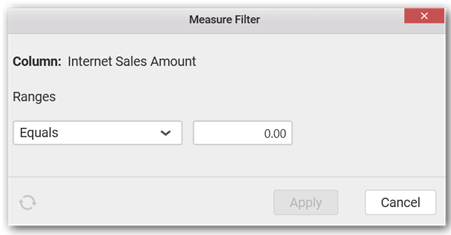
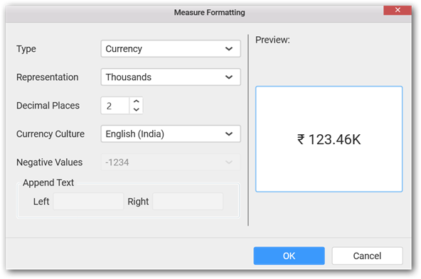
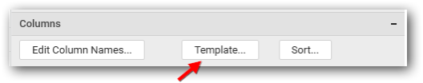
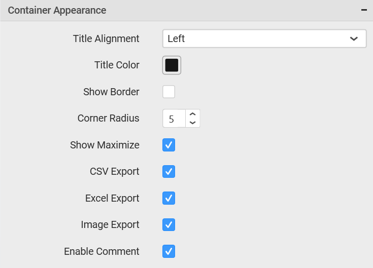

# Grid

Grid allows you to showcase ranking relationship through vertical arrangement of items, ordered from top to bottom. 

## How to configure flat table data to Grid?

To construct a grid, a minimum requirement of 1 column is needed. You can visualize both measure, calculated measure and dimension column data in grid control. You can also add a column that is hidden from the view by adding the column in the hidden columns section. The data of these columns will be hidden from the view but can be used for filtering other widgets in the dashboard.

The following procedure illustrates data configuration of Grid.

Drag and drop `Grid` control icon from the Tool box into design panel. You can find control in Toolbox by search.

After control added in design panel, click `Assign Data` button at Design Tools Pane to open the Data configuration pane.

Bind column through drag and drop element from `Measures` section to `Column(s)` section.

You can drag and drop the elements to `Hidden Columns` if required. Based on the Hidden columns elements the values will be shown in grid widget.

You can use aggregate function to change the column values by clicking the settings.

You can use `Filters` to change the values by selecting the `Edit` option.

You can get the `Measure Filter` window and select the filter condition.

You can clear the filter by clicking the `Clear` option.

You can format the elements by selecting the `Format` option.

`Measure Formatting` window will be shown to change the measure.

Here is an illustration,

## How to configure the SSAS data to Grid?

To construct a grid, a minimum requirement of 1 column is needed. You can visualize both measure, calculated measure and dimension column data in grid control. You can also add a column that is hidden from the view by adding the column in the hidden columns section. The data of these columns will be hidden from the view but can be used for filtering other widgets in the dashboard.

Following steps illustrates configuration of SSAS data to Grid.

Drag and drop `Grid` control icon from the Tool box into design panel. You can find control in Toolbox by search.

 
After control added in design panel, click `Assign Data` button at Design Tools Pane to open the Data configuration pane.

 
Drag and drop a column under `Measures` or `Dimensions` category into `Column(s)`

 
Drag and drop the elements to `Hidden Columns` if required. Based on the `Hidden columns` elements the values will be shown in grid widget.

 
Define the filter criteria to match through choosing `Edit` option in `Filter` menu item.

The `Measure filter` dialog will be shown where you can choose the filter condition and apply the condition value.

Select `Clear` option to clear the defined filter.

 

Select `Format` option to define the display format to the values in the column through `Measure Formatting` window.

 

Choose the options you need and click `OK`.

 
Here is an illustration, 

## How to format Grid Widget?

You can format the Grid for better illustration of the view that you require, through the settings available in `Properties` pane.

**General Settings**

**Header**

This allows you to set title for this Grid widget.

**Description**

This allows you to set description for this Grid widget, whose visibility will be denoted by `i` icon, hovering which will display this description in tooltip.

**Basic Settings**

**Allow Sorting**

You can toggle the interactive sorting of columns in grid control using this. This option is enabled by default.

**Fit To Content**

The columns in the grid can be made to auto size based on the length of the content of the column.

**Horizontal Grid Line**

You can enable/ disable horizontal grid lines in grid control. This option is enabled by default.

**Vertical Grid Line**

You can enable/ disable vertical lines in grid control. This option is enabled by default.

**Column Settings**

The `Template` and `Sort` options will be available only if you have a measure column added in `Column(s)` block.

**Edit Column Names**

This allows you to customize the column names displayed in the grid by navigating to edit columns dialog from property panel. Through `Edit Table Column Names` window, a different name can be set to individual columns.

Once the changes are made, you can save by clicking the `OK` button. 

**Template**

You can define the column value represented as text, bar or condition based coloring. Click Template to launch the Grid Template Column dialog. This lists out the columns added to the grid widget. For each of those columns, the value representation can be configured through options displayed at right.

For measure type column,

For dimension type column,

To define the value representation for a column, select the respective column from the `Columns` list in the left pane and select the display type for the same at right pane.

Select `Value` as display type, to get the column values represented as it is.

Select `Bar` as display type, to get the column values represented as progress bar.

Select `Conditional Formatting` to configure conditions and apply color to the cells based on that.

The `Grid Conditional Formatting` dialog can be opened through clicking the `Edit link` button.

Add one or more conditions through clicking the  icon.

In this dialog, 

**Based On** – Shows added column list out of which a column can be selected over which the condition need to be defined and applied to the column selected for template display.

**Color Settings** – It can be Single Color or Gradient Color. Selecting Single Color will apply the selected color to the rows/column that meets the filter criteria. Selecting Gradient Color will apply the selected palette to the rows/column that meets the filter criteria.

**Formatting Type** – It can be Row or Column which need to be applied with the formatting.

**Column Formatted Grid**

**Row Formatted Grid**

There is one more formatting type `Indication`. This type will be visible only when `Gradient Color` is selected. Selecting this type, will add a new column with indicator.

**Condition Type** – The compare operator can be set to compare values against.

Other font settings like color, style can be set. 

Click `OK` to save the condition. You can also edit an already added condition through selecting the respective condition and click the Edit icon highlighted below.

**Sorting**

You can sort the content in grid control based on the measure fields added by navigating to `Grid Sort Settings` dialog through`Sort` button click. The grid data can be sorted based on a single measure column only at a time.

**Key Performance Indicator (KPI)**

You can add Key Performance Indicator (KPI) columns in grid control by navigating to `KPI Expression` window by clicking `Add KPI` button from property panel at top. 

From the `KPI Expression` dialog, you can specify the column whose values need to be considered as actual value and the column that need to be considered as Target. The value type can be set based on which the KPI will be calculated. The following value types are available. 

* Actual Variation (Default)

* Actual Value

* Percentage of variation

* Percentage of target

* Value and Percentage

The `Result` can be set to showcase the result as gain or loss based on which the value will be visualized. You can choose the type as value or graphical bar to showcase the data in the column. 

The KPI column can be filtered based on the measure values bind to the KPI. You can set measure filter by clicking the filter icon button, which will open the `Measure Filter` dialog from where you can specify the column and the condition for filtering the data showcased. 

The values showcased in KPI column can be formatted just like any other measure column. You can open the `Measure Formatting` dialog box by clicking the Format KPI Column button. This allows you to handle different formatting options like display type, representation, decimal places and currency culture to the respective KPI column added.

You can Edit KPI column by clicking the `Edit KPI column` icon.

You can delete KPI column by clicking the `Delete KPI` column.

**Filter Settings**

**Allow Filter**

This allows you to enable a filter box for each column in the grid for easy filtering of data through this option.

**Enable Hierarchical Filtering**

Through this option, you can enable/disable hierarchical top `N` filtering. While applying Top N filter with multiple dimension columns, the data returned can be customized based on whether the filtering need to be done as flat or based on the hierarchy of dimension columns added. 

When `Flat` is set, the least number set as top will be applied for the whole data. When `Hierarchical` is set, the Top N will be applied for each individual column separately based on the number set for each column.

Below example shows data of 3 Country and its 2 Cities where the sales is high.

**Flat Top N**

**Hierarchical Top N**

**Act as Master Widget**

This allows you to define this grid widget as a master widget such that its filter action can be made to listen by other widgets in the dashboard.

**Ignore Filter Actions**

This allows you to define this grid widget to ignore responding to the filter actions applied on other widgets in dashboard.

**Link Settings**

You can enable linking and configure to navigate either to a published dashboard URL or to a general URL with or without parameters. For more details, refer [Linking](/en-us/dashboard-platform/dashboard-designer/compose-dashboard/linking-urls-and-dashboards). 

**Container Appearance**

**Title Alignment**

This allows you to handle the alignment of widget title to either left, center or right.

**Title Color**

This allows you to apply text color to the widget title.

**Show Border**

This allows you to toggle the visibility of border surrounding the widget.

**Corner Radius**

This allows you to apply the specified radius to the widget corners. Value can be between 0 and 10.

**Show Maximize**

This allows you to enable/disable the maximized mode of this grid widget. The visibility of the maximize icon in widget header will be defined based on this setting. Clicking this icon in viewer will show the maximized view of the grid widget.

**CSV Export**

This allows you to enable/disable the CSV export option for this grid widget. Enabling this allows you to export the summarized data of the widget view to CSV format.

**Excel Export**

This allows you to enable/disable the Excel export option for this grid widget. Enabling this allows you to export the summarized data of the widget view to XLSX format.

**Image Export**

This allows you to enable/disable the image export option for this grid widget. Enabling this allows you to export the view of the widget to image format (*.JPG) in viewer.

**Enable Comment**

This allows you to enable/disable comment for dashboard widget. For more details refer [here](/en-us/dashboard-platform/dashboard-designer/compose-dashboard/commenting-dashboard-and-widget)

