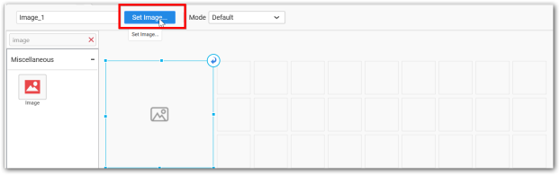
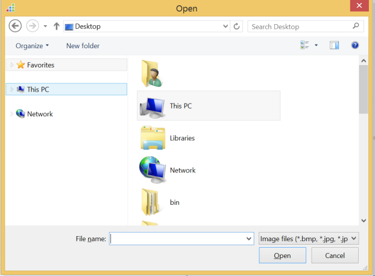
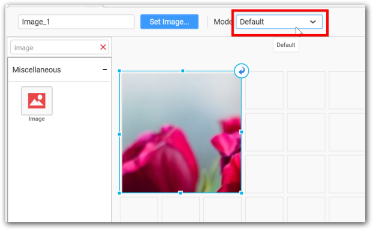
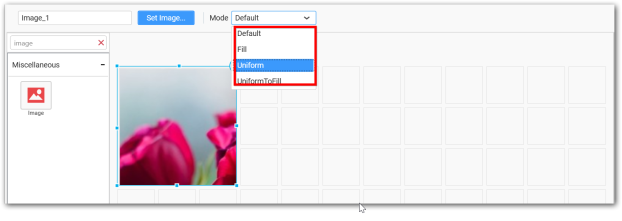
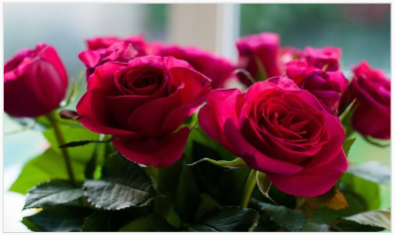
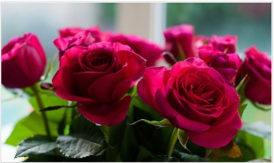
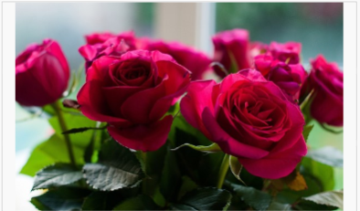

# Image

Image allows you to display a static image within defined mode (default, fill, uniform and uniform to fill). 

## How to configure the data to image widget?

You may add image of supported formats including, BMP, JPG, JPEG, GIF, EMF, JFIF, JPE, PNG, RLE, TIF, TIFF, WMF, DIB, and ICO from your local machine.

The following steps represents to add Image to dashboard.

Drag and drop the image widget into the Canvas.

Focus on the Image widget and Click on Set Image.

The file browser will open.

Select the image and Click on `Open`.

## How to format image widget?

You can customize the image showcase style through `Mode` setting in the Design Tools pane.

Follow the steps to format image widget

Drag and drop the image widget into the Canvas.

Set an image to image widget.

Focus on the Image widget and Click on `Mode`.

Click on the mode that you need to display image.

**Default**

The image will be displayed in its original size.

**Fill**

The image will be filled in the available space.

**Uniform to Fill**

The image will be uniformly occupying the space but gets clipped, if it is larger than control

**Uniform** 

The image sizes proportionally (without clipping) to best fit to the widget area.

