# Label

Label allows you to display value set in rich text format, hyperlinked and through parameter placeholders.

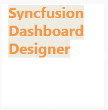

## How to add text and format label?

The following procedure illustrates data configuration of Label.

Drag and drop `Label` control icon from the Tool box into design panel. You can find control in Toolbox by search.

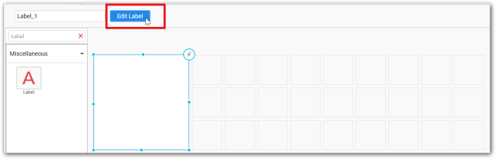

After control added in design panel, you can click edit icon at top right corner/ click `Edit Label` in Design Tools pane, to open the label editor.

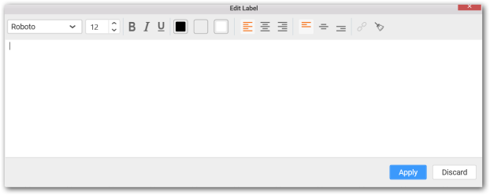

**Font Family Selection**

You can select font family of the text.

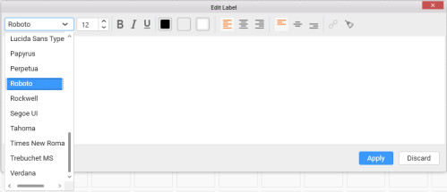

**Emphasis**

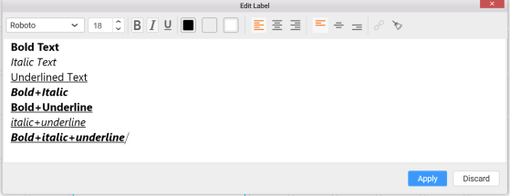

**Font Style Selection**

You can able to change font style of the text.

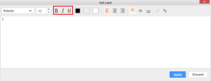

**Color Customization**

You can customize foreground and highlighting color of selected text and Background color of the label editor.

**Foreground Color of label**

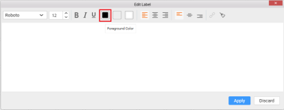

**Highlight Color of label**

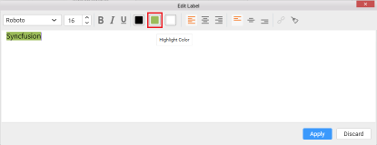

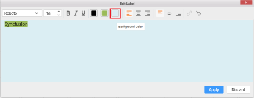

**Text Alignment**

You can change vertical and horizontal alignment of the text.

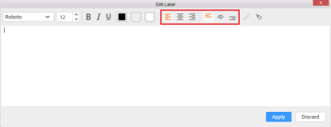

**Hyperlink**

The following procedure illustrates how to add hyperlink.

Add and select the URL link, `Add Hyperlink` option should be enabled.

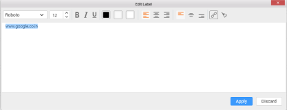

Click the option, you can customize hyperlink settings.

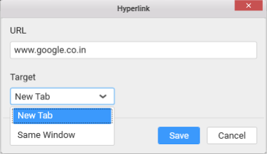

To remove hyperlink, click `Remove Hyperlink` which will be shown after adding hyperlink.

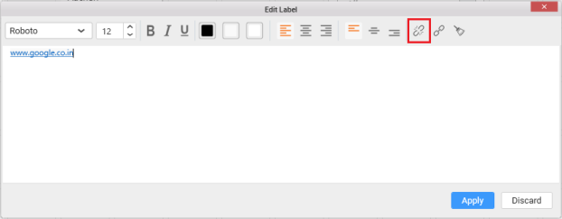

**Reset Formatting**

You can reset all the format settings applied to the text.

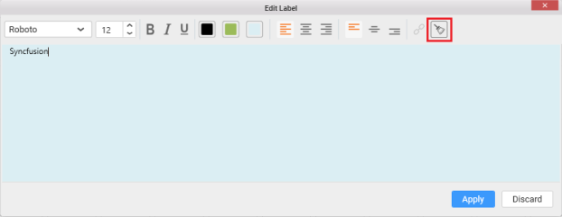

