# List Box

List Box enables you to filter based on single or multiple items selection in a list. To configure a list box, a minimum requirement of 1 column is needed.

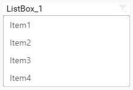

## How to configure the flat table data to ListBox?

The following procedure illustrates data configuration of ListBox.

Drag and drop `List Box` control icon from the Tool box into design panel. You can find control in Toolbox by search. 

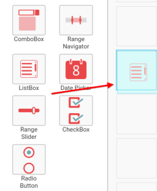

After control added in design panel, click `Assign Data` button at Design Tools Pane to open the Data configuration pane.

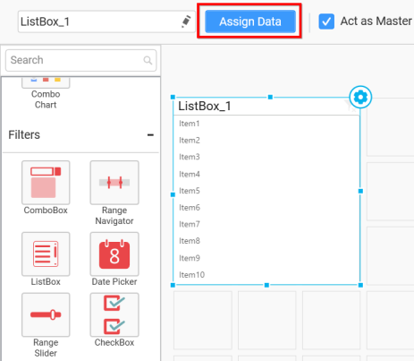

Bind column through drag and drop element from sections to `Column` section.

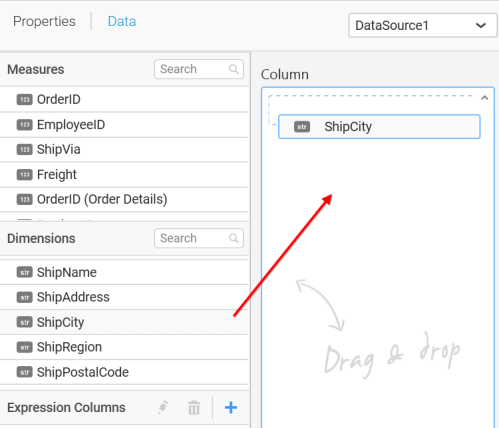

You can select the settings to sort the data either `Ascending` or `Descending`.

You can use the filters by selecting the `Filter(s)…` option to rank the elements.

You can select the specific city to filter the element and `CheckAll` is used either to check all the data or to select the specific data. `Include` and `Exclude` is used to include and exclude the elements by selecting the radio button and click the `Apply` button.

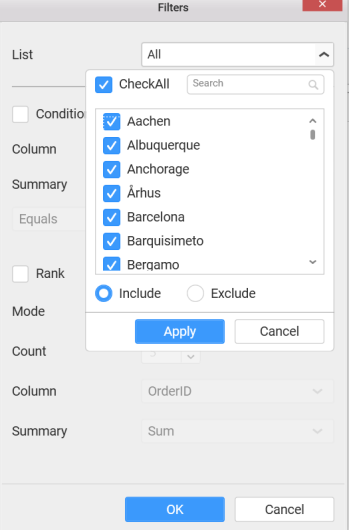

You can select the `Condition` option to change the `Column` elements and `Summary` type by selecting the required column name and summary type.

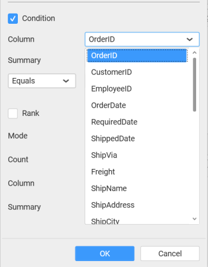

You can select the `Rank` option to enable filters and select the `Mode` either top or bottom.

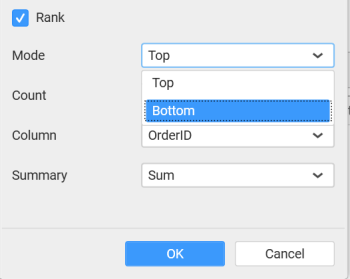

You can change the `Count` value to filter the top elements and change the column and summary type as required and click `OK` button.

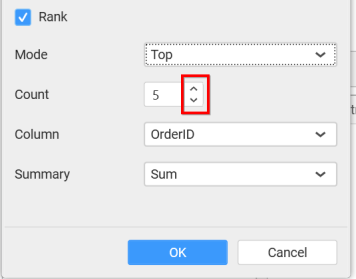

You can clear the filters by selecting the `Show All Records` option.

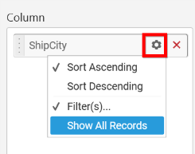

Here is an illustration,

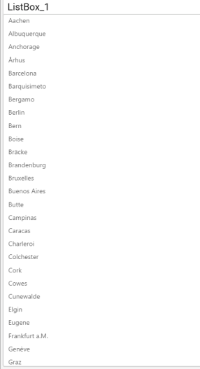

## How to configure the SSAS data to ListBox?

Following steps illustrates configuration of SSAS data to `List Box`.

Drag and drop `ListBox` control icon from the Tool box into design panel. You can find control in Toolbox by search.

After control added in design panel, click `Assign Data` button at Design Tools Pane to open the Data configuration pane.

Drag and drop a dimension level or hierarchy under Dimensions category into `Column`.

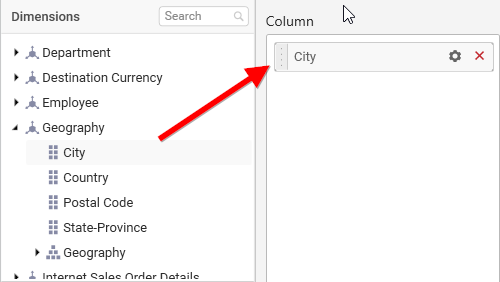

Define filter criteria through `Filter(s)…` menu item in the Settings drop down menu.

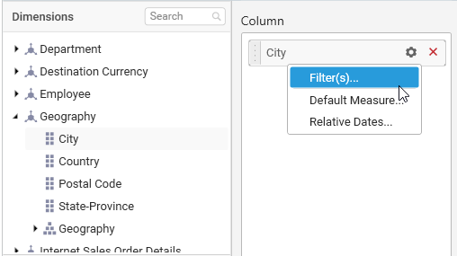

To know more about `filters`, refer [here](/en-us/dashboard-platform/dashboard-designer/compose-dashboard/configuring-widget-filters) 

Define default measure to the dropped dimension through `Default Measure` menu item to retrieve exact result for that dimension.

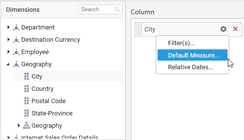

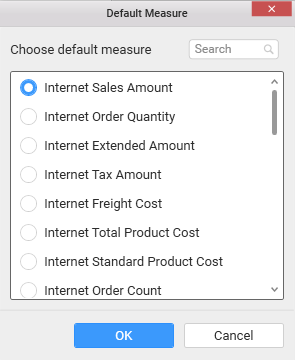

Here is an illustration,

## How to format ListBox?

You can format the List box for better illustration of the view that you require, through the settings available in `Properties` pane. This pane can be opened from design view through clicking the `Settings` icon at top right corner of the widget.

**General Settings**

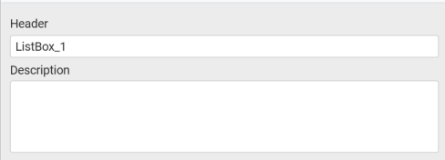

**Header**

This allows you to set title for this list box widget.

**Description**

This allows you to set description for this list box widget, whose visibility will be denoted by `i` icon, hovering which will display this description in tooltip.

**Basic Settings**

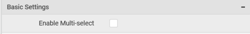

**Enable Multi-select**

This allows you to define single/multiple item selection in List Box.

**Single Selection**

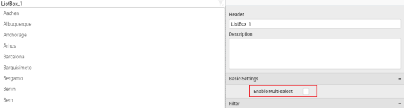

**Multiple Selection**

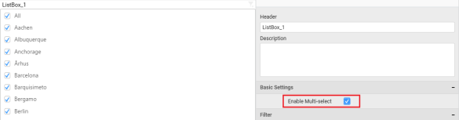

**Filter Settings**

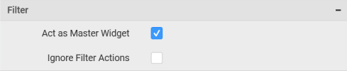

**Act as Master Widget**

This allows you to define this list box widget as a master widget such that its filter action can be made to listen by other widgets in the dashboard.

**Ignore Filter Actions**

This allows you to define this list box widget to ignore responding to the filter actions applied on other widgets in dashboard.

**Container Appearance**

**Title Alignment**

This allows you to handle the alignment of widget title to either left, center or right.

**Title Color**

This allows you to apply text color to the widget title.

**Show Border**

This allows you to toggle the visibility of border surrounding the widget.

**Corner Radius**

This allows you to apply the specified radius to the widget corners. Value can be between 0 and 10.

**Enable Comment**

This allows you to enable/disable comment for dashboard widget. For more details refer [here](/en-us/dashboard-platform/dashboard-designer/compose-dashboard/commenting-dashboard-and-widget)

