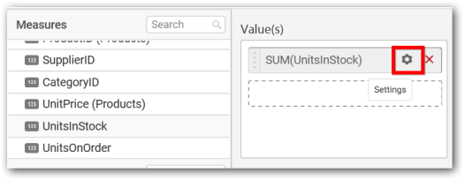
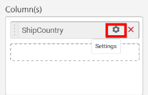
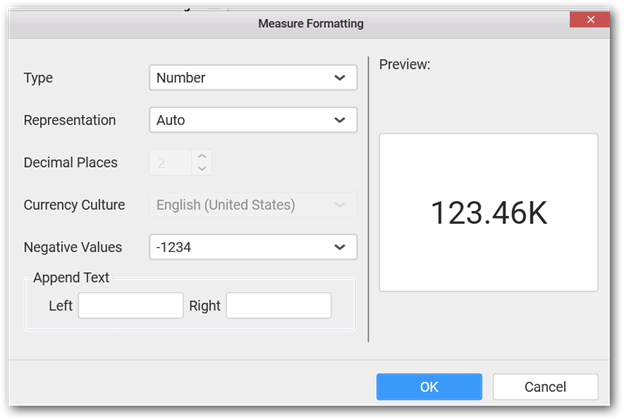
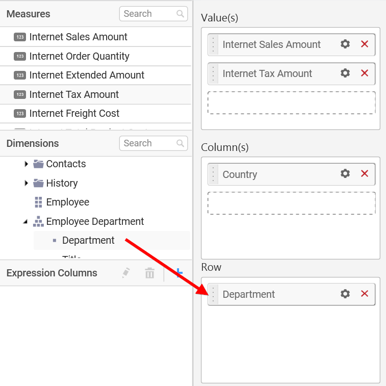
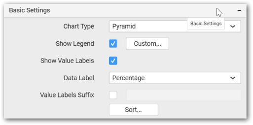

# Pyramid Chart

Pyramid Chart allows you to make proportional comparison between values showcased as progressively increasing manner. To plot a pyramid chart, a minimum requirement of 1 value and 1 column is needed.

## How to configure the flat table data to Pyramid Chart?

Pyramid Chart need a minimum of 1 value element and 1 column element to showcase. The measure or expression field that you would like to analyze can be dropped into Value(s) block. The dimension that you would like to categorize the measure, can be dropped onto Column block. If you would like to categorize based on a series, then the respective dimension can be dropped onto Row block in addition. 

To configure data into pyramid chart follow the steps

Drag and drop the `Pyramid` chart into canvas and resize it to your required size.

Connect to the Data source.

Focus on the dropped chart and Click on `Assign Data`.

The following data pane will appear with available `Measures` and `Dimensions` from the connected data source.

You can add the required data from `Measures` and `Dimensions` into required field. You can also create `Expression Columns` using Expression Designer.

**Adding Value(s)**

You can add `Measures` into `Value(s)` field by drag and drop the required measure.

Now the Pyramid chart will be rendered like this

You can change the settings option.

You can select the required summary type from the available summary types shown in settings.

You can filter the data to be displayed in pyramid chart by using `Filter` option.

When you click the `Measure Filter` option will appear.

You can select the `Condition` to be applied in the shown list box and set the value in text box.

Click on `Apply` to see the changes.

You have option to clear the applied filter. Click on clear to remove the filters

You can format the data to be displayed in the Pyramid chart by using format option.

The `Measure Formatting` dialog will be shown, select the format that you want and click `OK`.

To remove the added value fields click on `x` button.

You can add multiple `Measures` into `Value(s)`.

You can also drag and drop `Dimension` and `Expression Column` into `Value(s)`.

**Adding Column(s)**

Drag and drop the `Dimensions` into `Column(s)`.

Pyramid chart will be rendered like this

You can add more than one value into `Column(s)` field.

The following message will open

To enable drill down click `Yes`. 

The drilled view of the chart region selected.

To continue without drill down click `NO`.

The old column value will be replaced by new column value

You can change the settings.

You can apply filters by selecting filter in settings.

N> Filter will be set by default for top 5 records.

The filters option will open.

Select the needed `Conditions` and `Rank` and then click `OK`.

Similarly you can add the `Measures` and `Expression Columns` into `Column` field.

**Adding Row**

You can drag and drop the `Measure` or `Dimension` into the `Row` field.

This will render pyramid chart in series.

Scroll to see all charts  

## How to configure SSAS Data to Pyramid Chart?

Pyramid Chart need a minimum of 1 value element and 1 column element to showcase. The measure or expression field that you would like to analyze can be dropped into Value(s) block. The dimension that you would like to categorize the measure, can be dropped onto Column block. If you would like to categorize based on a series, then the respective dimension can be dropped onto Row block in addition.

Following steps illustrates configuration of SSAS data to Pyramid Chart.

Drag and drop the `Pyramid` chart into canvas and resize it to your required size.

Select the dropped widget using mouse.

Click the `Assign Data` button in the toolbar.

A Data pane will be opened with available `Measures` and `Dimensions`.

**Assigning Value(s)**

Drag and drop a column under `Measures` category into `Value(s)`.

Now the chart will be rendered like this.

Define the filter criteria to match through choosing `Edit` option in `Filter` menu item.

The `Measure filter` dialog will be shown where you can choose the filter `condition` and apply the condition `value`.

Select `Clear` option to clear the defined filter.

Select `Format` option to define the display format to the values in the column through `Measure Formatting` window.

Choose the options you need and click `OK`.

Now the Chart will be rendered like this.

You can also add more than one column to the `Value(s)`.

**Assigning Column(s)**

Add a dimension level or hierarchy into `Column(s)` section through drag and drop.

You may also add more than one column into `Column(s)` section.
In that case, you will be prompted with a message like below, asking for confirmation to enable drilling across the levels.

Select `Yes` to `enable drill` option in chart. Select `No`  to replace the existing column with this one in the `Column(s)` section.

Click the respective data value marker in chart to drill into its inner level.

The drilled view of the chart is follows.

Define filter criteria through `Filter(s)…` menu item in the Settings drop down menu.

Select `Filter(s)…` to launch the `Filters` window.

Define the filter `condition` and `Rank` and Click `OK`.

Now the chart will be rendered like this

To show all records again click on `Show All Records`.

**Assigning Row**

You can add a dimension level or hierarchy to `Row` section for series rendering of chart.

The chart will be rendered in series as shown in the image.

Scroll down to see all charts. 

## How to format Pyramid Chart?

You can format the pyramid chart for better illustration of the view that you require, through the settings available in `Properties` pane.

To configure data into Pyramid chart follow the steps

1. Drag and drop the Pyramid chart into canvas and resize it to your required size.

2. Configure the data into Pyramid chart.

3. Focus on the Pyramid chart and Click on Widget Settings.

The property window will be opened.

You can see the list of properties available for the widget with default value.

**General Settings**

**Header**

This allows you to set title for this pyramid chart widget.

**Description**

This allows you to set description for this pyramid chart widget, whose visibility will be denoted by `i` icon, hovering which will display this description in tooltip.

**Basic Settings**

**Chart Type**

This allows you to switch the widget view from current chart type to another chart type.

**Enable Animation**

This allows you to enable the series rendering in animated mode.

**Enable Drill Down**

This allows you to add more than one dimension element to the `Column` block in Data Pane of Widget View such that, those form an hierarchy and each of its level can be navigated through clicking the respective series drawn. In its disabled state, trying to add more than one element will replace the existing one.

**Initial View**

**Drilled View**

**Show Legend**

This allows you to toggle the visibility of legend in chart and also change the legend text position (selecting through combo box).

Enabling this option of **Custom Legend Text** will allow you to define a custom text (through the text area) to display for each legend series (selecting through the combo box) in chart. 

**Show Value Labels**

This allows you to toggle the visibility of value labels. 

**Data Label Value**

This allows you to define the display format either as value or as percentage.

**Percentage**

**Value Labels Suffix**

Allows you to set suffix to the value labels.

Filter Settings

**Enable Hierarchical Filtering**

This allows you to define the behavior of top `n` filtering which can be flat or hierarchical.

**Act as Master Widget**

This allows you to define this pyramid chart widget as a master widget such that its filter action can be made to listen by other widgets in the dashboard.

**Ignore Filter Actions**

This allows you to define this pyramid chart widget to ignore responding to the filter actions applied on other widgets in dashboard.

**Link Settings**

To configure the linking to URL or dashboard with the widget through its settings. For more details, refer [Linking](/en-us/dashboard-platform/dashboard-designer/compose-dashboard/linking-urls-and-dashboards).

**Container Settings**

**Title Alignment**

This allows you to handle the alignment of widget title to either left, center or right.

**Title Color**

This allows you to apply text color to the widget title.

**Show Border**

This allows you to toggle the visibility of border surrounding the widget.

**Corner Radius**

This allows you to apply the specified radius to the widget corners. Value can be between 0 and 10.

**Show Maximize**

This allows you to enable/disable the maximized mode of this pyramid chart widget. The visibility of the maximize icon in widget header will be defined based on this setting in viewer.

**CSV Export**

This allows you to enable/disable the CSV export option for this pyramid chart widget. Enabling this allows you to export the summarized data of the widget view to CSV format in viewer.

**Excel Export**

This allows you to enable/disable the Excel export option for this pyramid chart widget. Enabling this allows you to export the summarized data of the widget view to XLSX format in viewer.

**Image Export**

This allows you to enable/disable the image export option for this pyramid chart widget. Enabling this allows you to export the view of the widget to image format (*.JPG) in viewer.

**Enable Comment**

This allows you to enable/disable comment for dashboard widget. For more details refer [here](/en-us/dashboard-platform/dashboard-designer/compose-dashboard/commenting-dashboard-and-widget)

