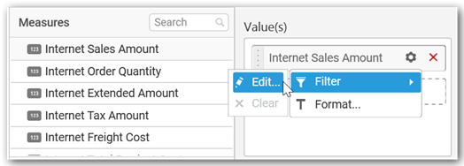

# Radial Gauge

Radial Gauge allows you to measure processing efficiency through key performance indicators like Value and Goal. To showcase a radial gauge, a minimum requirement of 1 actual or target value is needed.

## How to configure flat table data to Radial Gauge?

To construct a radial gauge, a minimum requirement of 1 column is needed. You can visualize both measure, calculated measure and dimension column data in radial gauge control.

The following procedure illustrates data configuration of Radial Gauge.

Drag and drop `Radial Gauge` control icon from the Tool box into design panel. You can find control in Toolbox by search.

After control added in design panel, click **Assign Data** button at Design Tools Pane to open the Data configuration pane.

Bind column through drag and drop element from `Measures` section to `Actual Value`.

Drag and Drop the elements from section to `Target Value`.

You can use aggregate function to change the `Actual Value` of the radial gauge widget.

You can use `Filter` option to filter the data by specifying the filter condition.

`Measure Filter` will be shown to set the `Ranges`.

You can clear the filter by selecting the `Clear` option.

You can format the elements by selecting the `Format` option.

`Measure Formatting` window will be shown to change the measure.

You can change the `Target Value` by changing the settings.

`Filters` can be applied to the `Target Value` by changing the filter condition.

You can clear the filter by selecting the `Clear` option.

Drag and Drop the elements from sections to `Series`.

Here, is an illustration

## How to configure the SSAS data to Radial Gauge?

To construct a radial gauge, a minimum requirement of 1 column is needed. You can visualize both measure, calculated measure and dimension column data in radial gauge control.

Following steps illustrates configuration of SSAS data to Radial Gauge.

Drag and drop `Radial Gauge` control icon from the Tool box into design panel. You can find control in Toolbox by search.

 
After control added in design panel, click `Assign Data` button at Design Tools Pane to open the Data configuration pane.

 
Drag and drop a column under `Measures` category into `Actual Value`.

 
Drag and drop a column under `Measures` category into `Target Value`.

 
Define the filter criteria to match through choosing `Edit` option in `Filter` menu item.

 
The `Measure filter` dialog will be shown where you can choose the filter condition and apply the condition value.

Select `Clear` option to clear the defined filter.
 

Select `Format` option to define the display format to the values in the column through `Measure Formatting` window.

 

Choose the options you need and click `OK`.

 
Add a dimension level or hierarchy into `Series` section through drag and drop.

Define filter criteria through `Filter(s)…` menu item in the `Settings` drop down menu.
 

To know more about filters, refer [here](/en-us/dashboard-platform/dashboard-designer/compose-dashboard/configuring-widget-filters).

Here, is an illustration

## How to format Radial Gauge?

You can format the radial gauge for better illustration of the view that you require, through the settings available in `Properties` pane.

**General Settings**

**Header**

This allows you to set the container header text.

**Description**

This allows you to set description for this radial gauge widget, whose visibility will be denoted by `i` icon, hovering which will display this description in tooltip.

**Basic Settings**

**Range Color** setting allows you to customize the range color of Gauge widget. Click the color to drop down the list of palette colors and select one to apply to the range.

**Custom Range** setting allows you to customize the range start and range end values of Gauge widget. Enable the Minimum and/or Maximum value boxes for editing through selecting respective checkbox.

N> Range Start Value should be always greater than range end value.

**Direction** setting allows you to define the quality of value through specifying whether higher value should be treated as good or bad.

**Filter Settings**

**Act as Master**

This allows you to define this gauge widget as a master widget such that its filter action can be made to listen by other widgets in the dashboard. This option is available only when a column in `Series` section is configured.

**Ignore Filter Actions**

This allows you to define this gauge widget to ignore responding to the filter actions applied on other widgets in dashboard.

**Link Settings**

You can enable linking and configure to navigate either to a published dashboard URL or to a general URL with or without parameters. For more details, refer [Linking](/en-us/dashboard-platform/dashboard-designer/compose-dashboard/linking-urls-and-dashboards). 

**Container Appearance**

**Title Alignment**

This allows you to handle the alignment of widget title to either left, center or right.

**Title Color** 

This allows you to apply text color to the widget title.

**Show Border**

This allows you to toggle the visibility of border surrounding the widget.

**Corner Radius**

This allows you to apply the specified radius to the widget corners. Value can be between 0 and 10.

**Show Maximize**

This allows you to enable/disable the maximized mode of this radial gauge widget. The visibility of the maximize icon in widget header will be defined based on this setting. Clicking this icon in viewer will show the maximized view of the radial gauge widget.

**CSV Export**

This allows you to enable/disable the CSV export option for this radial gauge widget. Enabling this allows you to export the summarized data of the widget view to CSV format.

**Excel Export**

This allows you to enable/disable the Excel export option for this radial gauge widget. Enabling this allows you to export the summarized data of the widget view to XLSX format.

**Image Export**

This allows you to enable/disable the image export option for this radial gauge widget. Enabling this allows you to export the view of the widget to image format (*.JPG) in viewer.

**Enable Comment**

This allows you to enable/disable comment for dashboard widget. For more details refer [here](/en-us/dashboard-platform/dashboard-designer/compose-dashboard/commenting-dashboard-and-widget)

