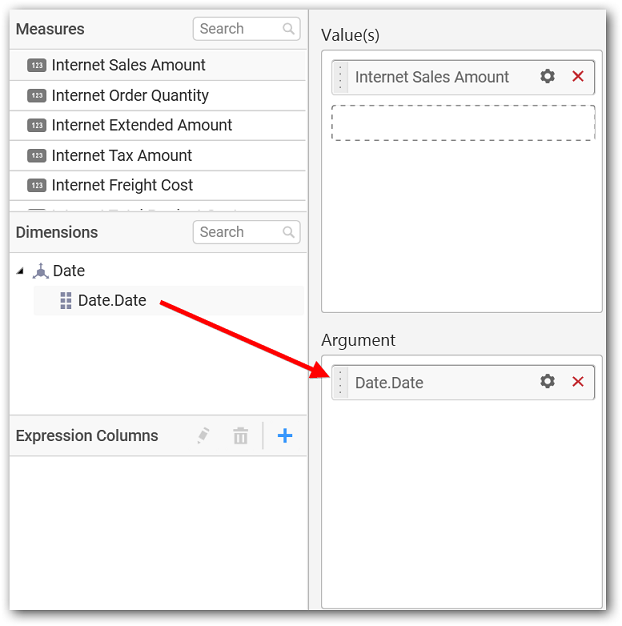

# Range Navigator

Range Navigator allows you to filter based on the date range dynamically set through navigation bars.

## How to configure flat table data to Range Navigator?

The following procedure illustrates data configuration of Range Navigator.

Drag and drop `Range Navigator` control icon from the Tool box into design panel. You can find control in Toolbox by search.

After control added in design panel, click **Assign Data** button at Design Tools Pane to open the Data configuration pane.

Bind a Measure column to `Value` section and a Date type column to `Argument` section.

You can use the aggregation function to change the values of the elements.

You can select the type of Date and Time as required by clicking the `Setting` button.

You can use the `Relative Date Filter` option to filter the `Range` and `Period`.

Select the `Link to specific date` option to select the specific date.

You can use the `Filter(s)…` option to apply the filter condition for date.

Range Filter will be shown to set either the `Range`, `Start Date` or `End Date` and click `Apply`.

**Ranges**

**Start Date**

**End Date**

Here is an illustration,

## How to configure SSAS data to Range Navigator?

Following steps illustrates configuration of SSAS data to Range Navigator.

Drag and drop the `Range Navigator` widget into canvas and resize into your required size.

Select the dropped widget using mouse.

Click the `Assign Data` button in the toolbar.

A Data pane will be opened with available `Measures` and `Dimensions`.

Drag and drop a column under `Measures` category into `Value(s)` section.

Drag and drop a column under `Dimensions` category into `Argument` section.

Define relative date filter criteria through `Relative Date Filter` menu item in the Settings drop down menu.

Select the `Link to specific date` option to select the specific date

 Define filter criteria through `Filter(s)…` menu item in the Settings drop down menu.

 

 Select `Filter(s)…` to launch the `Filters` window.

 set either the `Range`, `Start Date` or `End Date` and click `Apply`.

 **Ranges**
 
 

 **Start Date**

 

**End Date**

 Here is an illustration,

## How to Format Range Navigator widget?

You can format the Range Navigator for better illustration of the view that you require, through the settings available in `Properties` pane.

**General Settings**

**Header**

This allows you to set title for this range navigator widget.

**Description**

This allows you to set description for this range navigator widget, whose visibility will be denoted by `i` icon, hovering which will display this description in tooltip.

**Basic Settings**

**Series Type**

You can change the series type to any chart type to render in range navigator. 

**Filter settings**

**Act as Master Widget**

This allows you to define this range navigator widget as a master widget such that its filter action can be made to listen by other widgets in the dashboard.

**Ignore Filter Options**

This allows you to define this range navigator widget to ignore responding to the filter actions applied on other widgets in dashboard.

**Container Appearance**

**Show Border**

This allows you to toggle the visibility of border surrounding the widget.

**Corner Radius**

This allows you to apply the specified radius to the widget corners. Value can be between 0 and 10.

