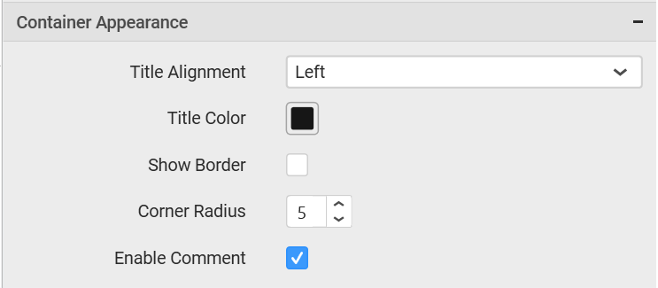

# Range Slider

Range Slider enables you to filter based on value or date range set through sliders. To configure a range slider, a minimum requirement of 1 column is needed.

## How to configure the flat table data to Range Slider?

The following procedure illustrates data configuration of Range Slider.

Drag and drop `Range Slider` control icon from the Tool box into design panel. You can find control in Toolbox by search.

After control added in design panel, click `Assign Data` button at Design Tools Pane to open the Data configuration pane.

Bind column through drag and drop element from sections to `Column` section.

Here is an illustration,

## How to configure the SSAS data to Range Slider?

Following steps illustrates configuration of SSAS data to `Range Slider`.

Drag and drop the `Range Slider`  widget into canvas and resize into your required size.

Select the dropped widget using mouse.

Click the `Assign Data` button in the toolbar.

A Data pane will be opened with available `Measures` and `Dimensions`.

Drag and drop a column into `Column(s)` section.

Select `Format` option to define the display format to the values in the column through `Measure Formatting window`.

The `Measure Formatting` window will open, you can select the values you want and click `ok`

Here is an illustration,

## How to format Range Slider?

You can format the Range Slider for better illustration of the view that you require, through the settings available in `Properties` pane. 

**General Settings**

**Header**

This allows you to set title for this range slider widget.

**Description**

This allows you to set description for this range slider widget, whose visibility will be denoted by `i` icon, hovering which will display this description in tooltip.

**Basic Settings**

**Selection Type**

Single – Single value can be bounded.

**Range Slider with Single Pointer**

Range – A range (two values) can be bounded.

**Range Slider with Range Pointer**

**Filter Settings**

**Act as Master Widget**

This allows you to define this range slider widget as a master widget such that its filter action can be made to listen by other widgets in the dashboard.

**Ignore Filter Actions**

This allows you to define this range slider widget to ignore responding to the filter actions applied on other widgets in dashboard.

**Container Appearance** 

**Title Alignment**

This allows you to handle the alignment of widget title to either left, center or right.

**Title Color**

This allows you to apply text color to the widget title.

**Show Border**

This allows you to toggle the visibility of border surrounding the widget.

**Corner Radius**

This allows you to apply the specified radius to the widget corners. Value can be between 0 and 10.

**Enable Comment**

This allows you to enable/disable comment for dashboard widget. For more details refer [here](/en-us/dashboard-platform/dashboard-designer/compose-dashboard/commenting-dashboard-and-widget)

