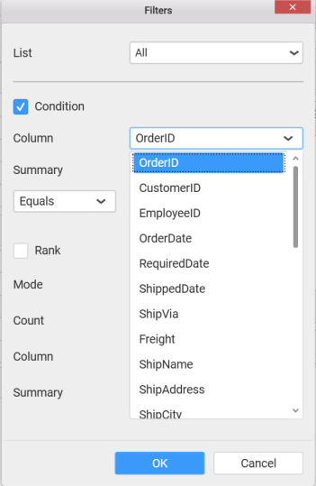
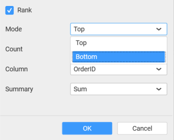

# Tree Map

Tree Map allows you to visualize large data through its proportional shelves and color scales. 

## How to configure flat table data to Tree map widget?

To showcase a tree map, a minimum requirement of 1 value and 1 group by field is needed.

The following procedure illustrates data configuration of Tree Map.

Drag and drop `TreeMap` control icon from the Tool box into design panel. You can find control in Toolbox by search.

After control added in design panel, click **Assign Data** button at Design Tools Pane to open the Data configuration pane.

Bind column through drag and drop element from sections to `Value`.

Drag and Drop the elements from sections to `Group by`.

You can use aggregate function to change the `Value` of the column. 

You can use `Filter` option to filter the data by specifying the filter condition.

`Measure Filter` window will be shown to edit the filter condition.

You can clear filters by selecting the `Clear` option for `Value` section.

You can format the values by selecting the `Format` option.

`Measure Formatting` window will be shown.

You can use the filters by selecting the `Filter(s)…` option to rank to the elements.

You can select the specific city to filter the element and `CheckAll` is used either to check all the data or to select the specific data. `Include` and `Exclude` is used to include and exclude the elements by selecting the radio button and click the `Apply` button.

You can select the `Condition` option to change the `Column` elements and `Summary` type by selecting the required column name and summary type. 

You can select the `Rank` option to enable filters and select the `Mode` either top or bottom.

You can change the `Count` value to filter the top elements and change the column and summary type as required and click `OK` button.

You can clear filters by selecting the `Show All Records`.

Here is an illustration,

## How to configure the SSAS data to Treemap?

To showcase a tree map, a minimum requirement of 1 value and 1 group by field is needed.

Following steps illustrates configuration of SSAS data to Tree map 

Drag and drop the `TreeMap` widget into canvas and resize into your required size.

Select the dropped widget using mouse.

Click the `Assign Data` button in the toolbar.

A Data pane will be opened with available `Measures` and `Dimensions`.

Drag and drop a column under `Measures` category into `Value(s)` section.

Drag and Drop the elements from sections to `Group by`.

Define the filter criteria to match through choosing `Edit` option in `Filter` menu item.

The `Measure filter` dialog will be shown where you can choose the filter condition and apply the condition value.

Select `Clear` option to clear the defined filter.

Select `Format` option to define the display format to the values in the column through `Measure Formatting` window.

Choose the options you need and click `OK`.

Define filter criteria through `Filter(s)…` menu item in the Settings drop down menu.

Select `Filter(s)…` to launch the `Filters` window.

Define the filter `Condition` and `Rank` and Click `OK`..

To show all records again click on `Show All Records`.

Here is an illustration,

## How to format Tree map widget?

You can format the Tree map for better illustration of the view that you require, through the settings available in `Properties` pane.

**General Settings**

**Header**

This allows you to set title for this tree map widget.

**Description**

This allows you to set description for this Tree map widget, whose visibility will be denoted by `i` icon, hovering which will display this description in tooltip.

**Basic Settings**

**Enable Drilldown**

In case of hierarchical view, multiple levels will get rendered in the same view. This can be switched to drill down view through enabling this setting.

**Filter Settings**

**Enable Hierarchical Filtering**

Through this option, you can enable/disable hierarchical Top `N` filtering. While applying Top N filter with multiple dimension columns, the data returned can be customized based on whether the filtering need to be done as flat or based on the hierarchy of dimension columns added. When `Flat` is set, the least number set as top will be applied for the whole data. When `Hierarchical` is set, the Top N will be applied for each individual column separately based on the number set for each column.

Below example shows data of 3 Country and its 2 Cities where the sales is high.

**Flat Top N**

**Hierarchical Top N**

**Act as Master**

This allows you to define this tree map widget as a master widget such that its filter action can be made to listen by other widgets in the dashboard.

**Ignore Filter Action**

This allows you to define this tree map widget to ignore responding to the filter actions applied on other widgets in dashboard.

**Link Settings**

You can enable linking and configure to navigate either to a published dashboard URL or to a general URL with or without parameters. For more details, refer [Linking](/en-us/dashboard-platform/dashboard-designer/compose-dashboard/linking-urls-and-dashboards). 

**Container Appearance**

**Title Alignment**

This allows you to handle the alignment of widget title to either left, center or right.

**Title Color**

This allows you to apply text color to the widget title.

**Show Border**

This allows you to toggle the visibility of border surrounding the widget.

**Corner Radius**

This allows you to apply the specified radius to the widget corners. Value can be between 0 and 10.

**Show Maximize**

This allows you to enable/disable the maximized mode of this tree map widget. The visibility of the maximize icon in widget header will be defined based on this setting. Clicking this icon in viewer will show the maximized view of the tree map widget.

**CSV Export**

This allows you to enable/disable the CSV export option for this tree map widget. Enabling this allows you to export the summarized data of the widget view to CSV format.

**Excel Export**

This allows you to enable/disable the Excel export option for this tree map widget. Enabling this allows you to export the summarized data of the widget view to XLSX format.

**Image Export**

This allows you to enable/disable the image export option for this tree map widget. Enabling this allows you to export the view of the widget to image format (*.JPG) in viewer.

**Enable Comment**

This allows you to enable/disable comment for dashboard widget. For more details refer [here](/en-us/dashboard-platform/dashboard-designer/compose-dashboard/commenting-dashboard-and-widget)

**Range Color Settings**

**Monochromatic**

This allows you to configure a single color palette whose saturation will be varied based on the value density.

**Range Brush Items**

This allows you to configure three different colors that allocates itself to the value range accordingly.

**Low**

Let you choose single color for low values when `Range Brush Items` is selected.

**Middle** 

Let you choose single color for middle values when `Range Brush Items` is selected.

**High**

Let you choose single color for high values when `Range Brush Items` is selected.

