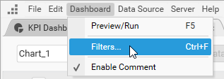
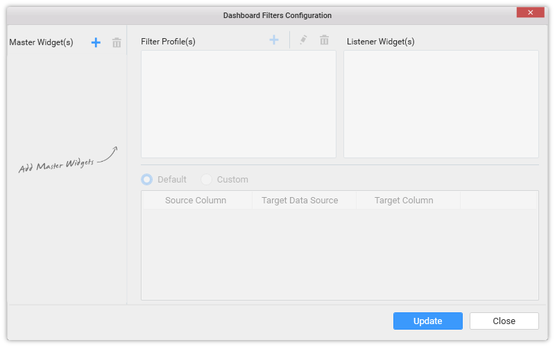
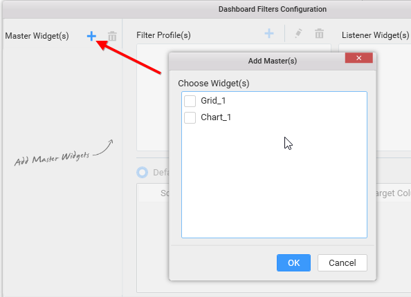
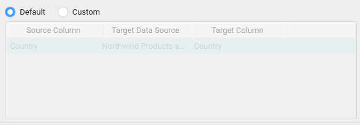
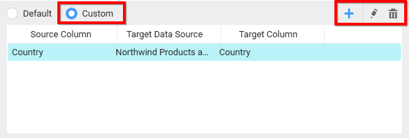
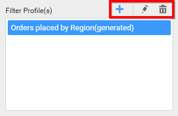
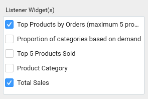
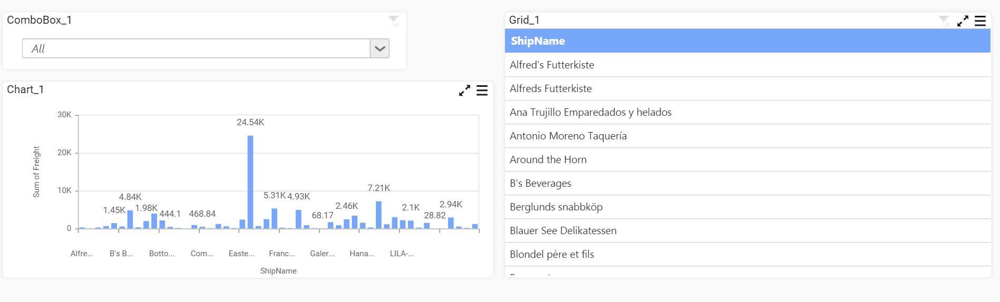
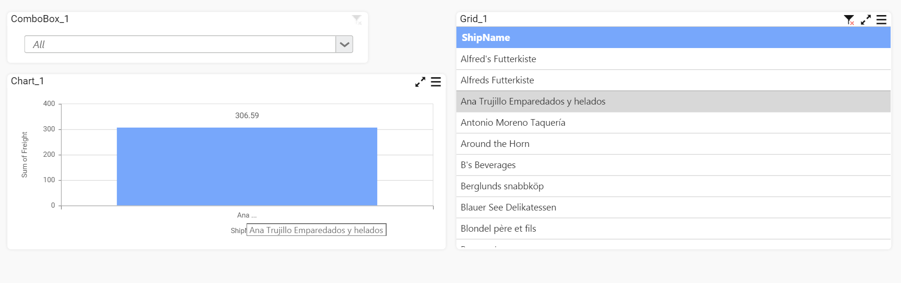
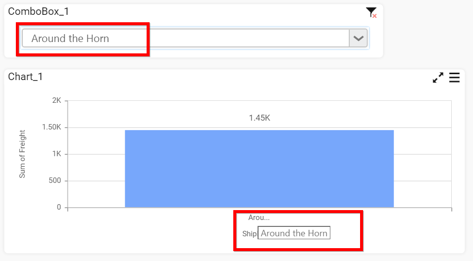

# Configuring Dashboard Filters

Dashboard Filters allows you to control the interdependency of widgets in a dashboard w.r.t dynamic user interactions. 

You can configure the dashboard filters through the `Dashboard Filters Configuration` window launched by selecting the `Filters…` menu item in `Dashboard` main menu.

**Master Widget(s)**

In this window, the Master Widget(s) section holds the names of widgets whose `Act as Master Widget` property setting was enabled. The widget once added under this section, is subjected to have its filter effect on user interaction with it, reacted over the widgets that were marked as listeners to it through Listener Widget(s) section.

You can also add a widget into this section explicitly through `Add` option in the header of this section.

Selecting a widget in this section, will show its associated filter profiles and listener widgets in respective sections, which are customizable.

You can remove a selected widget from the Master Widget(s) section through the `Remove` option in its header.

N> Filter type widgets will get added automatically in this section for user convenience, by default. You can remove it, if not required.

**Filter Profile(s)**
 
Filter Profile(s) section holds a default profile generated automatically for one widget added in Master Widget(s) section. This profile holds the detail about the filter criteria and listener widget(s) to be affected based on that criteria.

Filter criteria can be set through the bottom pane configuration.

This pane holds the detail about the mapping of a column in current data source with the one in target data source, which is same by default, based on which the user interaction filtering works. You can also customize this default filter criteria through switching to `Custom` option, like Add, Edit and Remove.

You can modify the default profile setting or remove the same or add a new profile through respective options in its header.

N> Having more than one filter profile defined for a master widget will have the interaction effect reflected in such a way that, only records that satisfies all those filter criteria defined under those filter profiles will get filtered.

**Listener Widget(s)**

Listener Widget(s) section holds the name list of widgets other than the master widget it was associated with. Select the checkbox near to the respective widget name so as to map it to the respective master widget under the specified filter profile to respond to user interaction in master widget and unselect the one which you don’t want to respond to.

For example, Consider Chart_1 widget is marked as a listener widget to the Grid_1 and ComboBox_1 widgets, Grid_1 widget is marked as listener widget to the ComboBox_1 widget.

While applying filter in the grid widget, the chart widget get filtered based on the filter applied in the grid widget. Now, the chart widget contain the information about the selected ship name in the grid.

Now, on selecting the data in the combo box, the chart widget shows the particular detail. 

