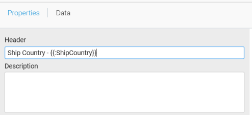
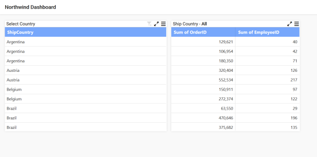
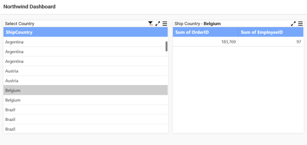
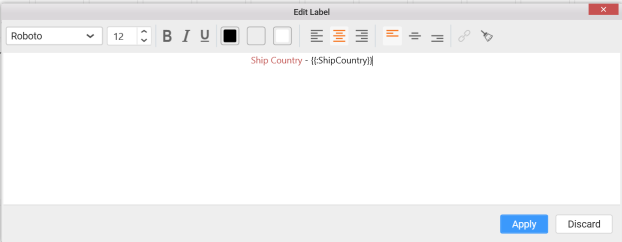
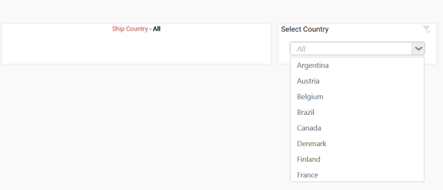
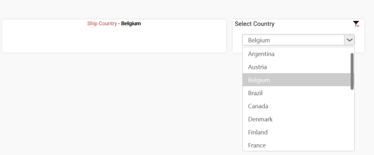
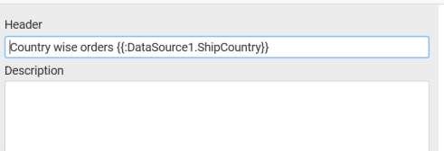
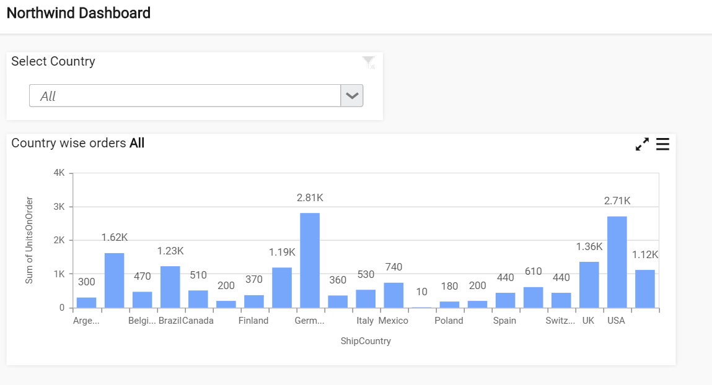
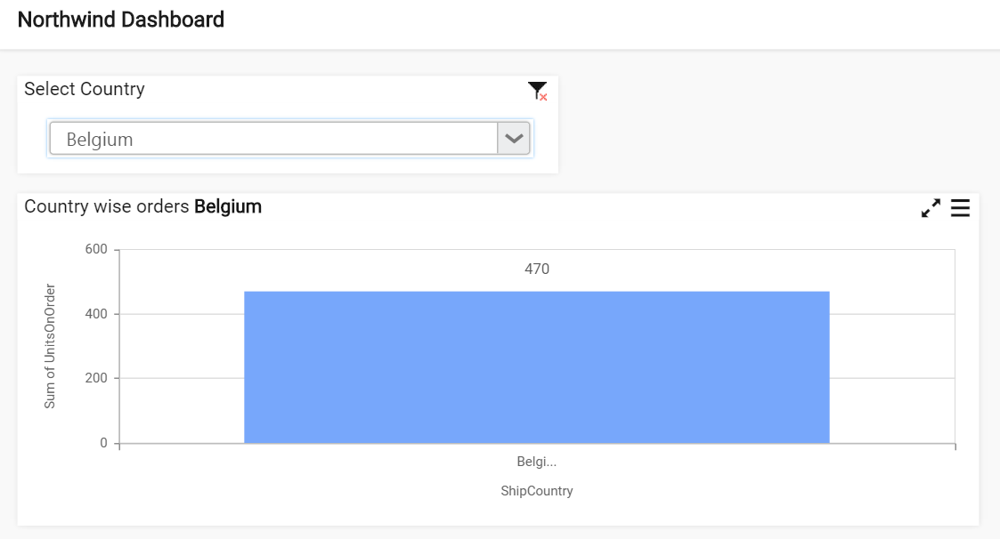

# Configuring Label Parameters

N> `Label` parameters are not supported for SSAS data source currently.

You can configure the label parameters by using the field name in the `Header` section of widget. Use the below format to configure the label parameter. 

**Syntax:** {{"{{"}}:Column_Name{{}}}} **when single data source is present** 

Or

**Syntax:** {{"{{"}}:DataSource_Name.Column_Name{{}}}} **when more than one data source is present**.

For example, The header text of the Grid widget as: Ship Country - {{"{{"}}:ShipCountry{{}}}}.

Now, the dashboard will show the label parameter for all the countries like `Ship Country - All`

You can select the required country to display by selecting the country name in the grid widget. Based on the selected country the values may get displayed on the widget.

You can also use Label widget to configure the Label parameters.

Drag and drop the label widget into the Design pane and click the edit label option to add the label parameters.

While previewing the dashboard, initially the parameter of the ship country will be shown as `All` in the label widget.

While selecting the particular country, it may show that Country name in the label widget.

You can add the Data source before the parameters in `Header` section of properties pane when more than one data source present in the dashboard.

While previewing the dashboard, initially the values of the parameters will be shown as `All`. 

While selecting the particular country, you may show that country name in the widget.

## Functions supported in Label Parameters

You can configure the label parameters using the column name with functions like `Sum, Count, Average, Min, Max, StdDev, Var, Distinct Count, Weighted Score` for numeric values.

For `Date Time` type, the supported functions are `Date, Year, Month, Quarter, Day, Day Month Year, Minutes, Second, Month Year, Date Hour, Day of Week and Week of Year`.

For `Text` type, the supported functions are `Count and Distinct Count`.

Use the below format to configure the label parameter. 

**Syntax:** {{"{{"}}:function(Column_Name){{}}}} **when single data source is present** 

Or

**Syntax:** {{"{{"}}:function(DataSource_Name.Column_Name){{}}}} **when more than one data source is present**.

<table>
<tr>
<th>Functions</th>
<th>Supported Type</th>
<th>Examples</th>
</tr>
<tr>
<td>sum</td>
<td>Numeric</td>
<td>Ship Country : `{{"{{"}}:sum(OrderID){{}}}}`</td>
</tr>
<tr>
<td>Average</td>
<td>Numeric</td>
<td>Ship Country : `{{"{{"}}:avg(OrderID){{}}}}` or `{{"{{"}}:average(OrderID){{}}}}`</td>
</tr>
<tr>
<td>Count</td>
<td>Numeric</td>
<td>Ship Country : `{{"{{"}}:count(ShipCountry){{}}}}`</td>
</tr>
<tr>
<td>Distinct Count</td>
<td>Numeric</td>
<td>Ship Country : `{{"{{"}}:dcount(ShipCountry){{}}}}` or `{{"{{"}}:distinctcount(ShipCountry){{}}}}`</td>
</tr>
<tr>
<td>Standard Deviation</td>
<td>Numeric</td>
<td>Ship Country : `{{"{{"}}:stdev(OrderID){{}}}}`</td>
</tr>
<tr>
<td>Minimum</td>
<td>Numeric</td>
<td>Ship Country : `{{"{{"}}:min(OrderID){{}}}}`</td>
</tr>
<tr>
<td>Maximum</td>
<td>Numeric</td>
<td>Ship Country : `{{"{{"}}:max(OrderID){{}}}}`</td>
</tr>
<tr>
<td>Weighted Score</td>
<td>Numeric</td>
<td>Ship Country : `{{"{{"}}:WeightedAvg([OrderID],[ProductID]){{}}}}`</td>
</tr>
<tr>
<td>Date</td>
<td>Date Time</td>
<td>Shipped Date : `{{"{{"}}:date(ShippedDate){{}}}}`</td>
</tr>
<tr>
<td>Year</td>
<td>Date Time</td>
<td>Shipped Date : `{{"{{"}}:year(ShippedDate){{}}}}`</td>
</tr>
<tr>
<td>Month</td>
<td>Date Time</td>
<td>Shipped Date : `{{"{{"}}:monthname(ShippedDate){{}}}}`</td>
</tr>
<tr>
<td>Quarter</td>
<td>Date Time</td>
<td>Shipped Date : `{{"{{"}}:quarter(ShippedDate){{}}}}`</td>
</tr>
<tr>
<td>Day</td>
<td>Date Time</td>
<td>Shipped Date : `{{"{{"}}:day(ShippedDate){{}}}}`</td>
</tr>
<tr>
<td>Day Month Year</td>
<td>Date Time</td>
<td>Shipped Date : `{{"{{"}}:daymonthyear(ShippedDate){{}}}}`</td>
</tr>
<tr>
<td>Minutes</td>
<td>Date Time</td>
<td>Shipped Date : `{{"{{"}}:minutes(ShippedDate){{}}}}`</td>
</tr>
<tr>
<td>Seconds</td>
<td>Date Time</td>
<td>Shipped Date : `{{"{{"}}:quarteryear(ShippedDate){{}}}}`</td>
</tr>
<tr>
<td>Month Year</td>
<td>Date Time</td>
<td>Shipped Date : `{{"{{"}}:monthyear(ShippedDate){{}}}}`</td>
</tr>
<tr>
<td>Date Hour</td>
<td>Date Time</td>
<td>Shipped Date : `{{"{{"}}:datehour(ShippedDate){{}}}}`</td>
</tr>
<tr>
<td>Day of Week</td>
<td>Date Time</td>
<td>Shipped Date : `{{"{{"}}:dayofweek(ShippedDate){{}}}}`</td>
</tr>
<tr>
<td>Week of Year</td>
<td>Date Time</td>
<td>Shipped Date : `{{"{{"}}:weekofyear(ShippedDate){{}}}}`</td>
</tr>
</table>

N> Function name of label parameters are `case insensitive`.