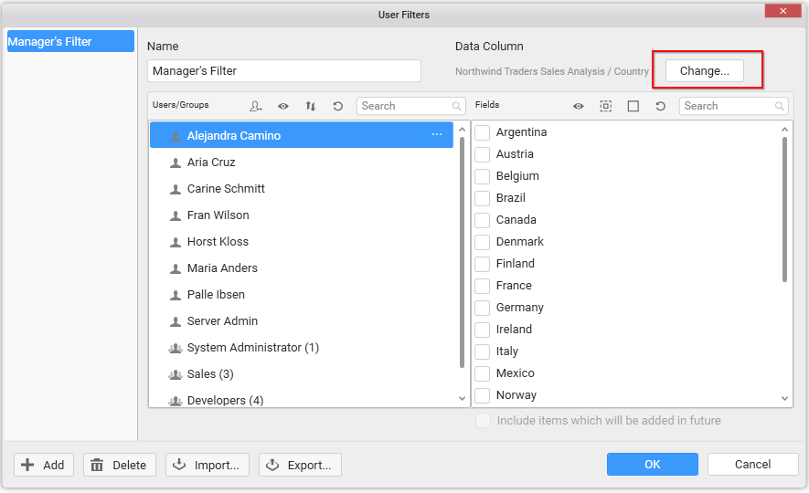
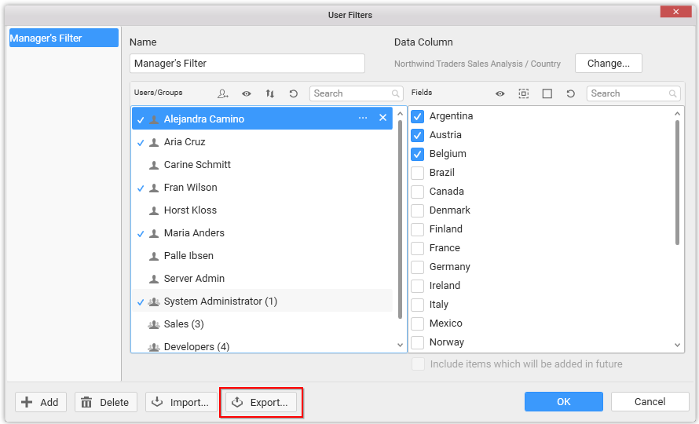

# Configuring User Filter

User Filter allows you to limit the data view of the published dashboard based on the logged in user. For example, in a sales dashboard that gets shared among Managers in different countries, you may want to show only the sales information of US to US Manager, and that of Europe to Europe Manager. In this case, instead of creating separate dashboards for each manager, you can make use of User based filter and define the data that will be available to each of them.

The user information will be referred from Dashboard Server user accounts. Once the dashboard is published to Dashboard Server, the view details in dashboard gets adjusted based on the logged in user.

## How to Create a User Based Filter
 
[Login](/en-us/dashboard-platform/dashboard-designer/sharing-dashboard/connecting-to-a-server) to Syncfusion Dashboard Server from your Syncfusion Dashboard Designer Application.

Navigate to the `Server` menu and select `User Filter…` menu item. Now, the `User Filters` popup window opens like below.

Click `Add` button at the bottom left corner to launch the `Choose Data Column` dialog.

Select a bounded data source in the combo box and choose a column from the list below to it.

I> User Filter will be applied based on the values in this field.

Now, a new user filter gets created with the users/groups registered in the Dashboard Server and the chosen field values get listed out for further configuration.

In the `User Filters` dialog, type in the `Name` field for naming the filter you created.

Select a user or group in the Users/Groups pane.  Then on the right pane, select the value(s) from the fields that the selected user or group is allowed to see. Repeat the process till all users are assigned with the correct set of data.

A search box is provided at top of both Users/Groups and Column values panes, so that you can narrow down the data in the dialog view if there is large number of users and groups or values in the fields, when you are looking for specific ones to configure.

Once completed, click `OK`.

## Previewing User Based Filter Configured Dashboards

When a dashboard opened in Dashboard Designer has user based filter set and is currently logged into Dashboard Server, the preview button in the toolbar will show a split button at right of it. Clicking the split button will drop down `Preview dashboard as` user menu with a drop down list populated with users/groups of the Dashboard Server. This menu will allow the user designing the dashboard to preview which user or group see which view once this dashboard published to respective Dashboard Server, and validate the user filters configured.

Here is the procedure to validate the configured user filters through different user/group preview.

Click the arrow next to Preview button.

Select the user or group from the drop down based on with you need to preview the dashboard.

You can reload the users from the server by clicking the refresh button next to the drop down.

## Changing the Filter Column

You can change the filter column selected while creating a user based filter, by clicking the `Change…` button at the top right corner which is highlighted below.

N> Changing the column will reset the mapping already made.

I> You can add more than one user filter through following the same procedure as discussed above, if you would like to set filter criteria by more than one column.

## Sharing User Filters

Adding same user filter configuration for multiple dashboards provided, they all have identical data sources configured, can be achieved through the export/import options of user filters. Hence, you can reuse the user filter created for one dashboard to other dashboards.

### Exporting User Filters

You can export the user filters created for a dashboard to an XML file and reuse it in another dashboard that has identical data source.  Here is the procedure to achieve the same.

Once a user filter was created, click the `Export` button (highlighted below) at the bottom of the dialog.

Now the `Export` dialog opens.

From the dialog, choose the user filters which you need to export.

Click `Export`. A save dialog will open up, where you can specify the location and name of the file.

### Importing User Filters

You can import already saved user filters in a file through the `Import` dialog. Here is the procedure to achieve the same.

In the `User Filters` dialog, click `Import` button (highlighted below) at the bottom.

Now the `Import` dialog opens.

An open file dialog will pop up. Select the XML file (that holds the user filters previously saved) you need to import and click `Open`.

`Import` dialog opens with the user filters list. Choose the user filters which you need to import and click `Import`.

The selected user filters will get added to the current dashboard.

N> There should be a column with the same name as that of the column used in the user filter being imported. Otherwise, the import will fail.

## Users/Groups Functionalities

### Auto Mapping of Users

When the column chosen for applying user filter contains User Name, Full Name, or Email that matches one in Dashboard Server User Account, you can automatically map corresponding values in both left and right panes in the User Filters dialog without much effort.  Here is the procedure to achieve the same.

Click `Auto User mapping` button at the top of the Users/Groups pane in `User Filters` dialog. 

Select the item from the drop down menu based on the data in the column connected (In this example, we are mapping based on user’s Full Name). 

Now, a message confirmation dialog will get displayed.

Click `Yes` in the prompt window. Now a message box will pop up that showcasing the status of the user mapping.

All the users whose name matches with the value will map automatically.

### Filter
You can filter the users/groups pane based on whether a value is mapped or not using the Filter button at top of it. Click the `Filter` icon and select any of the following values in the drop down menu to filter the users/groups list.

*	All
*	Mapped
*	Unmapped

### Sort

You can toggle the users/groups sorting in the pane by clicking the `Sort` icon. The list can be sorted in ascending or descending order, whose sort order is ascending, by default.

### Refresh

You can reload the user/groups list from server anytime by clicking the `Refresh` icon.

I> The mapping set for users will not be affected when the list is refreshed.

### Search

You can filter the user/groups list based on the user’s name by entering the first few characters of user’s name in the search box at top.

### Remove Mapping

You can remove the mapping made for a user by clicking the `Remove` button next to the user name. This will remove the values bind for the user, and the user will not be able to view any data in the dashboard.

### More Options

You can navigate to additional options available such as copying or merging the mapping already set for one user to another or remove the applied mapping or view the users present in a group, by clicking the more options button. The same options can be accessed via context menu by clicking the right mouse button. 

### How to copy the mapping set for one user to another

You can copy the mapping done for one user to another user(s) or group(s) through the following procedure.

Select the user(s) or group(s) for whom you need to set mapping. Open context menu by clicking the right mouse button.

Click `Copy from…` menu item. Now, `Users/Groups` dialog will open.

Select the user/ group from which the mapping data need to be copied from.

Click `OK` to copy the mapping details.

N> Copying mapped data from another user/group will reset the already mapped data for the selected user. If you need to retain both information you can merge the data using Merge dialog.

## How to merge multiple user(s) or group(s) mapping data to another user(s) or group(s)

You can merge the mapped data of multiple users or groups to another user(s) or group(s) by using the merge option through the following procedure.

Select the user(s) or group(s) for whom you need to set mapping. Open context menu by clicking the right mouse button.

Select `Copy from…` menu item. Now, Users/Groups dialog opens.

Select `Merge` option.

Select the user(s) or group(s) whose mapped data need to be merged to the selected user(s) or group(s).

Click `OK` to complete the merging process.

I> The previously mapped data for the selected user will be maintained when you perform merge operation.

## Column Values Functionalities

### Filter

You can filter the column values based on whether it is checked or not using the Filter button at top of Fields pane. Click the `Filter` icon and select any of the following values in the drop down menu to filter the field values list.

* All
* Checked
* Unchecked

### Check All

Click the `Check All` icon to check all the values in the list. This will allow the mapped user to access all data in the dashboard.

### Uncheck All

Click the `Uncheck All` icon to uncheck all the values in the list. This will restrict the mapped user to access any data in the dashboard. By default,

when a user filter is created for a dashboard, all users will be restricted to view the data in the dashboard unless a value is bind for that user.

### Refresh

You can reload the field values list from database anytime by clicking the `Refresh` icon.

### Search

You can filter the column values list based on the value text by entering the first few characters of value in the search box at top. 

 

