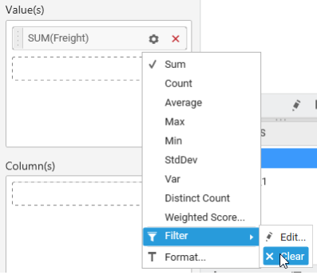
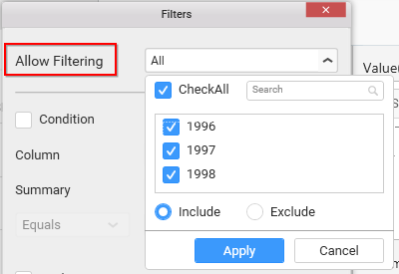

# Configuring Widget Filters

## Configuring Filter for Measure Column

   Filter for measure column can be configured through opening the `Measure Filter` dialog from the `Filter` option in the `Settings` drop down menu.

   

   Measure Filter dialog will open like below on clicking the `Edit…` menu item.

   

   Configure the compare operator and the value to be compared against the selected column values. Click `Apply` to apply the filter settings to the widget. Now, the applied settings get saved. These applied settings will be retained on reopening this dialog.

   Click `Reset` to reset the changes made in the dialog. Doing so, will reset the filter applied to that column before.

   N> `Reset` will be in enabled state only when there was a filter applied already. `Apply` will be in enabled state only when there are pending changes in the dialog to save. 

   

   To clear the filter applied to a measure column, click the `Clear` menu item in the Settings drop down menu. This menu item will be in enabled state only when there was filter configured already to that column.

   

## Configuring Filter for Dimension Column

   Filter for dimension column can be configured through opening the `Filters` dialog from the `Filters…` option in the `Settings` drop down menu.

   

   Filters dialog will open like below.

   

   This dialog consist of three different filters, which can be applied individually or in combined manner.

   **Item-based Filtering**

   Through this filtering, you can filter out the specific items from consideration.

   

   Click the button at right to drop down the list holding the individual values of that column. You can check or uncheck each of those or as a whole (through `CheckAll` option). 

   `Include` and `Exclude` options, lets you choose whether to consider checked items for inclusion or for exclusion in filter respectively.

   The `Search` text box helps you to filter the view in case of larger list and required to search for specific one.

   Click `Apply` to save the changes you made in the filter drop down list.

   Click `Cancel`, if you require to cancel the changes made in the filter drop down list.

   Click `OK` in the Filters dialog to save the changes made w.r.t this item-based filtering.

   Click `Cancel` in the Filters dialog, if required, to ignore the changes made.

   **Condition-based Filtering**

   Through this filtering, you can impose a condition based on which the filter need to be applied. This filtering option is disabled, by default. You can enable it by clicking the `Condition` checkbox. Doing again, will disable it.

   

   Set the column near the `Column` label, by which the filter criteria need to be defined. Set the summary type near `Summary` label, based on which aggregation need to be applied over the selected column. Set the Compare Operator and the value to compare against the column values.

   N> The `Summary` setting is not applicable for widget bounded with SSAS data source.

   Click `OK` in the Filters dialog to save the changes made w.r.t condition-based filtering.

   Click `Cancel` in the Filters dialog, if required, to ignore the changes made.

   **Rank-based Filtering**

   Through this filtering, you can filter top or bottom `n` items based on a different column with the selected aggregated calculation applied. You can enable it by clicking the `Rank` checkbox. Doing again, will disable it.

   

   Set the top or bottom mode to consider, near the `Mode` label. Set the number of records to filter near the `Count` label. Set the column name based on which the filter need to be applied, near the `Column` label. Set the summary type based on which aggregation need to be handled whose output should have been compared with corresponding value in widget bounded data, near the `Summary` label.

   N> The `Summary` setting is not applicable for widget bounded with SSAS data source.

   Click `OK` in the Filters dialog to save the changes made w.r.t rank-based filtering.

   Click `Cancel` in the Filters dialog, if required, to ignore the changes made.

   N> When all these three filters were configured and applied, the records satisfying the criteria of all these filters will be considered by widget into it.

   **Filtering based on Relative Dates**

   This filtering is applicable only for date time type dimension columns. This is an added option for date time columns and hence can be found only for them in `Settings` drop down menu.

   

   Click the `Relative Date Filter…` option in `Settings` drop down menu corresponding to that date time column, to open the `Relative Date Filter` dialog.

   

   This dialog allows you to configure the filter for date time column relatively. i.e. if you configure `Previous 1 week` as filter, it will get you the last 1 week data in that widget. After a week, if you check, it will show you the previous 1 week from the date you are viewing. Through this, you no longer required to set the filter statically and change week by week to see the previous week results.

   In this dialog, set the range you are going to look over through the widget. It may be year, month, week, etc. like below, near the `Range` label.

   

   Set the period you would like to see in the defined range, near the `Period` label like below.

   

   You can even pin the relative date filter to a specific date such that, it will then behave statically like other normal filters. i.e. last 1 month returns the period w.r.t the specific date such that, it always return the data of the same month even after 1 month.

   

   You can see the preview date (highlighted below) in the dialog based on the values you set.

   

   Click `OK` to save the changes and apply the filter.

   Click `Cancel` if required, to ignore the changes made.

