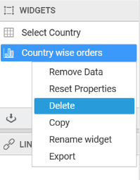
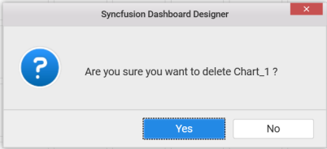
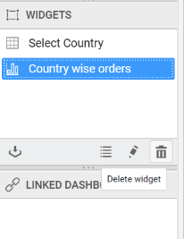

# Deleting a dashboard widget

You can delete a dashboard widget by right click on the widget name in `WIDGETS` pane and select the `Delete` option.

You will get the alert message to delete the widget and click `Yes` button. 

Click `No` if required, not to delete the widget.

You can also delete the widget by clicking the `Delete` Widget icon in `WIDGETS` pane.

You will get the alert message to delete the widget and click `Yes` button. 

