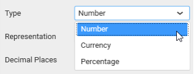
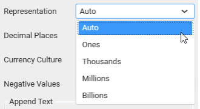
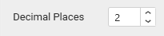
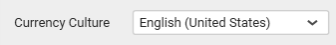
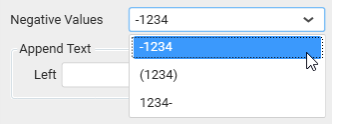
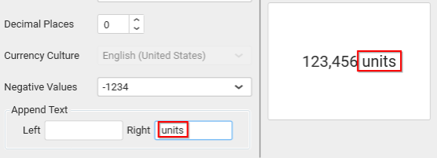
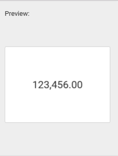

# Formatting Measure Type Column

Measure type column values can be formatted based on the following different options:

**Type**

The measure column values display type can be defined through this based on the data displayed. For example, if you are displaying sales amount column, then type can be defined as `Currency`.

**Representation**

The value display format representation can be defined through this. For example, through selecting Thousands, value 10,000 will be displayed as 10K.

**Decimal Places**

You can set the decimal places explicitly when the Representation was set with options other than `Auto`.

**Currency Culture**

You can set the currency value culture when the value display type was set as `Currency`.

**Negative Values**

You can set the negative value display format for number representation.

**Append Text**

You can append text, character, number or symbol either at start or at the end of the values.

**Preview**

This pane at right of `Measure Formatting` dialog will preview the display value based on the settings you change.

