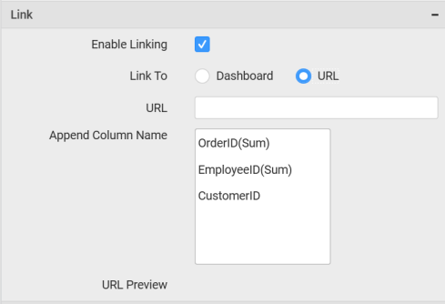
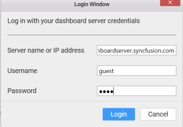

# Linking URLs and Dashboards

You can link the URLs and Dashboards by selecting the `Enable Linking` and select either `Dashboard` or `URL` for linking.

**Dashboard**

Select the Dashboard option and paste the published dashboard HTTP/HTTPS URL.

After giving the dashboard link you will get the `Login Window`. You can provide the server credentials to login and click the `Login` button.

Now, the `Set Parameters…` option will get enable and click on the `Set Parameters...` button.

You will get the Parameter Settings window. You can change the Source Widget and Source Column as required and select the `Reset` button and finally click `OK`.

**URL**

Select the `URL` option and give the URL name based on your requirements and append the column name in that and finally you will get the URL preview binding a particular column value.

For Grid Widget, you may get `URL` based on `Row` and `Column`. Dashboard linking property will be same as explained above.

**Row**

You can add the web `URL` and `Append Column Name` into `URL`. Now, the URL may points to that particular Column name information by clicking the `URL Preview`.

**Column**

You may select the Column and click the `Url Settings` button.

Now, the `Url Settings` wizard may get open.

Now, add the Web `Url` into `ShipName` field and select the column name to append the column name into the link.

Now, the link will be added into the grid widget and then you can select the URL link which you want to refer.

