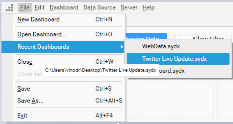

# Recently used Dashboard

You can open the recently opened/created dashboard using `Recent Dashboards` menu option in `File` menu. This list can show up to 10 recently used dashboards. The physical path will be shown in the tooltip for each dashboard.

