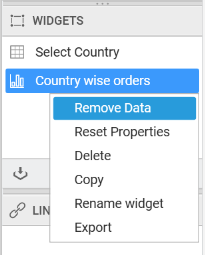

# Removing bounded data

You can remove the data by right click on the widget name in `WIDGETS` pane and select the `Remove Data` option.

You will get the alert message to remove the bounded data and click `Yes` button.

