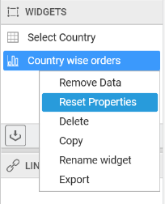
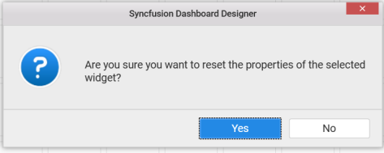

# Resetting the widget properties

You can reset the widget properties by right click on the widget and select the `Reset Properties`.

You will get the alert message to reset the properties of the selected widget and select `Yes` button to reset it.

