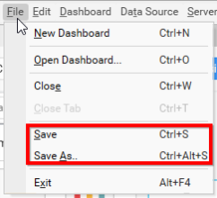

# Saving a Dashboard

Save the newly created dashboard in local or existing dashboard with same or different name in same or different location as SYDX formatted file. This file holds details about dashboard, widget and data source configurations, images, if any bounded to image control from local, map JSON files, if any bounded to map control from local, CSV, Excel or JSON file for file based connection types like CSV, Microsoft Excel and JSON respectively.

Saving operation can be handled through the File Menu items such as, `Save` and `Save As…`

Saving the dashboard for the first time, will prompt the `Save As…` dialog even on clicking the `Save` menu item.

