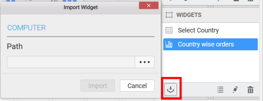
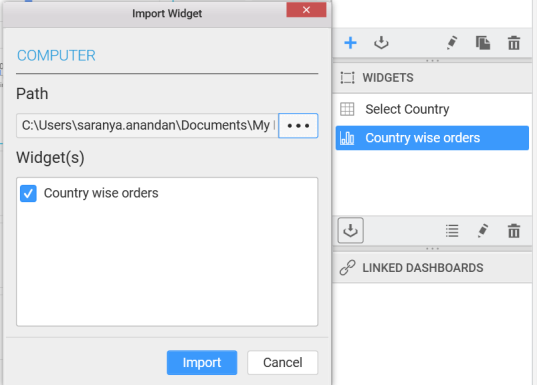

# Using an existing dashboard widget 

You can use an existing dashboard widget by clicking the Import Data Source icon in `WIDGETS` Pane and you will get the `Import Widget` window.

You can select the path and then you will get the widget from that path and select the required widgets and click on the `Import` button.

