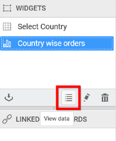
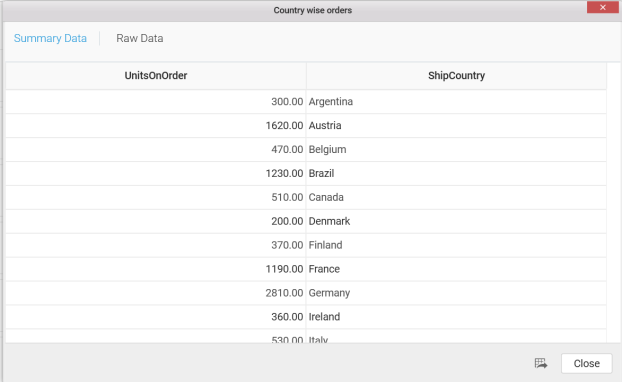
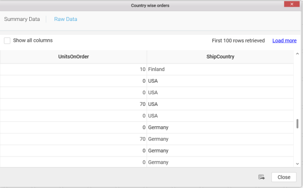

# Viewing widget bounded data

You can view the widget bounded data by clicking the view data icon in `WIDGETS` pane and you will get the window which contains the `Summary Data` and `Raw Data`.

N> Any widget bounded with SSAS data source don’t have the Raw Data tab displayed in View Data window as the cube itself holds the aggregated data.

**Summary Data**

**Raw Data**

