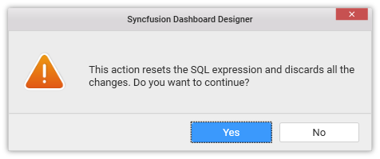

# Connecting through Custom SQL Query

You can also connect to data source of certain data connections through custom SQL query. This feature allows you to define the data source with the manually written queries instead of manual drag and drop of tables for data connection types like Microsoft SQL Server, PostgreSQL and ODBC Connections (SQL, MySQL and Oracle).

**Establish Data Connection**

In `New Connection` wizard, set the respective `Connection type` and configure other details based on the chosen connection.

Click Connect to establish the connection to data source. 

**Switch to Code View**

Be default, data source tab will get opened with design view. Switch to the code view through the drop down menu in the tool bar to access the Query editor pane.

**Write Query and Execute**

Write your custom SQL query in the Query editor and click `Execute` button in the toolbar to process that query. This will get you the table schema information and create a new data source  which can be bounded to dashboard widgets. The data preview can be seen through the preview grid at bottom pane.

Query editor supports to query with parameters too. Click `Parameters` button in toolbar to launch Query Parameters window and add one or more parameters that you require to define.

You may also edit the added parameters through the same window.

Click `Apply` to save the parameter changes and click `Execute` to generate data based on the defined parameters.

If you tried to switch back to design view, you will be prompted with an alert message for confirmation as proceeding with this action, will reset the code view expression.

N>With PostgreSQL connection type, query editor does not support to query with parameters. 
