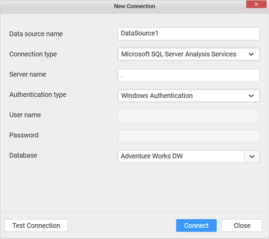
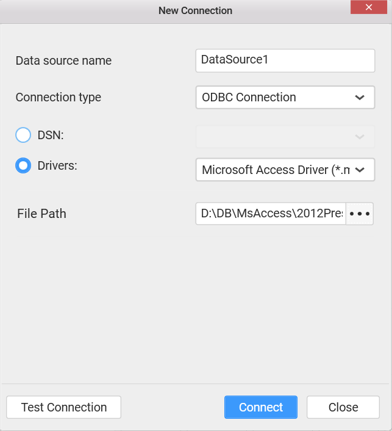

# Connecting to Data

  Before designing a dashboard, it is necessary to decide the data that you are going to visualize, to pick the right widgets for visualization.

  **Data Connection Types**

  Dashboard Designer supports various data connection types such that the structured data can be in any specific format to consider for processing.

## Connecting to SQL Server Database

   With `Microsoft SQL Server` data connection type, you can connect to a database hosted in Microsoft SQL Server whose version should be 2012 and above.

   

   Set `Connection type` as `Microsoft SQL Server`.

   Set the `Server name`. You may either select the server existing in the local network from the dropdown list or specifying the specific remote server name like, myserver.domain.com, myserver.domain.com:port, ipaddress, and ipaddress:port.

   Set the `Authentication type`. For SQL Server Authentication, credentials are required. 

   Set the `Database` that you need to connect and test its connection. If it succeeds, proceed to connect it through clicking the `Connect` button.

   Now you will get into the data design view window.

   

   N> If you have only one table in the bounded database, the data design view will have that one table added by default.

## Connecting to SQL Server Analysis Services Cube

  With  `Microsoft SQL Server Analysis Services` data connection type, you can connect to a cube hosted in Microsoft SQL Server Analysis Services whose version should be 2012 and above.

  

  In the `New Connection` dialog, enter a data source name and select connection type as `Microsoft SQL Server Analysis Services`.

  Set the name of the server. You may either select the server existing in the local network from the dropdown list or specify the remote server name like, myserver.domain.com, myserver.domain.com:port, ipaddress, and ipaddress:port

  N> For more SQL Server name formats, please refer [here](https://msdn.microsoft.com/en-us/library/ms188642.aspx#Anchor_0).

  Set the authentication type. For `Server Authentication`, user credentials are required.

  Select the `Database` that you need to connect and test its connection. If it succeeds, proceed to connect it through clicking the `Connect` button.

  Now you will get into the data design view window

   
 

## Connecting to PostgreSQL Database

   With `PostgreSQL` connection type, you can connect to a PostgreSQL database hosted in local or remote machine whose version should be 9.x and above.

   

   In the `New Connection` dialog, enter a data source name and select connection type as `PostgreSQL` from the drop down list.

   Set the `server name` and `port number` where the PostgreSQL service is running. 

   Enter the `user name` and `password` to connect to the PostgreSQL server.

   Select the database that you need to connect and test its connection. If it succeeds, proceed to connect it through clicking the `Connect` button.

   Now you will get into the data design view window.

   

   N> If you have only one table in the bounded database, the data design view will have that one table added by default.

## Connecting to an Excel workbook

   With `Microsoft Excel` data connection type, you can connect to an excel workbook whose format can be XLS or XLSX.

   

   Set `Connection type` as `Microsoft Excel`.

   Set the `File Path` through locating the excel workbook existing in your machine accessible location and click Connect.

   Now you will get into data design view window.

   

   N> If you have only one worksheet in the excel workbook, the data design view will have that one table added by default.
   
   I> The Excel workbook that need to be connected, should have column names at first row of sheet followed by data rows.

## Connecting to a CSV file

   With CSV data connection type, you can connect to any comma separated value formatted file (CSV).

   

   Set `Connection type` as `CSV`.

   Set the `File Path` through locating the CSV file existing in your machine accessible location and click `Connect`.

   Now you will get into data design view window.

   

   N> The data design view will have that only table added by default.

## Connecting to Spark SQL Data

   With Spark SQL data connection type, you can connect to data placed in HDFS processed by Spark on Hive Server.

   

   Set `Connection type` as `Spark SQL`.

   Set the `Server name` which can be either IP address or the host name of the server where the data resides in HDFS and Spark is running.

   The `Port` number and the `Type` will be filled by default as 10001 and HiveServer2 respectively.

   Select the `Database` to connect to and test the connection. If it succeeds, you will get into the data design view like below.

   

   N> If you have only one table in the bounded database, the data design view will have that one table added by default.

## Connecting to SQL Server Database through ODBC connection

Through `ODBC Connection` data connection type, you can connect to ODBC enabled SQL database hosted in Microsoft SQL Server 2012 & above through any of the following ODBC drivers.

•	SQL Native Client

•	SQL Server Native Client 10.0

### Setting up an ODBC-enabled SQL Server database

To setup a new data source with SQL database, add the installed driver through the following procedure.

1. Navigate to the Control Panel -> System and Security -> Administrative Tools folder location.

2. Double click the ODBC Data Sources (32-bit) tool to open the ODBC Data Source Administrator (32-bit) dialog.

3. Select the System DSN or User DSN tab where the data sources already available get listed in the list. Click Add to select the specific driver and bind the preferred database to create a new ODBC data source.
 

### Connecting to ODBC SQL Server data source

1. Select `ODBC Connection` as Connection type in the New Connection wizard.

2. Select Data Source Name (DSN) or the SQL ODBC driver that you added, and bind the SQL Server database path and connect, to create a new data source for dashboard.

Now you will get into the data design view window.

N> For connecting SQL Server Database through ODBC connection, ensure both SQL driver and Syncfusion Dashboard Designer are installed on the same machine.

## Connecting to Oracle Database through ODBC Connection

Through ODBC data connection type, you can connect to ODBC enabled Oracle database through any of the following ODBC drivers.

•	Microsoft ODBC for Oracle - This comes with Office installation. Need to install Oracle Client software separately to use this driver.

•	Oracle in OraClient 11g_home1 – This can be downloaded from [here](http://www.oracle.com/technetwork/topics/dotnet/utilsoft-086879.html) – v11.2.0.2.1 

### Setting up an ODBC-enabled Oracle database

To setup a new data source with Oracle database, add the installed driver through the following procedure.

   1. Navigate to the Control Panel -> System and Security -> Administrative Tools folder location.

   2. Double click the ODBC Data Sources (32-bit) tool to open the ODBC Data Source Administrator (32-bit) dialog.

   3. Select the System DSN or User DSN tab where the data sources already available get listed in the list. Click Add to select the specific driver and bind the preferred database to create a new ODBC data source.

### Connecting to ODBC Oracle data source

To establish Oracle connection, click on add data source which displays `New Connection` window as shown below.

1. Select `ODBC Connection` as Connection type in the `New Connection` wizard.

2. Select Data Source Name (DSN) or the Oracle ODBC driver that you added, and bind the Oracle database path and `Connect`, to create a new data source for dashboard.

We can also test the connection by clicking on `Test Connection` button.

Click `Connect` to navigate to the data design view. It holds the tables, views, etc. available under the connected data source. Now, a new oracle data source was created.

N> For connecting Oracle Database through ODBC connection, ensure both Oracle driver and Syncfusion Dashboard Designer are installed on the same machine.

## Connecting to Access Database through ODBC Connection

Through `ODBC Connection` data connection type, you can connect to ODBC enabled Microsoft Access database file whose format can be either MDB or ACCDB.

### Setting up an ODBC-enabled Access database

1.	Download & Install the redistributable driver from [here](https://www.microsoft.com/en-us/download/confirmation.aspx?id=23734)

2.	Add the installed driver through the following procedure to setup a new data source with Access database:

   a.	Navigate to the Control Panel -> System and Security -> Administrative Tools folder location.
   
   b.	Double click the `ODBC Data Sources (32-bit)` tool to open the `ODBC Data Source Administrator (32-bit)` dialog.
   
   c.	Select the User DSN tab. In this tab, the user data sources already available get listed in the list. Click `Add` to select the specific driver and bind the preferred database to create a new ODBC data source.

### Connecting to ODBC Access data source

1.	Select ODBC Connection as Connection type in the New Connection wizard.

2.	Select Data Source Name (DSN) or the Access driver that you added, and bind the Access database file path and connect, to create a new data source for dashboard.

Now you will get into data design view window.

N> For connecting Microsoft Access Database through ODBC connection, ensure both Access driver and Syncfusion Dashboard Designer are installed on the same machine.

## Connecting to MySQL Database through ODBC Connection

Through `ODBC Connection` data connection type, you can connect to ODBC enabled MySQL database.

### Setting up an ODBC-enabled MySQL database

1.	Download & Install the MySQL ODBC 5.3 Unicode driver from [here](https://dev.mysql.com/downloads/file/?id=453004)

2.	Add the installed driver through the following procedure to setup a new data source with MySQL database:

   a.	Navigate to the Control Panel -> System and Security -> Administrative Tools folder location.
   
   b.	Double click the `ODBC Data Sources (32-bit)` tool to open the `ODBC Data Source Administrator (32-bit)` dialog.
   
   c.	Select the User DSN tab. In this tab, the user data sources already available get listed in the list. Click `Add` to select the specific driver and bind the preferred database to create a new ODBC data source.

### Connecting to ODBC MySQL data source

1.	Select ODBC Connection as Connection type in the New Connection wizard.

2.	Select Data Source Name (DSN) or the MySQL driver that you added, and select  the MySQL database by providing the Server Name,Port,User Name,Password and connect, to create a new data source for dashboard.

Now you will get into data design view window.

N> For connecting MySQL Database through ODBC connection, ensure both MySQL driver and Syncfusion Dashboard Designer are installed on the same machine.

   
## Connecting to Salesforce

With Salesforce data connection type, you can connect the objects from your Salesforce account.

Set `Connection type` as `Salesforce`.

Set the URL for the Salesforce server you are connecting to. By default, the server is [here](https://login.salesforce.com)

Fill your user name and password for Salesforce.com.
 
In order to Salesforce login, you may need to append a special security token to the end of your password.

To get the security token, refer [How to obtain my security token](https://success.salesforce.com/answers?id=90630000000glADAAY).

Click Connect, now you will get into data design view window.

**Salesforce Account Configuration**

In order to connect Salesforce data, all of the following must be enabled on your Salesforce account.
 
•	SOAP API – To sign in and get Salesforce objects information.

•	BULK API – To retrieve data.

•	REST API – To retrieve data that BULK API doesn’t support.

## Connecting to RESTful Web Services

With RESTful Web Services connection type, you can connected to data from web which is accessible through RESTful APIs.

Set `Connection type` as `Web Data Source`.

Click the `Connect` button to open `Web Data Source` window.

Enter the API in URL text box which must be a valid REST API and choose the appropriate Authentication type for the REST API in Type combo box, it can be either `Basic HTTP Authentication` or `No Authentication`.

Click on Get Data button after entering all necessary fields. If it succeeds, you will get into the data design view like the following screenshot.

## Connecting to Microsoft Azure Table Storage

   To create a new data source select the `Microsoft Azure Table Storage` option from the connection type.

   

   Provide the `Account Name` and `Account Key` about the data source and then proceed to test the connection. Finally, on clicking the `Connect` button a new Data source with the given name will be created.

   

   Dragging and dropping tables listed on the left pane to the center pane creates a de-normalized virtual table that will be used for creating your dashboard. The dashboard designer application joins multiple tables by automatically detecting the related fields but it can be manually defined. A preview of the transformed data is shown in the data grid.

   
   
## Connecting to JSON

With `JSON` data connection type, you can connect to JSON file whose format will be JSON.

Set `Connection type` as `JSON`.

Set the `Database Path` through locating the JSON file existing in your machine accessible location and click Connect.

Now you will get into data design view window.

## Connecting to SQLite Database

With `SQLite` data connection type, you can connect to SQLite database whose format will be in DB.

Set `Connection type` as `SQLite`.

Set the `Database` through locating the SQLite Database file existing in your machine accessible location and click Connect.

Now you will get into data design view window.

N> If you have only one table in the bounded database, the data design view will have that one table added by default.

## Connecting to Hive Data

With Hive data connection type, you can connect to data placed in Hive Server.

Set `Connection type` as `Hive`.

Set the `Server name` which can be either IP address or the host name of the hive server.

The `Port` number and the `Type` will be filled by default as 10000 and HiveServer2 respectively.

Select the `Database` to connect to and test the connection. If it succeeds, you will get into the data design view like below.

  

