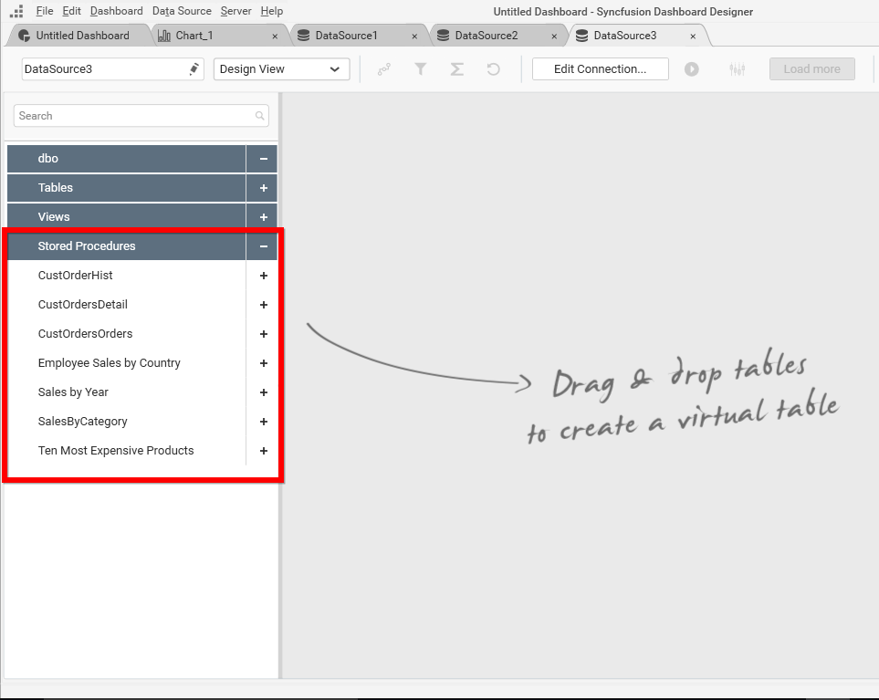

## Connecting to Stored procedures in SQL Server Database

Syncfusion Dashboard Designer allows you to use stored procedures defined in SQL Server database either through direct SQL Server connection or through ODBC connection.

N> You can connect to a database hosted in Microsoft SQL Server whose version should be 2012 or above.

### Connecting to SQL Server Database
     
If it succeeds, you will get into the data design view like below with the available stored procedure will be displayed on the left pane of tree view. And the available parameters also can be displayed while expand the procedure.

You can drag the desired stored procedure into the canvas area to create a table view with the supplied parameters to this procedure.

Syncfusion Dashboard Designer allows to edit the supplied parameters by using the edit parameters button which is available in the created table.

