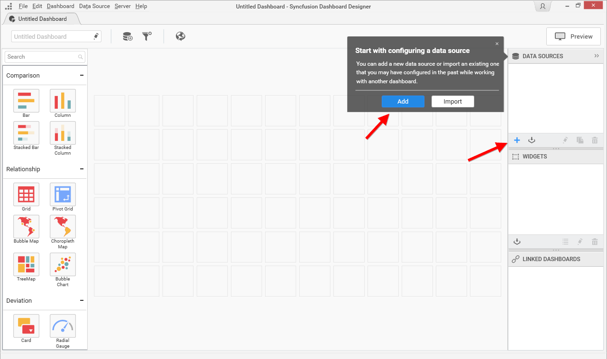
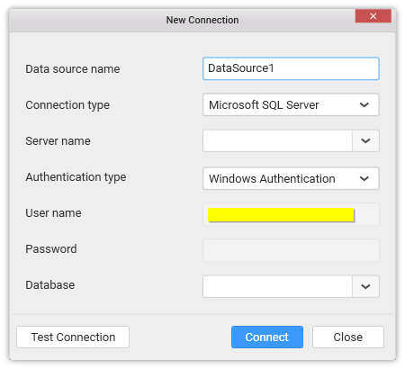
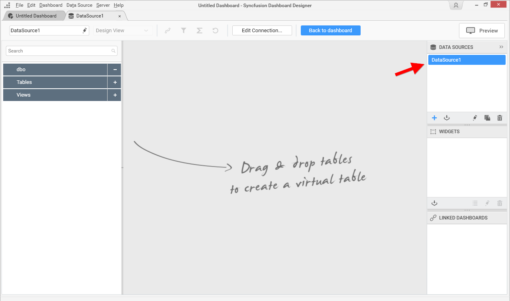

# Creating a new Data source

To bind data to a widget, a minimum of one data source is required. A data source can be created through the following procedure:

Go to the Dashboard Design View and click the `+` button at the bottom of `DATA SOURCES` container as indicated in the below image.

If it is the empty dashboard that was newly created, on launch, it will display a smart screen window through which too, the data source can be created as indicated in the above image.

The `New Connection` dialog will launch like below.

Enter a suitable name for data source at your convenience, fill the other details as requested and establish connection to the respective data source. `Test Connection` option will be available for server based data connection types to validate the connection with the details that you filled in.

Click `Connect` to navigate to the data design view. It holds the tables, views, etc. available under the connected data source. Now, a new data source was created.

