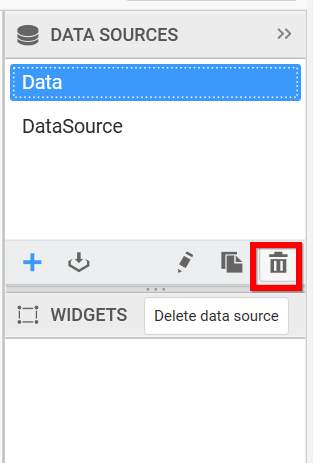

# Deleting a data source

You can delete an existing data source through the following procedure:

Select a data source in the DATA SOURCES container that you need to delete from dashboard.

Click the highlighted icon to delete the selected data source.

Now the selected data source will get removed from the DATA SOURCES container.
