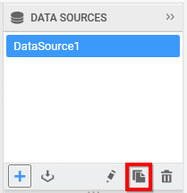
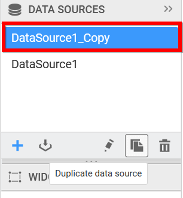

# Duplicating a data source

You can create a duplicate copy of an existing data source through the following procedure:

Select the data source that you need to duplicate in the DATA SOURCES container.

Click the highlighted icon to duplicate the selected data source.

Now a duplicated data source will be created like below.

