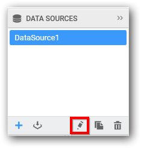
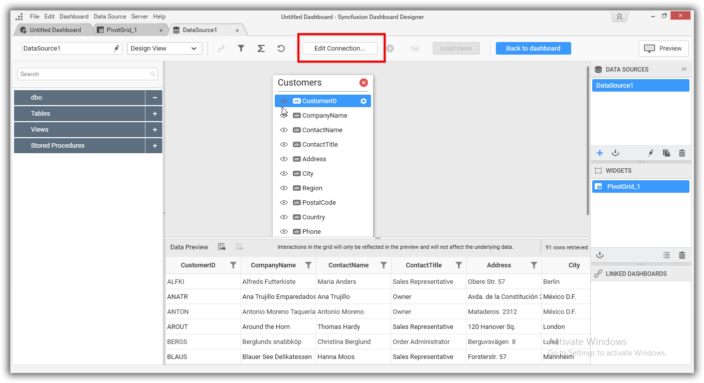
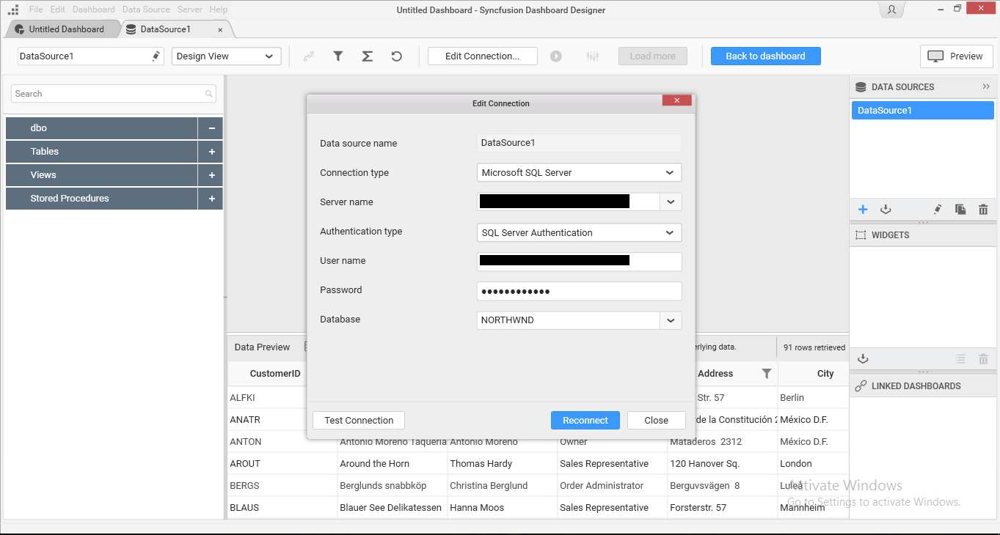

# Editing a Data Connection#

Select the data source associated with the connection that you need to edit in the `DATA SOURCES` container window.

To open the data source window in separate tab, either click the `Edit` icon (highlighted above) at bottom of this container, or right click the selected data source and select the `Edit` option in the context menu displayed.

Click the `Edit Connection…` button in the data design window toolbar. Now, `Edit Connection` dialog opens.

Make the preferred changes and click `Reconnect` button.

I> Reconnection will persist the dropped table(s), table relationships, data filters, data configuration to widgets, unless the schema is different from the previous data connection. i.e., the reconnected database should have similar schema like the previously connected database, which may exist in same or different location. If the reconnected one don’t have a column that is available in previous one, reconnection will just ignore that column and its related settings alone and persist others. Beyond that level, reconnection will drop previous settings entirely.

N> Cross-data source filter configuration handled in `Dashboard Filters Configuration` window will not be maintained on reconnection even the schema is similar.
