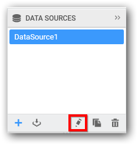

# Editing a data source

You can edit a data source through the following procedure:

Select a data source in the DATA SOURCES container that you need to edit.

Click the highlighted icon to edit the selected data source.

Now the respective data source will get opened in a separate tab to handle your modification.

After modification, click `Back to dashboard` to get back to the dashboard view.
