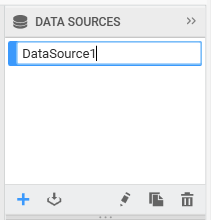

# Renaming a data source

You can rename a data source through the `Rename` option in context menu shown on right click over the respective data source in the DATA SOURCES container like below.

On clicking the `Rename` option, you will get the selected data source name in edit mode like below to enter the modified name.

Once modified, clicking out of that edit region will save the pending changes.

You can also rename a data source while creating it by changing the `Data source` name field. 

