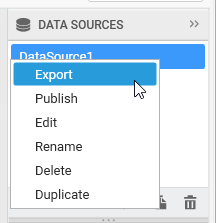
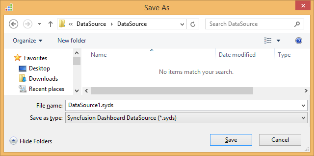
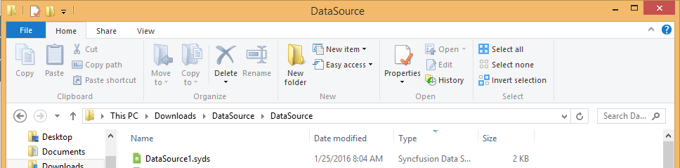

# Saving a Data source

A data source can be saved to any accessible location in local machine in `SYDS` format. Here is the procedure to save a data source.

Select the respective data source name in the `DATA SOURCES` container.

Right click the selected item to pop out the context menu and select `Export` option.

Now, the Save As dialog opens to set the location and file name under which this data source need to be saved.

Once it was saved, the saved file will get placed in the mentioned location like below.

