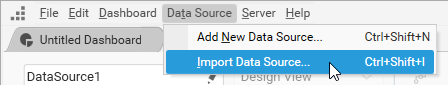
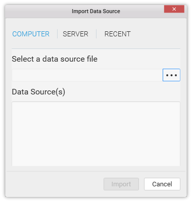
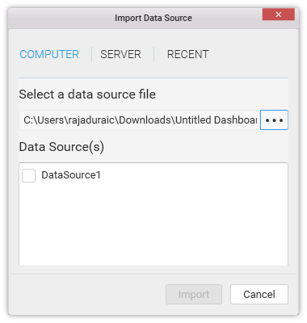
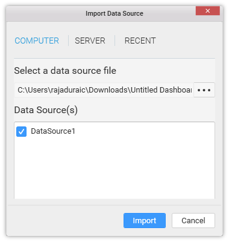
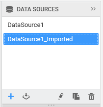
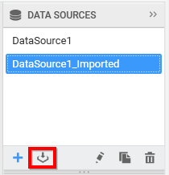

# Using an existing data source

You can use an existing data source in your current dashboard through the Dashboard Designer as per the below procedure.

Click the `Data Source` menu and select `Import Data Source…` item.

Now the Import Data Source dialog opens like below.

Browse to the path of your data source file and select it. Here, you can import data sources from SYDS/SYDX/SYDW formatted files. On selecting a file, you will get the list of available data sources displayed like below.

Select the data sources that you require to import to your current dashboard and click `Import`.

Now the respective data source(s) will get imported into the DATA SOURCES container like below.

N> The imported data source will have its original name displayed here, unless it don’t match the one in the current dashboard. If matches, it will get renamed on import like above.

You can also import data source through keyboard shortcut (Ctrl + Shift + I) or through the import icon in the DATA SOURCES container highlighted below.

