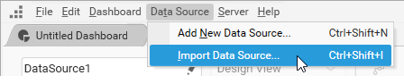
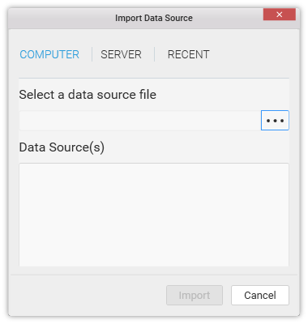
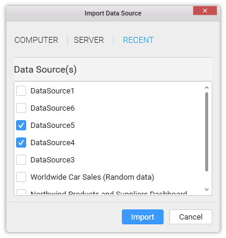
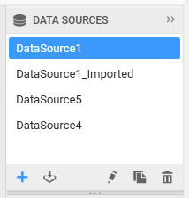

# Using recently used data source

You can import recently used data sources in your current dashboard through the following procedure.

Click the `Data Source` menu and select `Import Data Source…` item.

Now the Import Data Source dialog opens like below.

Select the `RECENT` tab and choose the data sources you prefer to import and click Import. 

N> This list of data sources were automatically saved ones when you created or imported any dashboard and not saved, exist under the following location.
`\%appdata%\Syncfusion\DashboardDesigner\Datasources`

Now the respective data source(s) will get imported into the DATA SOURCES container like below.

