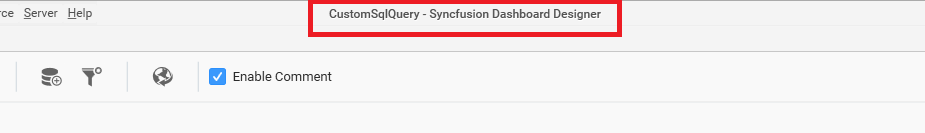
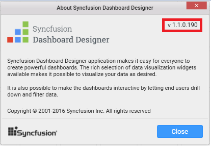
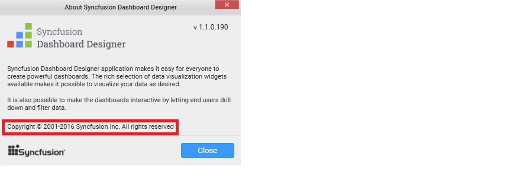
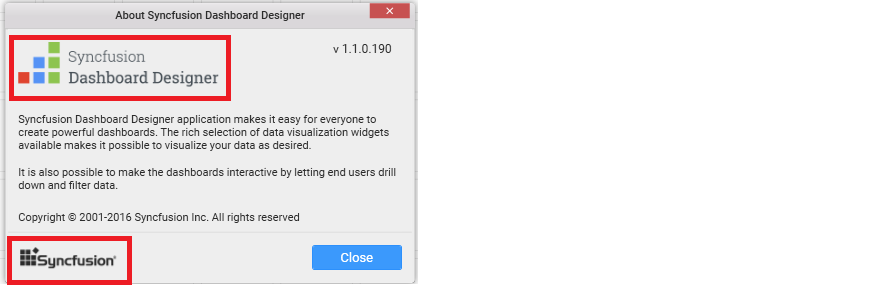

# Custom Rebranding

Syncfusion Dashboard Designer can be rebranded through changing the Organization name, Build version, Product name, Copyright information, Product overview, Company URL, App icon, Company logo, Title icon and URL image.

**Organization Name**

This setting will apply the change in the organization name defined in the Title bar of the Main window and the About window.

**Product Name**

This setting will apply the change in the product name defined in the Title bar of the Main window and the About window.

**Build Version**

This setting will apply the change in the build version of Dashboard Designer in the About window.

**Copyright Information**

This setting will apply the change in the copyright information of Dashboard Designer in the About window.

**Product Overview**

This setting will apply change in the overview of Dashboard Designer showcased in the `About` window.
Company URL

This setting will apply change in the Company URL showcased in the `About` window.

**App icon, Company logo, Title icon and URL image**

Setting these will apply changes in respective areas in the Main window and the About window.

## Handling Custom Rebranding in Dashboard Designer

After installation of Dashboard designer, BrandingText.xml file will be generated in dashboard designer installed location. 

`C:\Program Files (x86)\Syncfusion\Dashboard Designer\DashboardDesigner\CustomBranding\BrandingText.xml`

Open this file and edit the respective attribute values like, OrganizationName, ProductName, Version, ProductOverview, CopyrightInformation and Company URL, which you like to rebrand.

Replace images that exists in the same folder like, App icon, Company logo, Title icon and URL image with required ones but with same name and dimensions.

<table>
<tr>
<th> Image </th>
<th> File Name </th>
<th> Dimensions(pixels) </th>
</tr>
<tr>
<td> App Icon </td>
<td> Windows-AppLogo-16x16.ico </td>
<td> 256x256 </td>
</tr>
<tr>
<td> Company Logo </td>
<td> Windows-CompanyLogo-220x49.png </td>
<td> 220x49 </td>
</tr>
<tr>
<td> Title Icon </td>
<td> Windows-TitleLogo-16x16.png </td>
<td> 16x16 </td>
</tr>
<tr>
<td> URL Image </td>
<td> Windows-UrlLogo-100x25.png </td>
<td> 100x25 </td>
</tr>
 
Restart the Dashboard Designer application to get these changes reflected in.

