# Extracting Live Data

To import data from `Salesforce Objects`, `RESTful Web Services`, `Microsoft Azure Table Storage` you need to install `Syncfusion Dashboard Data Agent` in the data server. This agent extracts the web accessible data to the data server and refresh the data to keep it alive based on provided time schedules.

## Installing Syncfusion Dashboard Data Agent

Run the installer either through clicking the `Run` button or by double-clicking the executable file from the saved location.

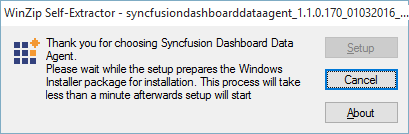

The installer extracts the files and launch the installation wizard.

Read and accept the license terms and conditions through checking the option `I agree to the License Terms and Conditions` and click `Next`.

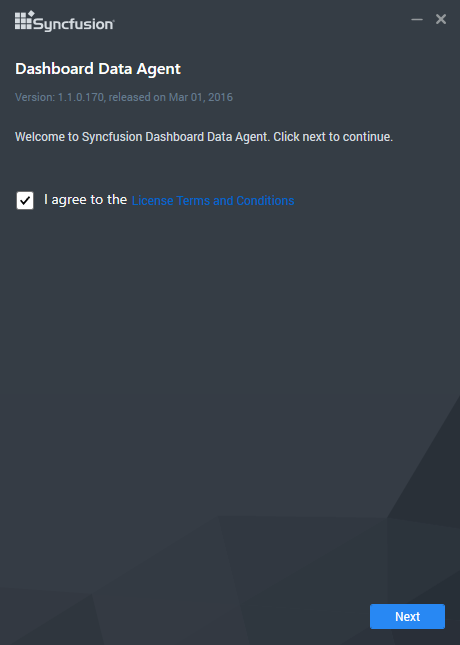

Browse to the location where you would like to install the Syncfusion Dashboard Data Agent and click `Install`.

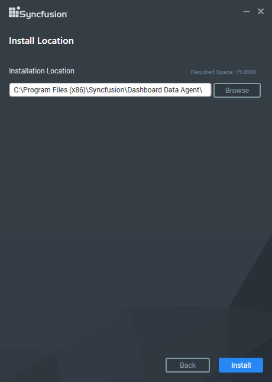

Now the installation begins. You can cancel the installation anytime through pressing `Cancel`, if needed.

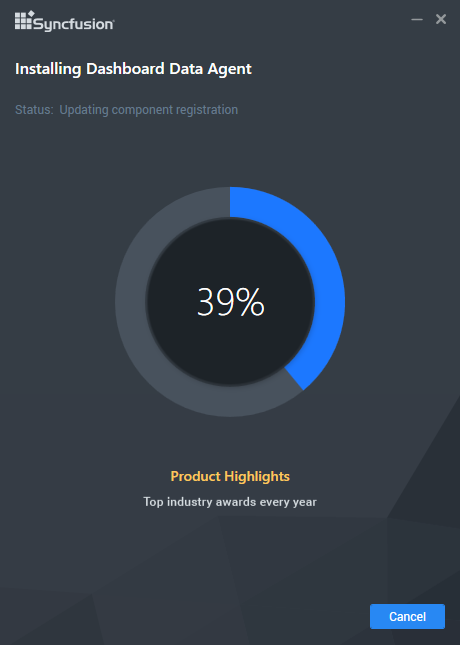

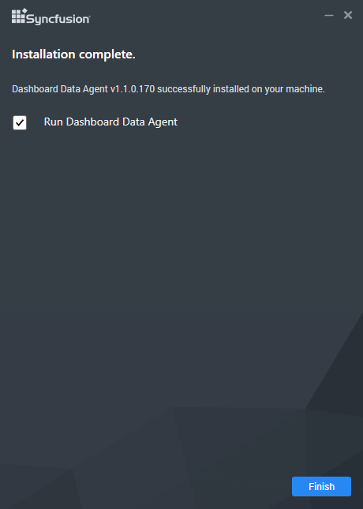

On successful installation, the above screen appears. Click `Finish` to close the installation wizard and run the newly installed `Syncfusion Dashboard Data Agent`. You can also run the application later by unchecking the option `Run Data Agent`.

## Configuring Syncfusion Dashboard Data Agent

Syncfusion Dashboard Data Agent is a self-hosting service which is prepared to be installed only in data servers. It is responsible for extracting data from Salesforce objects, RESTful web services, Azure Table Storage and incremental update data for web accessible resources on the time based schedulers.

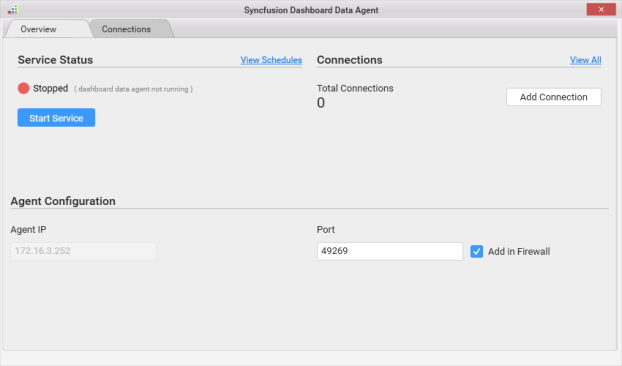

The `Overview` tab of the Syncfusion Dashboard Data Agent has following segments:

1. Service Status

2. Connections

3. Agent Configuration

### Service Status

We can start the Dashboard Data Agent Service on a specific port by click on `Start Service` button.

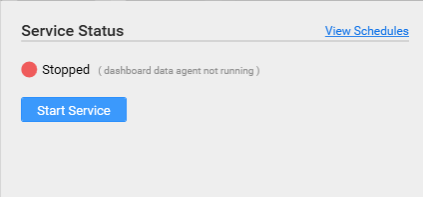

Once you clicking on start service button the `Syncfusion Dashboard Data Agent` start the service on the specified port which was mentioned in `Agent Configuration Section`.

We can stop the Dashboard Data Agent Service on a specific port by click on `Stop Service` button at any time.

`View Schedules` lists the scheduled dashboard report in `Scheduler Window`.

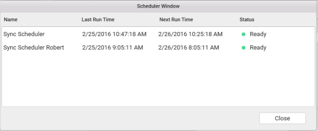

### Connections

We can add the Target Connection details (where the published data should be extracted) by clicking `Add Connection` button.

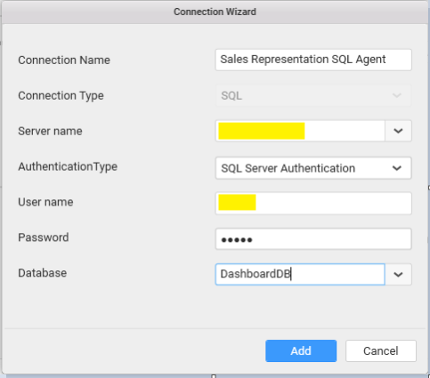

By Clicking Add Connection button the connection wizard open and fill the connection details in the required area to save the connection in Agent.

Once the connection was added in agent you can publish/extract the data on specific connection by using its connection name.

`View All` allows us to navigate to the connection tab.

### Agent Configuration

Agent IP text box shows you the IP of the machine where the Syncfusion Dashboard Data Agent was installed.

Port text box allows us to specify the port where the Dashboard Agent service need to be run.

`Add in Firewall` check box allows us to add a new inbound rule for the mentioned port in firewall. 

N> If you want to access the Agent which runs on a specific port from the client machine then you need to add inbound rule for the specific port in firewall.

The `Connections` tab of the Syncfusion Dashboard Data Agent allows us to handle connections configuration in agent.

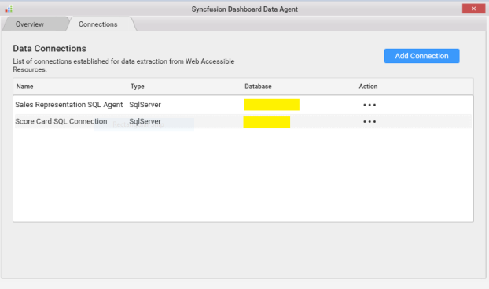

The `Add Connection` button in `Connections` tab is same as the `Add Connection` button in Overview tab which is used to add and configure connections in agent.

This tab lists the SQL connections that are configured in Syncfusion Dashboard Data Agent. You can remove the particular connection from the list by clicking `Remove Connection` option in Action menu of the connection from Data Connections list 

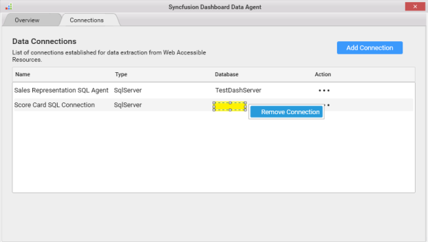

N> Connection modification in agent is irrelevant to the Service state i.e. you can add/remove connection at any time, even when the service is in stop state.

## Extracting Data from Web Accessible Resources through Agent

After Configuring the Syncfusion Dashboard Data Agent in data server we can publish the reports which was created using Salesforce connection, Web Data Source and Azure Table storage in the data server by following way.

Once you have completed the dashboard click on `Server` from menu and `Publish` and then `Dashboard`.

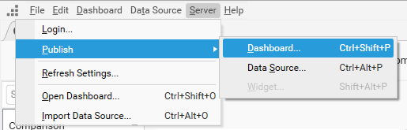

In `Publish Dashboard` window enter the IP of the data server where the agent was installed and enter the port number (Where the agent was running) in Port text box. Once you entered the Agent details when you click on the connection combo box it will show the list of connections configured in Agent.

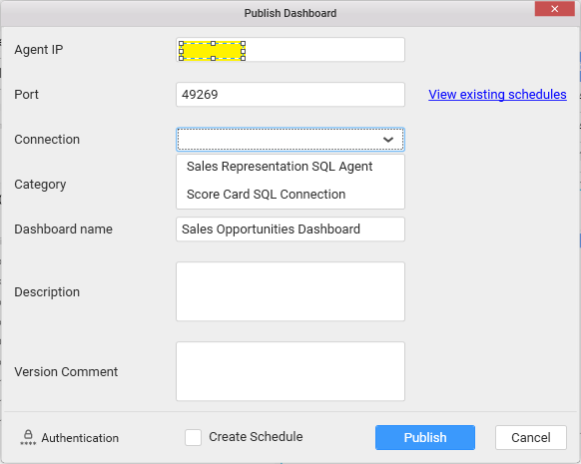

After entering the Necessary Details to publish the dashboard if you want to enable schedule for the dashboard to update the data of the dashboard periodically based on time schedules then check `Create Schedule` check box and click `Next`.

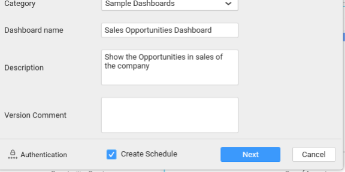

In scheduler window enter the name of the scheduler and configure the scheduler by the list of options available in scheduler window like daily update, weekly update and monthly update and when to start the scheduler and end scheduler etc.

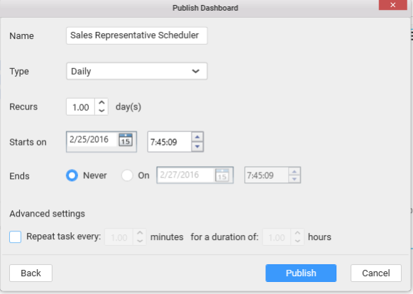

Click on `Publish` button once you have configured the scheduler.

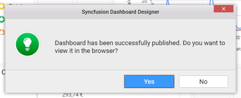

