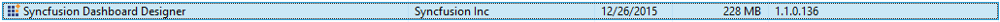

# Installation

This section discusses about the installation/uninstallation, upgrading, service hosting procedures of Syncfusion Dashboard Designer.

## Downloading Dashboard Designer

Download the Syncfusion Dashboard Designer from [here](http://www.syncfusion.com/downloads/dashboard). You may download either as EXE or as ZIP file and extract the EXE.

Save it to your preferred location in your machine.

## Installing Dashboard Designer

Run the saved installer either through clicking the `Run` button or by double-clicking the EXE file from the saved location.

Read and accept the license terms and conditions through checking the option `I accept the terms and conditions` and click `NEXT`.

Browse to the location where you would like to install the Dashboard Designer application and click `INSTALL`.

Now the installation begins. You can cancel the installation anytime through pressing `CANCEL`, if you prefer.

On successful installation, the above screen appears. Click `Finish` to close the installation wizard and run the newly installed Dashboard Designer. You may also run the application later through unchecking the option `Run Dashboard Designer`.

## Hosting Dashboard Service in IIS Express

Dashboard Service is a web service through which data requests will be processed by Dashboard Designer application. This service will get hosted in IIS Express and run automatically on previewing a dashboard through Dashboard Designer.

Two sites, one representing the dashboard service and the other representing the dashboard preview will be running in IIS Express on clicking the `Preview` in the Dashboard Designer application. On closing the Dashboard Designer application, these started sites will get stopped automatically.

## Upgrading Dashboard Designer

On any new release of Dashboard Designer, it can be downloaded and installed on top without uninstalling the previous version. The installation of Dashboard Designer will replace the previous installation and related files.

## Uninstalling Dashboard Designer

You can uninstall the dashboard designer application, if required, through uninstalling the Syncfusion Dashboard Designer entry from Control Panel.

