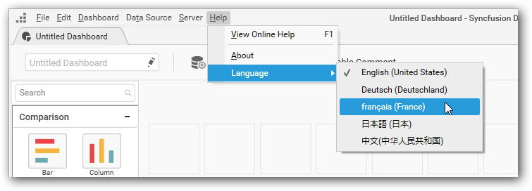
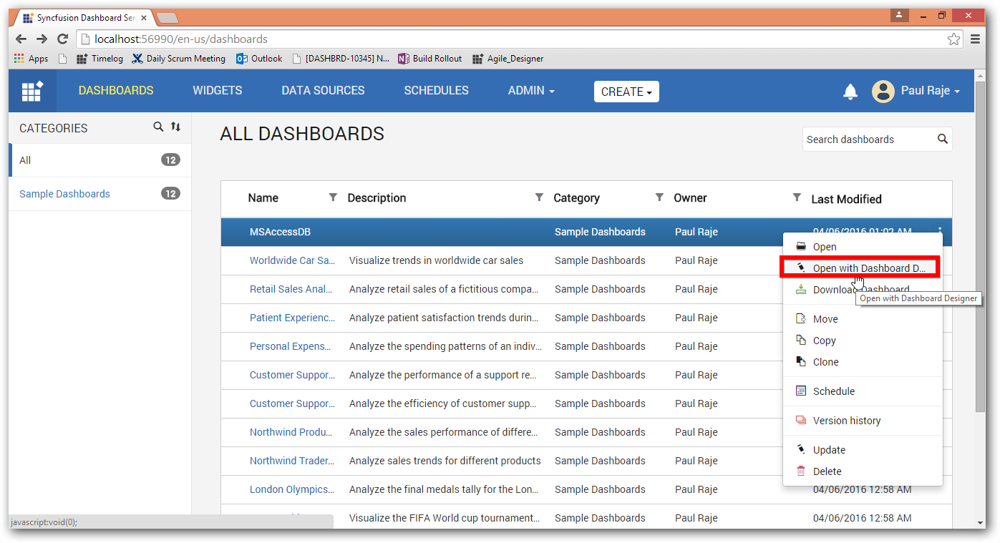

# Localization 

Localization is the process of translating an application’s user interface based on specific cultures. 

## Localizing Dashboard Designer

You can localize the Syncfusion Dashboard Designer by placing the resource file `(.resx)` modified as per your preferred culture, into the `Localization` folder within the installed location of dashboard designer application.

**To localize the Syncfusion Dashboard Designer using resource file, follow the below steps**

* Create a copy of the default resource file (Resources.en-US.resx) of Syncfusion Dashboard Designer, available in the `Localization` folder at the installed location of the dashboard designer application, and place it in the same location 

`C:\Program Files (x86)\Syncfusion\Dashboard Designer\DashboardDesigner\Localization`

* Open the copied file using the Text Editor such as Notepad++. Each data row of the resource file contains a name, and value.

* Edit the value corresponding to each name based on the specific culture.

* Rename the file as `Resources.<culturename>`.resx. Here, the culture name illustrates the codes of language and country. For example, you have to specify file name as Resources.fr-FR.resx for French culture.

* Close any instance of Syncfusion Dashboard Designer application kept open, so as to get the above changes into effect. 

* Open the Syncfusion Dashboard Designer where the newly added language will be listed in languages list under the Help->Language menu item and select the language from that list which requires closure of Syncfusion Dashboard Designer to get the selected language take into effect during next startup of the Dashboard Designer.

## Opening Dashboard from Localized Dashboard Server

From a `Syncfusion Dashboard Server` localized to a specific culture, you can open a dashboard/data source/widget with `Syncfusion Dashboard Designer`, where it will launch the dashboard in a Dashboard Designer localized to respective culture.

N> Dashboard Designer opens with the respective culture only if it available in the location `C:\Program Files (x86)\Syncfusion\Dashboard Designer\DashboardDesigner\Localization`. If it doesn’t exists, the Dashboard Designer will open with the default culture (en-US).

