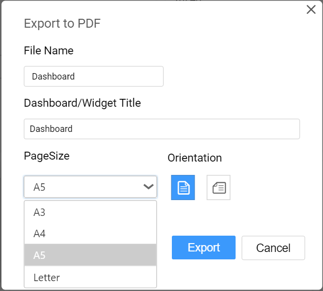

## Exporting Dashboard to Image

   Export the current view of the dashboard in the form of image through clicking the `Export to Image` option in drop down menu at right corner of the title section.
    
   
   
   On clicking the `Export to Image` option, the popup will be shown like below.
   
   
   
   Set the `File Name` and `Dashboard/Widget Title` fields with preferred values replacing the default ones.
   
   
   
   The default and minimum value for `Resolution` is 96 dpi (dots per inch). Maximum value allowed to set is 1790 dpi (dots per inch).
   
   
   
   You can choose the Image `Format` as JPEG (*.jpg), PNG (*.png) or BMP (*.bmp) file format.
   
   
   
   On clicking the `Export` button, the current view of the dashboard will display in the chosen image format with applied settings.
   
   
   
   On clicking the `Reset` button, the default values get restored in the popup.
   
   N> In Windows operating system, `Export to Image` functionality is not supported for Safari browser. Only in Mac OS or iOS having Safari browser version 6+ installed, this will be supported.
   
## Exporting Dashboard to PDF

   You can obtain the data showcased in the dashboard through exporting it as PDF format by clicking the `Export to PDF` option in the drop down menu at right corner of the title section.
   
   
   
   On clicking the `Export to PDF` option, the popup will be shown like below.
   
   
   
   Set the `File Name` and `Dashboard/Widget Title` fields with preferred values replacing the default ones.
   
   
   
   Set the preferred `Page Size` of the PDF File.
   
   
   
   Choose the `Orientation` of the page as either Portrait or Landscape mode.
   
   
   
   On clicking the `Export` button, the data in the dashboard will get displayed in the PDF file format.
   
   
   
   On clicking the `Reset` button, the default values get restored in the popup.
   
    
   
## Exporting Dashboard to Excel

   You can obtain the aggregated data showcased in the dashboard through exporting it as Excel format by clicking the `Export to Excel` option in the drop down menu at right corner of the title section.
    
   
   
   On clicking the `Export to Excel` option, the popup will be shown like below.
   
     
   
   Set the `File Name` field with preferred value replacing the default one. 
   
   Choose the `Format` as either Excel Workbook (*.xlsx) or Excel 97-2003 Workbook (*.xls).
   
   
   
   On clicking the `Export` button, the data in the dashboard will get displayed in the chosen Excel format.
   
   
   
   On clicking the `Reset` button, the default values get restored in the popup.
   
## Updating Dashboard

   You can update the dashboard manually through clicking the `Update Dashboard` option in drop down menu at right corner of the title section.
    
   
    
   This will update the dashboard with the browser cached data view which will remain for 10 minutes. After this time, the updated data get fetched from the data server and store in cache.   