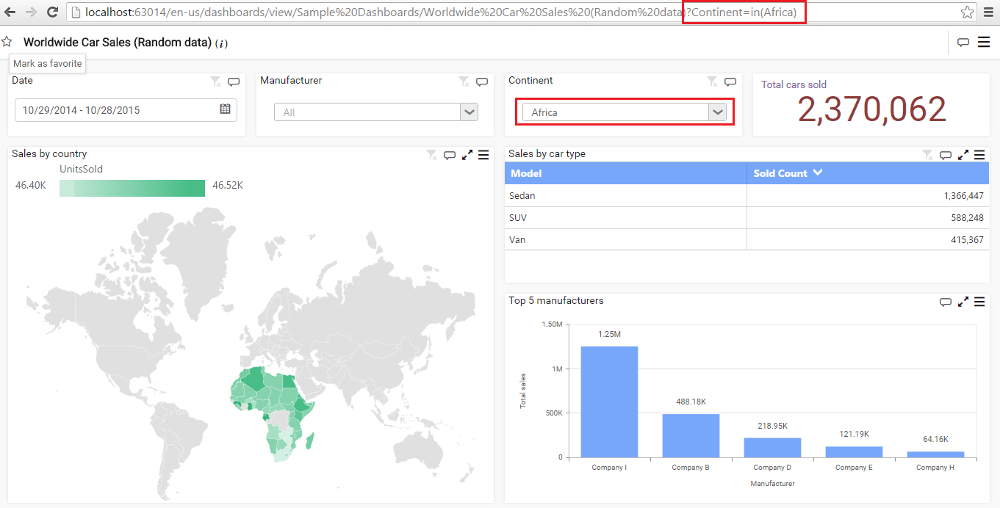
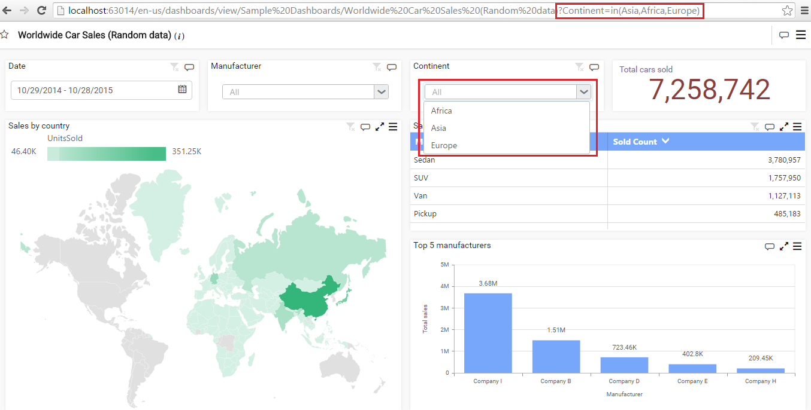
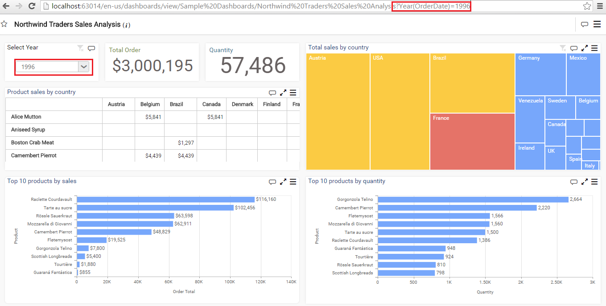
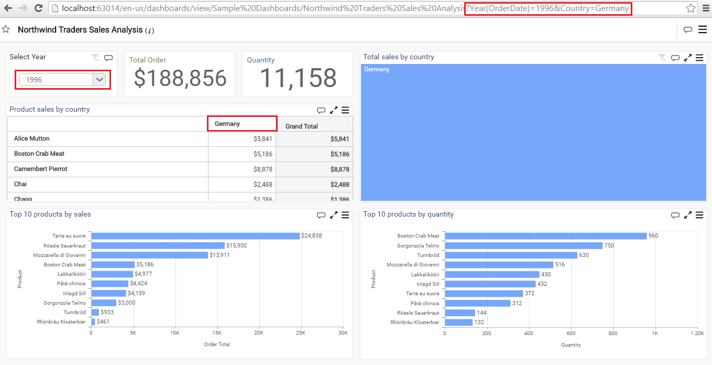

# Filtering Views through URL Parameters

## URL Filters

Filter the dashboard based on column values by using URL filters. These filters will act as initial filter while launch the dashboard.

## URL Structure

The basic URL pattern

### Server:

`http://<servername>/<culture>/dashboards/view/<category>/<dashboardname>`

### Preview in Local:

`http://<localhost:port>` 

* To start the query string with question mark (?)

* If you already have query string, you can start with ampersand (&) character

## URL Filter Functions

The following functions are supported:

### Range Functions:

* IN()

* NOTIN()

* Between()

* InBetween()

* like()

The syntax for using the above functions is 

       ColumnName=val1,val2,…

       ColumnName=in(val1,val2,……) 

       ColumnName=between(val1,val2)

       ColumnName=like(val1,val2)

### DateTime Functions

* Year

* MonthName

* Quarter

* QuarterYear

* MonthYear

* DayMonthYear

* MonthDayYear

* Hours

* Minutes

* Day

* Seconds

* DateHour

* DayOfWeek

* DayOfYear

* WeekOfYear

The syntax for the functions is

       FunctionName(DateTime Column Name)=value 

### Example

We have used ‘Worldwide Car Sales’ dashboard which comes under Dashboard Server.

Step 1: Add question mark (?) with Continent=in(Africa) or Country=Africa

`http://<servername>/<culture>/dashboards/view/<category>/<dashboardname>?Continent=in(Africa)` 

   

Syntax for passing more than one value:

      Column Name=value1, value2…  

Ex: Continent=in(Asia, Africa,Europe) or Country=Asia,Africa,Europe

`http://<servername>/<culture>/dashboards/view/<category>/<dashboardname>?Continent=in(Asia,Africa,Europe)`

 

We have used ‘Northwind Traders Sales Analysis’ for date functions which comes under Dashboard Server.

Syntax for passing Year :

                year(DateTime Column Name)=value

Ex: Year(OrderDate)=1996

Syntax for passing more than one value:

                year(DateTime Column Name)=value1, value2…  

`http://<servername>/<culture>/dashboards/view/<category>/<dashboardname>?Year(OrderDate)=1996`

 

Use ‘&’ for adding multiple filter

`http://<servername>/<culture>/dashboards/view/<category>/<dashboardname>?Year(OrderDate)=1996&Country=Germany`

 

N> * Both IN and NOTIN functions can be used with DateTime values but, LIKE function cannot be used with DateTime value.
N>
N> * The above function names are case insensitive. So function name can be given in both upper case, lower case or mixed casing.
N>
N> * Value(s) should be case sensitive.
N>
N> * In case value contains comma (,) or ampersand (&) then, use escape character tilde (~) as prefix and suffix for those characters. For example, CompanyName=Syncfusion Inc~,~.
N>
N> * Any invalid column name in filter, it will be ignored from filter.
N>
N> * Any invalid value in filter, ‘no data available’ will be displayed.

