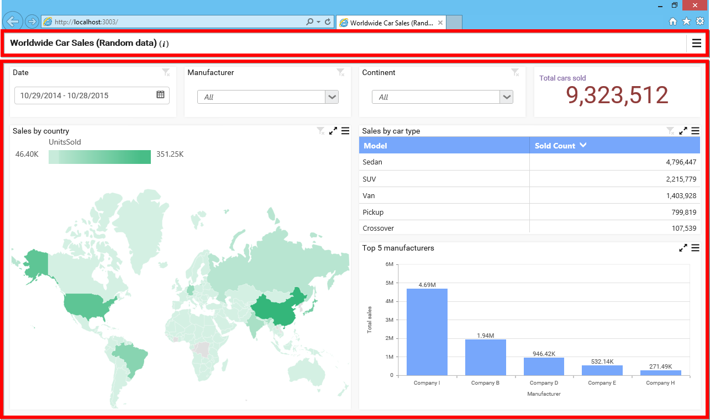

# Previewing Dashboard

  You can preview the currently opened dashboard through clicking the `Preview` at right corner in tools pane.
  
  
  
  This preview button will be visible across all the window tab views in Syncfusion Dashboard Designer, thereby allowing you to preview the dashboard from anywhere within application.
  
## Previewing Dashboard using Dashboard Viewer

   Dashboard was previewed using built-in Dashboard Viewer opened in your default web browser.
   
   
   
   You can preview and interact the dashboard only if dashboard service is running in web development server in parallel. This service get started as discussed [here](/en-us/dashboard-platform/dashboard-designer/installation#hosting-dashboard-service-in-iis-express).
   
   Dashboard Viewer can be split into two sections: `Title` and `Content`, like below.
   
   
   
   The `Title` section holds the dashboard title, description (can be viewed through clicking the `i` icon near to the title) that were set in Dashboard Designer before publish like below.
   
   
   
   And, a menu to handle the dashboard update and export operations at runtime like below.
   
   
   
   The `Content` section holds the complete content of the dashboard design area in Dashboard Designer.
   
   
   
   You can interact with the dashboard widgets in the viewer and apply filter on top of other widgets based on the dashboard filters configuration made in that dashboard through Dashboard Designer.

   Each widget in dashboard viewer itself can split into two sections: `Title` and `Content`, like below.
   
   
   
   The `Title` section holds the widget title, description (can be viewed through mouse hovering the `i` icon near to the title).
   
   
   
   These were one that can be set through Dashboard Designer before publish like below.
   
   
   
   It also holds maximize, drop down menu, and filter status options at right end like below.
   
   