## Exporting Widget to Image

   You can export the widget view in the form of image through clicking the `Export to Image` option in drop down menu at right corner of the title section.
    
   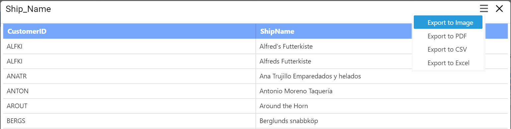
   
   On clicking the `Export to Image` option, the popup will be shown like below.
   
   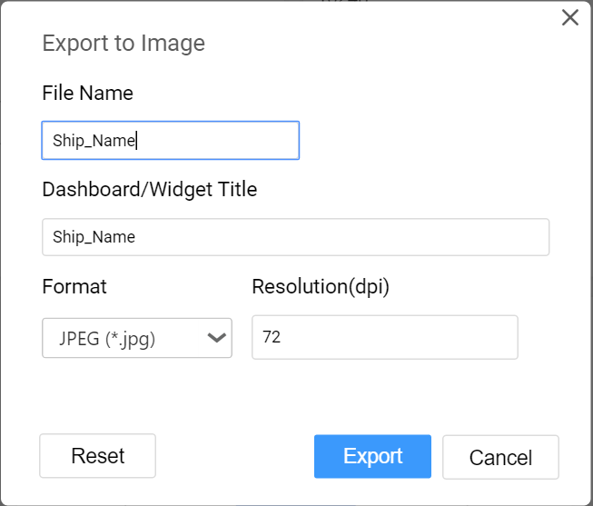
   
   Enter the `File Name` and `Dashboard/Widget Title` fields with preferred values replacing default ones.
   
   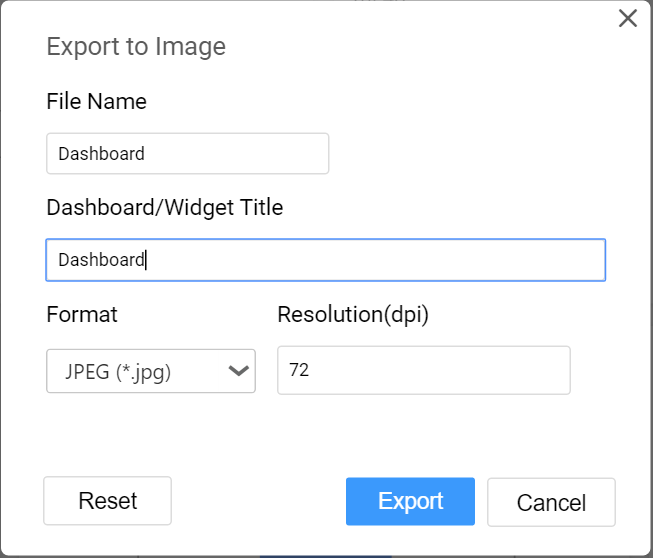
   
   The default and the minimum value for `Resolution` is 72 (dpi). Maximum value allowed to set is 1790 (dpi).
   
   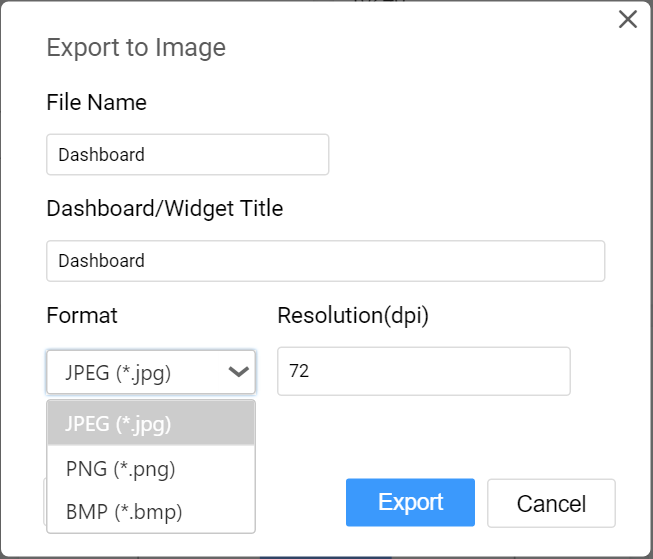
   
   You can choose the Image `Format` as JPEG (*.jpg), PNG (*.png) or BMP (*.bmp) file format.
   
   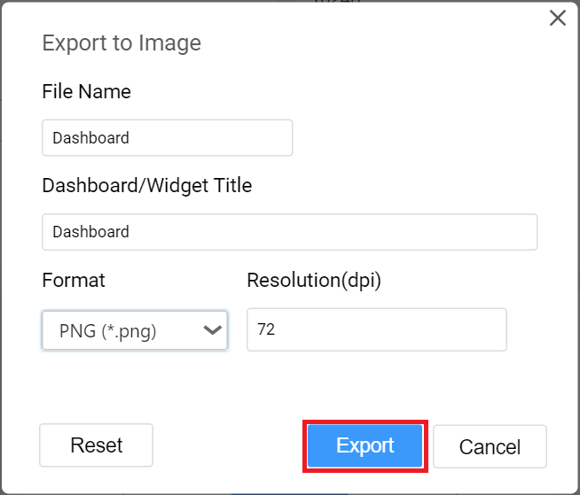
   
   On clicking the `Export` button, the current view of the widget will get displayed in the chosen image format with applied settings.
   
   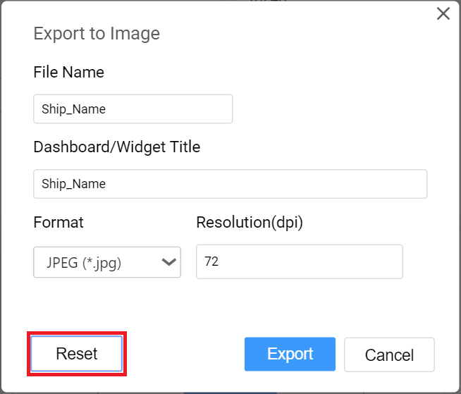
   
   On clicking the `Reset` button, the default values get restored in the popup.
   
   N> In Windows operating system, `Export to Image` functionality is not supported for Safari browser. Only in Mac OS or iOS having Safari browser version 6+ installed, this will be supported.
   
## Exporting Widget to PDF

   You can obtain the data showcased in the widget through exporting it as PDF format by clicking the `Export to PDF` option in the drop down menu at right corner of the title section.   
   
   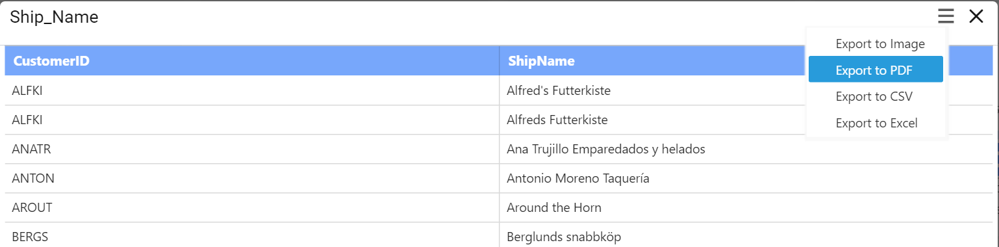
   
   On clicking the `Export to PDF` option, the popup will be shown like below.
   
   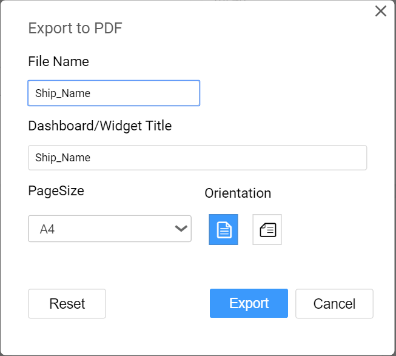
   
   Set the `File Name` and `Dashboard/Widget Title` fields with preferred values replacing the default ones.

   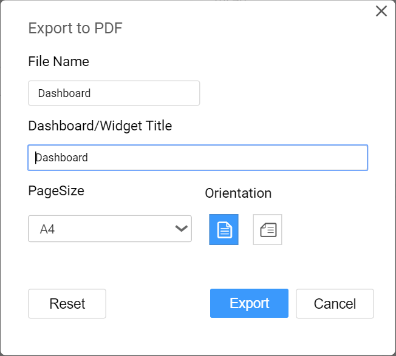 
   
   Set the preferred `Page Size` of the PDF File.
   
   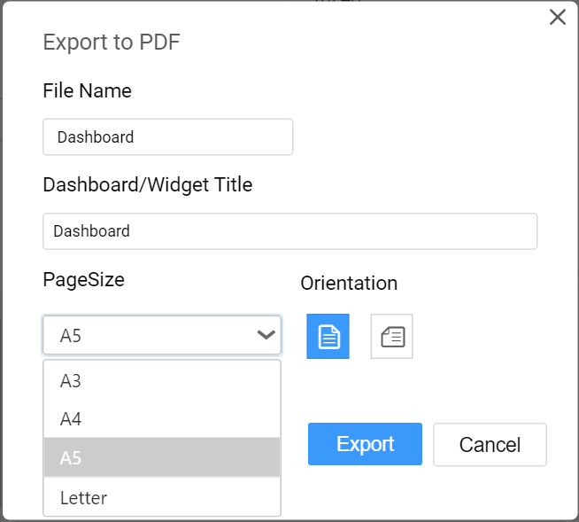
   
   Choose the `Orientation` of the page as either Portrait or Landscape mode.
   
   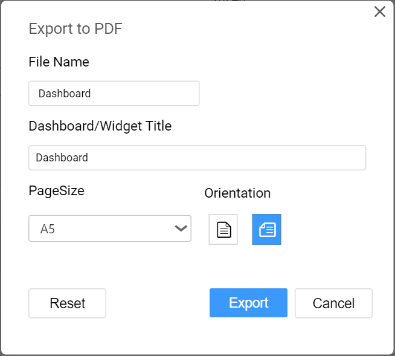
   
   On clicking the `Export` button, the data in the widget will get displayed in the PDF file format.
   
   
   
   On clicking the `Reset` button, the default values get restored in the popup.
   
   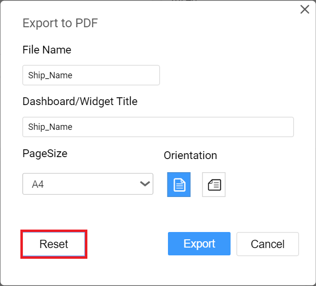
   
## Exporting Widget to CSV

   You can obtain the aggregated data showcased in the widget through exporting it to CSV format by clicking the `Export to CSV` option in the drop down menu at right corner of the title section.
    
   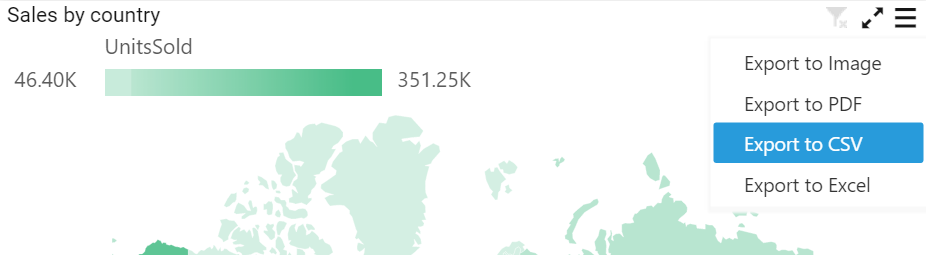   
   
## Exporting Widget to Excel

   You can export the widget in the form of excel through clicking the `Export to Excel` option in drop down menu at right corner of the title section.
   
   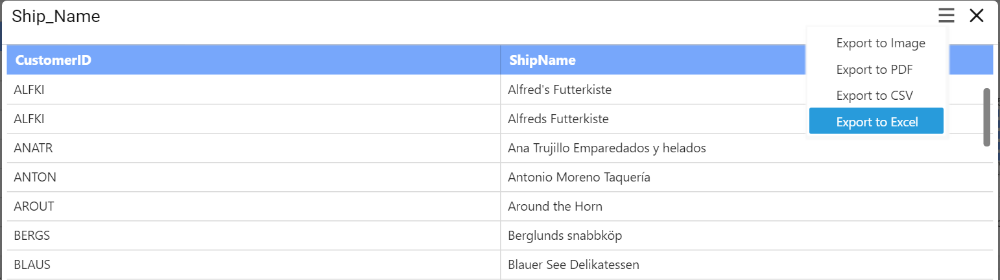
   
   On clicking the `Export to Excel` option, the popup will be shown like below.
   
   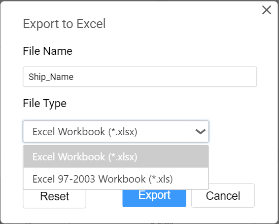
   
   Set the `File Name` field with preferred value replacing the default one.
   
   Choose the `Format` as either Excel 97-2003 Workbook (*.xls) or Excel Workbook (*.xlsx).
   
   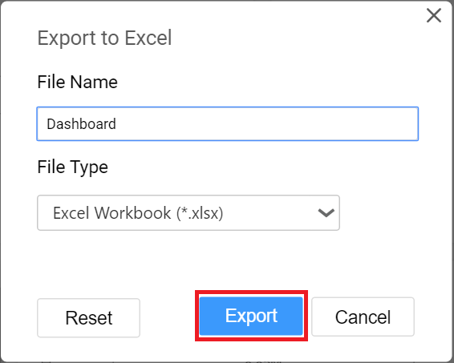
   
   On clicking the `Export` button, the data in the widget will get displayed in the Excel format.
   
   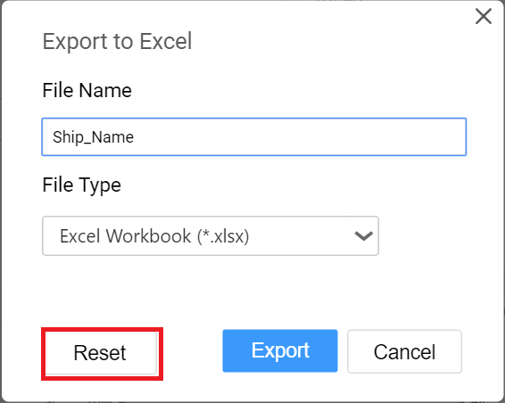
   
   On clicking the `Reset` button, the default values get restored in the popup.   
      